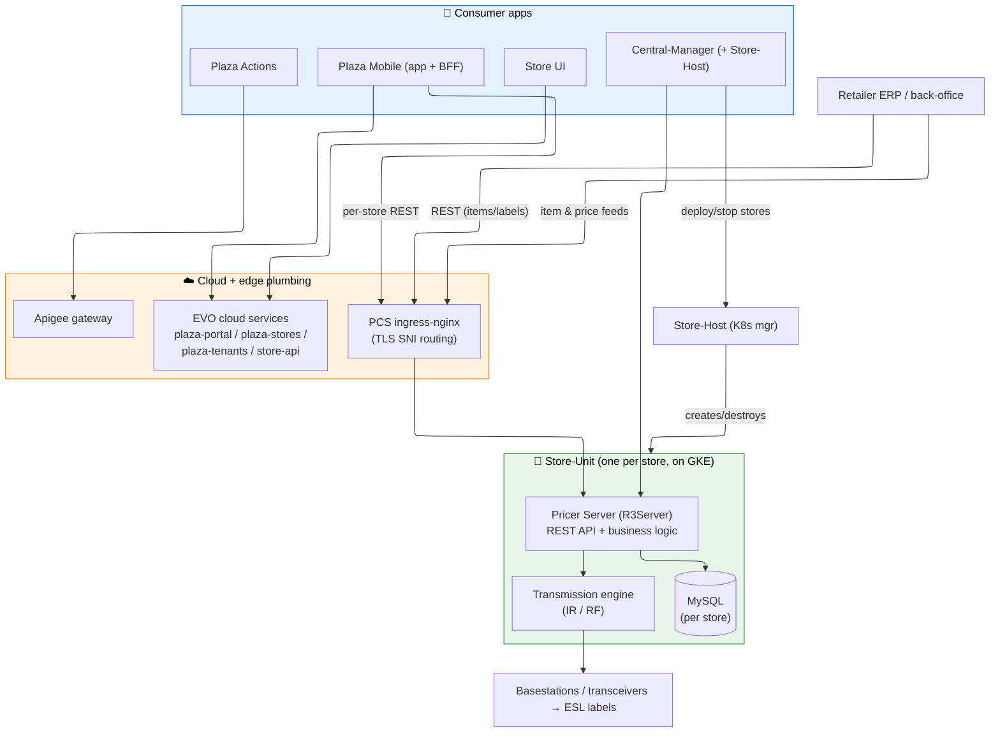
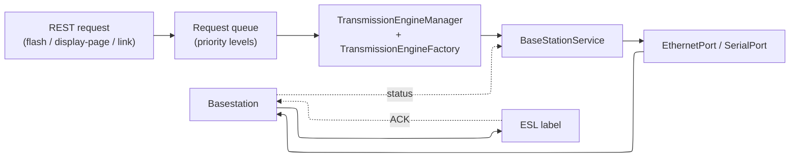
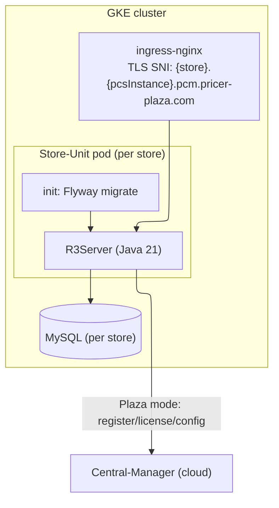
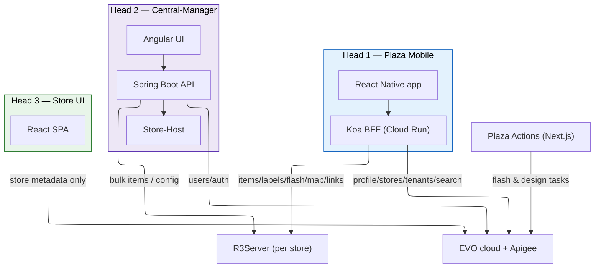
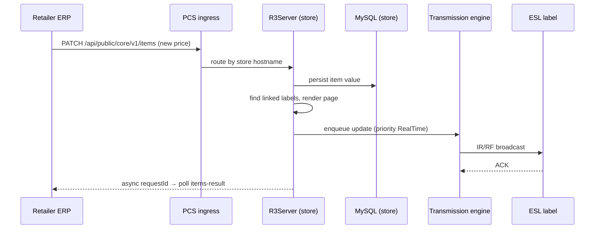

# 01 — Current Pricer AB Systems Architecture

> **Scope:** Everything that exists **today**, end to end: the ESL on the shelf, the in‑store radio infrastructure, **Pricer Server (R3Server)**, the three consumer "heads" (Plaza Mobile, Central‑Manager, Store UI) plus Plaza Actions, and the cloud edges they already use. Closes with how the team develops (the BEEP harness).
>
> **Validated:** 2026-06-17 against repo code + live GCP/GitHub. File paths are clickable into this workspace.

---

## 1. The big picture

Pricer sells an **Electronic Shelf Label (ESL)** platform to retail chains. A price change in the retailer's ERP must end up on thousands of e‑paper labels on the shelves, correctly and within seconds. The platform is layered:



**Key idea:** the platform is **multi‑instance, not yet multi‑tenant**. Each store gets its **own** R3Server + its **own** MySQL, deployed as a Kubernetes "Store‑Unit". A retail chain (a *tenant*) is just a set of these Store‑Units grouped together. (See [doc 02](02-tenant-model.md).)

---

## 2. The edge: ESL hardware, basestations, and transmission

The physical layer is what makes Pricer special and is the part that **cannot** move to the cloud.

- **ESL labels** — battery‑powered e‑paper displays. Each has a unique **PLID** (barcode). They receive updates wirelessly.
- **Basestations & transceivers** — ceiling‑mounted radios that broadcast to labels over **IR** (infrared, line‑of‑sight, fast) and **RF** (radio). Organized into **transmission zones**.
- **R3Server's transmission engine** drives this hardware in real time.

The transmission path inside R3Server (all under [pricer-server-r3server/R3Server/.../infrastructure/](../../pricer-server-r3server)):



- Requests are prioritized — e.g. `RealTime` (immediate price), `BroadcastDisplayPage`, `Link`, `Unlink`, `BroadcastLedKeepAlive` (see `TransmissionPriority` in `shared/esl-serverapi-advanced`).
- Latency matters: a "flash this label" or "switch display page" is effectively a tiny IR command that must land in **milliseconds**. This is why these operations **stay on R3Server** even after Replatforming ([doc 04](04-target-architecture.md#3-the-hybrid-boundary--what-stays-on-the-edge)).
- Infra validation: `CoverageTestService`, `FalseAckTestService`, transceiver enable/disable commands.

---

## 3. Pricer Server (R3Server) — the common backend

**Repos:** [pricer-server-r3server](../../pricer-server-r3server) (Plaza/cloud build, internal version 175.x) and [pricer-server-on-prem](../../pricer-server-on-prem) (legacy build, 1005.x). On‑prem is the classic single‑server install; **R3Server is the one that runs in PCS/EVO** and is the focus of Replatforming.

**Stack:** Java 21 · Spring · Maven multi‑module · MySQL (+ Flyway migrations) · Docker (`eclipse-temurin:21` base).

### 3.1 Module map (Maven)

| Module | Responsibility |
|--------|----------------|
| `shared/` (incl. `esl-serverapi-advanced`) | Core POJOs: `Item`, `ItemPropertyName/Value`, transmission enums |
| `esl-api-proxy/` | **The REST API gateway** — ~115 controllers (`/api/public`, `/api/private`, `/api/internal`) |
| `R3Server/` | Core app (`se.pricer.bootloader.Server`), JPA entities, infrastructure/transmission, Plaza‑mode cloud hooks |
| `transmission/` | Transmission + basestation infra entities |
| `WebInstoreUI/` | In‑store web UI (e.g. store map / geo editor) |
| `ecc/` | ECC (legacy linking/rendering) client tooling |
| `pda/`, `API/`, `esl-jasper-reports/` | Handheld endpoints, legacy API docs, reporting |
| `installers/esl-docker-r3server/` | Dockerfile + runtime config for the Store‑Unit image |

### 3.2 REST API domains (in `esl-api-proxy`)

These are the surfaces the consumer apps actually call:

| Domain | Representative endpoints | Notes |
|--------|--------------------------|-------|
| **Items** | `GET/PATCH/DELETE /api/public/core/v1/items[/{id}]`, async `…/items-result/{requestId}` | The hot path. Async update/delete with result polling. |
| **Labels** | `…/core/v1/labels[/{barcode}]`, `…/labels-result` | Label CRUD, barcode lookup. |
| **Links** | `…/core/v1/labels/link-single`, `…/labels/{barcode}/links` | ECC item↔label linking. |
| **Flash** | `…/core/v1/items/{id}/flash`, `…/labels/{barcode}/flash`, `…/core/v1/flash` | Locate labels by blinking LED. |
| **Display page** | `…/core/v1/display-page/labels` | Switch which page the ESL shows. |
| **Map / Geo** | `…/map/v1/geo-store/...` (floors, blueprint.png) | Store floor maps + label coordinates. |
| **Infra** | `…/infra/v1/basestations`, `…/transmission-zones`, `…/link-departments` | Radio infrastructure config. |
| **Config** | `…/config/v1/{jobs,store,item-properties}` | Store settings, custom item properties. |
| **Internal** | `…/internal/{liveness,readiness}/v1`, `…/monitoring/v1/server-status` | K8s health probes. |

### 3.3 Data model (MySQL, per store)

| Entity (table) | Meaning |
|----------------|---------|
| `PricerLabelEntity` (`pricerlabel`) | A physical ESL: PLID, state, battery, firmware |
| `LinkEntity` (`eclink`) | Item↔label association (itemId → plId, order, visible) |
| `LinkDepartmentEntity` (`LINK_DEPARTMENT`) | Department/zone classification of links |
| `PricerlabelImageEntity` (`pricerlabel_image`) | Rendered page content per label |
| `PricerLabelProperty` (`pricerlabel_properties`) | Per‑label metadata |
| *(item values)* | Item prices/descriptions — the data Shadow Mode exports as `storeitemvalues` |

### 3.4 Deployment: a "Store‑Unit" on GKE

R3Server is **not bare metal** in PCS. Each store is a containerized **Store‑Unit**:



- **Plaza mode**: on boot R3Server (via `se.pricer.esl.plaza.*` — `PlazaModeHelper`, `CentralManagerService`, M2M token handler) registers with Central‑Manager, pulls config, and obtains licensing. This is what makes a generic R3Server image become "store 123 of tenant X".
- **Store‑Host** (in `chain-management-centralization/store-host`) creates/destroys these deployments via Helm/the K8s API.

---

## 4. The three consumer "heads"

Pricer's product has **three consumer systems** ("heads of the snake"), plus Plaza Actions. Each calls a different mix of backends.



### Head 1 — Plaza Mobile (in‑store associates)
- **Frontend** [plaza-mobile-ui-frontend](../../plaza-mobile-ui-frontend): React Native app; talks only to the BFF (`api.plaza-mobile.*.pricer-plaza.com`), Auth0 for login.
- **BFF** [plaza-mobile-ui-backend](../../plaza-mobile-ui-backend): Koa/TypeScript. Routes in `src/endpoints/v{1,2}/`; backend clients in `src/common/axios-*-client.ts`.
- **Backend split** (the migration‑relevant part):
  - **R3Server (per store)** at `https://{storeId}.{pcsInstance}.pcm.pricer-plaza.com/api/*` — items, labels, links, flash, **map**, display‑page, link‑departments, label models.
  - **Cloud** — `plaza-portal` (profiles), `plaza-stores` (store list), `plaza-tenants`, and **Apigee** (item search, Designer linking).
- This head is the **most affected** by Replatforming (its item GET/PATCH path is the blocked epic — see [doc 03](03-replatforming-deep-dive.md)).

### Head 2 — Central‑Manager (chain administrators)
- **Repo** [chain-management-centralization](../../chain-management-centralization): Angular 15 UI + Spring Boot API (`central-manager`), plus **Store‑Host** and an "EVO UI".
- **Responsibilities:** store lifecycle (create/deploy/start/stop/delete), store groups, configuration (`.prc` files in GCS), **multi‑store bulk item update/delete + CSV import**, users/roles/permissions, monitoring.
- **Backends:** its own MySQL/Redis + GCS (stays), R3Server for bulk items (migrating), EVO for users/auth (already cloud).
- **Store‑Host** (`store-host/.../KubernetesService.java`, `StoreUnitService.java`) is the component that turns "create store" into a running Store‑Unit pod. Endpoints like `POST /api/internal/central/v1/store-units`, `…/{id}/start|stop`. **This stays** — someone has to manage the edge fleet.

### Head 3 — Store UI (super‑admins / IT)
- **Repo** [store-ui](../../store-ui): React + RTK Query. Runtime config in `public/config/config.js` (`window._env_`).
- Talks **only to EVO cloud** (`store.<env>.pricer-plaza.com/api`, `plaza-portal`, `tag`, supporting‑services): create stores, assign metadata, store groups/tags, registration keys, on‑prem licenses.
- **Already 100% cloud‑native → zero migration** for its own APIs.

### Plaza Actions
- **Repo** [plaza-actions](../../plaza-actions): Next.js. Lets operators build **flash** and **design‑switch** *tasks* with conditions, executed against labels. Talks to Apigee → `actions-executor` / `actions-library` Cloud Run services.

### Backend dependency matrix

| Consumer | R3Server (edge) | EVO cloud / Apigee | Migration exposure |
|----------|:---------------:|:------------------:|--------------------|
| Plaza Mobile | items, labels, flash, links, map, display‑page | profile, stores, tenants, search, Designer | 🔴 High (items) |
| Central‑Manager | bulk items, config push | users, auth | 🔴 High (items) / ⚪ lifecycle stays |
| Store UI | — | everything | ✅ Already cloud |
| Plaza Actions | (via task execution) | actions services | 🟡 Cloud‑native already |

---

## 5. The cloud/EVO platform (what already runs)

Even today, a lot already lives in GCP project **`platform-dev-p01`** (`europe-north1`). This is the foundation Replatforming builds on. **Live inventory (2026-06-17):**

- **21 Cloud Run services** — `item-registry-api`, `item-registry`, `link-registry`, `studio-renderer`, `studio-link-evaluator`, `studio-design-library`, `studio-scenario-library`, `dtoflow-transmission`, `dtoflow-lfs`, `dtoflow-spanner`, `dtoflow-changequeue-dashboard`, `link-bfg`, `link-storeasset-bfg`, `actions-executor`, `actions-library`, `delivery-sync-service`, `delivery-dashboard`, `ecc-renderer`, `ecc-link-projector`, `esl-image-merger`, `migration-helper`.
- **Spanner** instance `dtoflow` (regional‑europe‑north1, 1000 PU) with databases `dtoflow` (29 DTO tables) + `item-registry`.
- **Pub/Sub** — 23 topics (20 `dtoflow-changes-<dto>.v1` + DLQ + sync job + `item-registry-requests`).
- **GKE** cluster `platform` (europe-north1-a, running) — hosts the **ChangeQueueService**.
- **GCS** — `dtoflow-data-*`, `dtoflow-lfs-*`, `dtoflow-dlq-*`, `item-registry-requests-*`.

Most of these map 1:1 to GitHub repos in the `PricerAB` org (e.g. `platform-item-registry-api`, `platform-dtoflow-server-spanner`, `platform-changequeue-service`, `platform-designer-service`, `platform-evaluation-engine`, `platform-ecc-link-projector`, `platform-esl-image-merger`, `evo-dtoflow-grpc-clients-{java,node}`). Full deep dive in [doc 03](03-replatforming-deep-dive.md) and [doc 04](04-target-architecture.md).

---

## 6. End‑to‑end: a price change today



Today **everything in this flow happens inside one Store‑Unit**. Replatforming pulls the storage + render steps out to the cloud while keeping the last two steps (transmission → ESL) on R3Server — that contrast is the whole story of [doc 03](03-replatforming-deep-dive.md) and [doc 04](04-target-architecture.md).

---

## 7. How the team builds — the BEEP AI harness

A leader inherits not just the system but **how the team works on it**. Pricer development runs through **BEEP AI**, an internal harness with two layers:

| Layer | Repo | What it gives you |
|-------|------|-------------------|
| **Sandbox** | `beep-gemini-sandbox` (v7.x) | A Docker container where AI agents run isolated from the host; a credentials broker for GitHub/Jira/Confluence/GCP; `sandbox-guard` to block destructive ops; **rsync‑to‑volume builds** (Maven ~32 min → ~3 min). |
| **Scaffold** | `beep-dot-ai-root` (`.ai` in each repo) | `AGENTS.md` → `project.yaml` routing, ~7 personas, ~30 rules, and skills (`/create-spec`, `/create-plan`, `/implement`, `/review`). "Strategy‑first": no code before an approved plan. |

Typical daily loop:

```bash
hive-up && hive-enter        # start + enter the sandbox container
gwt task PLT-2378            # fetch the Jira issue, make a worktree + branch
sync-repo && mci             # rsync source to fast volume, mvn clean install
# (Node repos: nci / nbt / ntest ; Go: goci / gotest)
jira PLT-2378                # human-readable issue view ; jira-proxy get-issue for JSON
gclean                       # end-of-day worktree cleanup
```

> Inside the sandbox, Jira/Confluence/GCP are provided to agents by the credentials broker. Outside it (e.g. a bare Claude Code session), use the `gcloud`/`gh` CLIs and the configured MCP servers directly — see [README → Live data sources](README.md#live-data-sources-how-to-refresh-these-docs).

---

### Next: [02 — The Tenant Model →](02-tenant-model.md)
