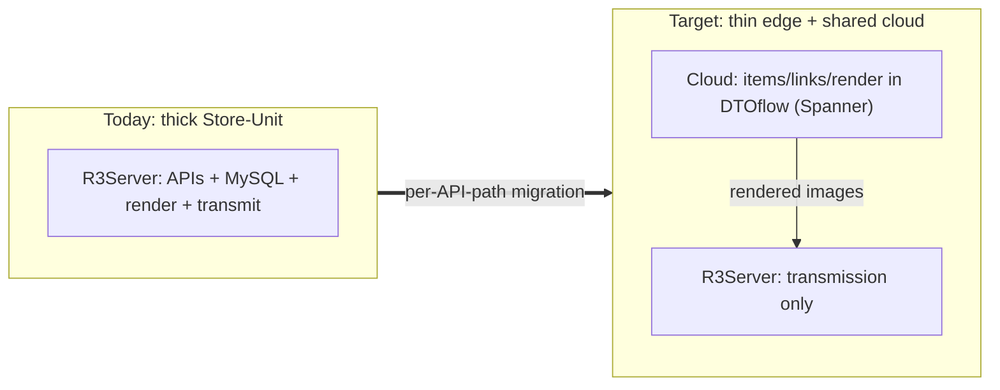
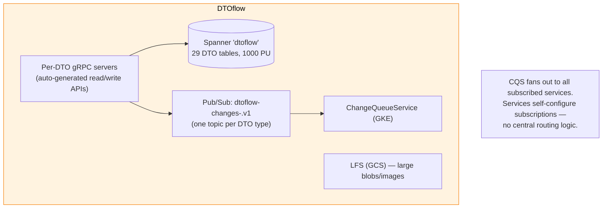
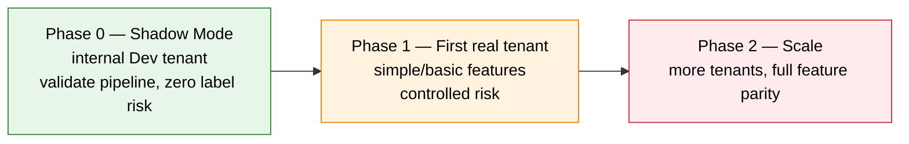
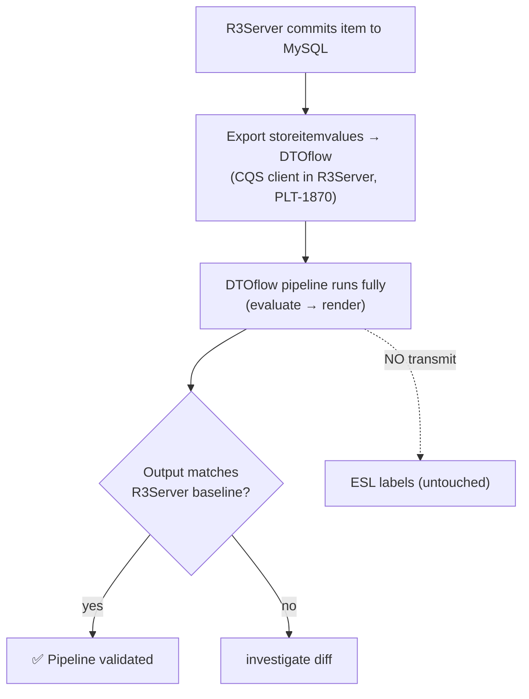
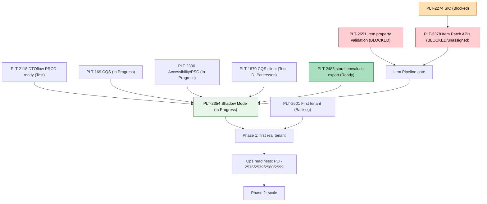

# 03 — Replatforming: Deep Dive

> **Scope:** What Replatforming is and why, the **DTOflow** platform it's built on, the **phase model**, **Shadow Mode**, the **live epic backlog** (pulled from Jira 2026-06-17, with 2026-06-23 updates), and the critical blocker. The *target architecture* itself is in [doc 04](04-target-architecture.md).
>
> **Validated:** 2026-06-17 against live Jira (`project = PLT`), Confluence (Replatforming space), and GCP `platform-dev-p01`. **2026-06-30:** Jira epic statuses refreshed — see §5 for live status.
>


---

## 1. What Replatforming is

**Replatforming = moving the data, APIs and rendering off each per‑store Pricer Server (R3Server) and into a shared, multi‑tenant cloud platform (DTOflow), while keeping the real‑time radio transmission on R3Server at the edge.**

It is **not** a big‑bang rewrite. It is a **per‑API‑path migration**: one API surface at a time is re‑pointed from R3Server to a cloud service, validated, and cut over. R3Server is progressively "thinned" — it loses its database and most APIs, retaining only what must be physically near the labels.



### Why (the motivation)

| Problem today | What the cloud platform gives |
|---------------|-------------------------------|
| One MySQL **per store** → no cross‑store/tenant view, hard to aggregate | One shared **Spanner**, multi‑tenant by key prefix |
| Rendering engine copied into **every** Store‑Unit → CPU cost ×N | Centralized `studio-renderer` / `ecc-renderer` on Cloud Run |
| Thousands of independently reachable store endpoints to secure | One **Apigee** front door |
| Scaling = more pods; ops burden grows with store count | Serverless Cloud Run + managed Spanner |
| Cost (an active **cost‑saving initiative**, ref PD‑5778 in the weekly notes) | Fewer always‑on edge resources |

---

## 2. DTOflow — the cloud data backbone

DTOflow is the heart of the target platform: a standardized way for services to **publish, store, and react to** data as typed **DTOs**, instead of bespoke point‑to‑point integrations.



**Building blocks (live in `platform-dev-p01`, 2026-06-17, with 2026-06-23 updates):**
- **Spanner** instance `dtoflow` (1000 PU) — databases `dtoflow` (29 DTO tables, DDL verified live) + `item-registry`. Every row keyed `t/{tenantId}/s/{storeId}/{dtoType}/{id}` (see [doc 02 §5](02-tenant-model.md#5-how-isolation-works-in-the-target-dtoflow)).
- **Pub/Sub** — **32 topics** (updated from 23: 20 `dtoflow-changes-<dto>.v1`, `link.v2`, DLQ, sync job, `item-registry-requests`).
- **gRPC client libraries** — auto‑generated read/write clients (`evo-dtoflow-grpc-clients-java`, `evo-dtoflow-grpc-clients-node`) so any service can talk to DTOflow type‑safely.
- **ChangeQueueService (CQS)** — runs on the GKE `platform` cluster; a subscription-based fan-out layer that delivers change events to whichever services subscribed to each DTO type (epic **PLT‑169**, In Progress). CQS has no routing logic of its own.
- **LFS** (`dtoflow-lfs`) — GCS‑backed large file storage for images/blobs.

**Cloud Run services around DTOflow** (21 total, plus 3 new since last validation): item path (`item-registry-api`, `item-registry`), links (`link-registry`, `link-bfg`, `link-storeasset-bfg`), studio/rendering (`studio-renderer`, `studio-link-evaluator`, `studio-design-library`, `studio-scenario-library`, `ecc-renderer`, `ecc-link-projector`, `esl-image-merger`), edge bridge (`dtoflow-transmission`), actions (`actions-executor`, `actions-library`), delivery/ops (`delivery-sync-service`, `delivery-dashboard`, `dtoflow-changequeue-dashboard`, `migration-helper`), plus `dtoflow-spanner`/`dtoflow-lfs`.

### The DTO event flow (item update → label)

```mermaid
sequenceDiagram
    participant SRC as Item source (R3Server shadow / cloud API)
    participant IR as item-registry(-api)
    participant SP as Spanner (storeitemvalues)
    participant PS as Pub/Sub (changes)
    participant SLE as studio-link-evaluator
    participant SR as studio-renderer
    participant R3 as R3Server (edge)
    participant ESL as ESL

    SRC->>IR: write item value
    IR->>SP: persist storeitemvalues DTO
    IR->>PS: emit dtoflow-changes-storeitemvalues.v1
    Note over PS,SLE: Fan-out to all subscribers in parallel
    par Evaluator Path
        PS-->>SLE: storeitemvalues notification
        SLE->>SLE: re-evaluate CEL rules; if changed, write studiolink
    and Renderer Path
        PS-->>SR: storeitemvalues notification
        SR->>SR: render with current studiolink + new item values
        SR->>SP: write renderedimage DTO
        SR->>PS: emit dtoflow-changes-renderedimage.v1
    end
    Note over R3,ESL: In Shadow Mode, R3→ESL transmit is SKIPPED
    R3->>ESL: IR/RF transmit (production only)
```

In **Shadow Mode** every step runs **except** the last `R3 → ESL` transmit — that's the whole point (validate without touching labels).

---

## 3. The phase model



| Phase | Goal | Gate |
|-------|------|------|
| **Phase 0** | Prove the cloud pipeline end‑to‑end with the `Replatforming-Dev` tenant in Shadow Mode | **PLT‑2354** Shadow Mode demo works |
| **Phase 1** | First *real* tenant live on the cloud path for basic features | **PLT‑2601** first‑tenant selection + that tenant's feature set migrated |
| **Phase 2** | Broaden features (timed updates, GeoPos, segment labels, PFI, webhooks, subscriptions) and onboard more tenants | Operational readiness (load test, monitoring, DR, runbooks) |

**Current status (2026-06-30):** Shadow Mode is now **In Progress** (PLT-2354, Daniel Pettersson). The storeitemvalues export data pipe (PLT-2483) is **Ready for Deploy** (Johan Ekman). The CQS client in R3Server (PLT-1870) is in **Test** (Daniel Pettersson). PSC setup for Cloud Run continues (PLT-2336).

---

## 4. Shadow Mode (the Phase‑0 gate)

**Definition:** R3Server starts exporting its item data to DTOflow in real time, so the cloud pipeline processes it in parallel — **without** affecting the store's labels.

From **PLT‑2354** (Acceptance Criteria, live): *"Every time an item update gets committed to the database, make sure that within a reasonable amount of time it also gets published to DTOflow as `storeitemvalues` — ideally batch‑wise and without significantly loading the database by expensive polling."* The challenge is the **efficient export mechanism** (DB → cloud), not comparison logic.



**Prerequisite layers:**
1. **Foundation** — DTOflow prod‑ready (PLT‑2118, *Test*), CQS (PLT‑169, *In Progress*), Spanner + Pub/Sub (live), broader accessibility/PSC (PLT‑2336, *In Progress*).
2. **R3Server side** — `storeitemvalues` export + the **CQS client in R3Server** (PLT‑1870), link export, and the **item Patch APIs** in the cloud (PLT‑2378 — see below).
3. **Validation** — deploy a store in Dev, enable shadow, compare outputs.

---

## 5. The live epic backlog (PLT, refreshed 2026-06-30)

> **Updated (2026-06-30):** Live Jira query of all 15 critical epics. Key changes since 2026-06-23: PLT-2354 moved to **In Progress**, PLT-2483 is now **Ready for Deploy** (Johan Ekman), PLT-1870 is in **Test** (Daniel Pettersson), PLT-2601 slipped to **Backlog**. PLT-2651 (item property validation) identified as the single clearest gate on item-driven migration.

### 🔴 Blockers / critical
| Epic | Summary | Status | Assignee |
|------|---------|--------|----------|
| **PLT‑2651** | **Item property validation** | **Blocked** | **Unassigned** |
| **PLT‑2378** | **Support for Item Patch APIs — Core** | **Blocked** | **Unassigned** |
| **PLT‑2274** | SIC support | **Blocked** | Daniel Pettersson |

> **PLT‑2651 is the single clearest gate on item-driven migration.** 4 of 5 item pipeline services are built, but item writes don't validate properties end-to-end, blocking all item-driven flows. **PLT‑2378** remains critical — its description enumerates the exact item surfaces being migrated (R3Server `PATCH/DELETE /api/public/core/v1/items[/{id}]`, `items-result/{requestId}`, Central‑Manager `PATCH/DELETE /api/public/multi-store/v2/multi-store-requests/items[.csv]`). **Both** Plaza Mobile and Central‑Manager depend on it, and it is **Blocked and Unassigned**. Assigning an owner is the most leveraged action a new lead can take. **PLT‑2274 (SIC)** lets items be found by the customer's own code and is blocked behind PLT-2378.

### 🟡 In motion (Phase‑0 critical path)
| Epic | Summary | Status | Assignee |
|------|---------|--------|----------|
| PLT‑2354 | Pricer Server & Replatforming **Shadow Mode** | **In Progress** | Daniel Pettersson |
| PLT‑2118 | Make DTOflow **PROD‑ready** for Task & Scenario | Test | Bart De Boer |
| PLT‑169 | DTOflow — **ChangeQueueService** | In Progress | Johan Ekman |
| PLT‑2336 | Make DTOflow **more broadly accessible** (PSC) | In Progress | Sreekanth S. Uppara |
| PLT‑2101 | **API request routing** (per‑API path) | Selected for Dev | Saikiran Katta |
| PLT‑171 | 'correct' SLA & trackingId support in all services | Selected for Dev | Unassigned |
| PLT‑2478 | **PS ↔ CQS/DTOflow design** | In Progress | Sreekanth S. Uppara |
| PLT‑2792 | **Services own CQS queues** | In Progress | Bart De Boer |
| PLT‑2484 | **Link v1 DTO refactor** | In Progress | Bart De Boer |

### 🟡 In Test / Ready for Deploy
| Epic | Summary | Status | Assignee |
|------|---------|--------|----------|
| PLT‑2483 | storeitemvalues export (Shadow Mode data pipe) | **Ready for Deploy** | Johan Ekman |
| PLT‑1870 | CQS client in R3Server | **Test** | Daniel Pettersson |

### Phase‑1 feature epics (all Backlog) — examples
PLT‑2355 Label Status APIs (Bart) · PLT‑2356 Item Flash APIs · PLT‑2357/2358 Linked‑Item APIs · PLT‑2359 ECC Links & Rendering · PLT‑2360 Unified Linking API · PLT‑2363 Auto‑Unlink · PLT‑2361 Segment Labels · PLT‑2353 Pricer Server config export · PLT‑2350/2351/2352 Item ingest/timed updates · operational readiness PLT‑2576 (load), PLT‑2579 (monitoring), PLT‑2580 (DR), PLT‑2581 (runbooks), PLT‑2599 (cutover/rollback), PLT‑2600 (studio prod‑readiness), PLT‑2578 (tenant isolation), PLT‑2572/2575 (store onboarding/bootstrapping), PLT‑2601 (**first tenant selection — Backlog**, Cristian Deaconeasa).

### Phase‑2 epics (Backlog)
PLT‑2436 Item/Link via PFI · PLT‑2350 timed updates · PLT‑2362 GeoPos · PLT‑2440 webhooks · PLT‑2428 subscription/license · PLT‑2427 configuration management · PLT‑170 DTOflow write protection · PLT‑2369 autoscaling.

### Recently closed (scope settled)
PLT‑2294 (id/alias validation), PLT‑2598 (initial bulk item load), PLT‑2577 (ESL registration in cloud), PLT‑2574 (transmission service integration), PLT‑2573 (ECC sync push). **6 closed total.** Note some closures are scope‑outs, not completions — re‑read them before assuming a capability exists.

> **Refresh anytime** with the JQL in [README → Live data sources](README.md#live-data-sources-how-to-refresh-these-docs). The backlog is actively re‑labeled, so always trust live Jira over any table.

---

## 6. Epic dependency picture



---

## 7. Risks a new lead should track

| Risk | Why it matters | Action |
|------|----------------|--------|
| **PLT‑2651 — Item property validation Blocked** | Gates the Item Pipeline itself — 4 of 5 services built, can't validate properties end-to-end | Unblock; this is the single clearest gate |
| **PLT‑2378 Blocked + Unassigned** | Gates both consumer item paths and Shadow‑Mode completeness | Assign an owner; clear the block first |
| **PLT‑2601 slipped to Backlog** | Phase‑1 scope can't be finalized without it; was Selected for Dev, now Backlog | Drive criteria → decision |
| **Tenant isolation is now software‑enforced** | A missing `t/{tenantId}` check = cross‑tenant data leak | Prioritize PLT‑2578; add tests |
| **Shadow Mode sub-tasks unassigned** | 5 sub-tasks (PLT-2494, 2495, 2492, 2488, 2714) need owners | Assign before next sprint |
| **Review bottleneck** | 6+ items waiting for Johan Ekman's review | Distribute review load |
| **Saikiran vacation** | API routing (PLT-2101) not started, Saikiran on vacation this week | Complete hand-over planning |
| **Apigee/prod + ops readiness still Backlog** | Cutover (PLT‑2599), monitoring (PLT‑2579), DR (PLT‑2580) not started | Sequence before any real‑tenant cutover |
| **Bus factor** | A few names (Bart, Daniel, Johan, Sreekanth) own most critical epics | Spread ownership; document |

---

### Next: [04 — Target Architecture →](04-target-architecture.md) · [08 — Delta Report](08-replatforming-delta-report.md)