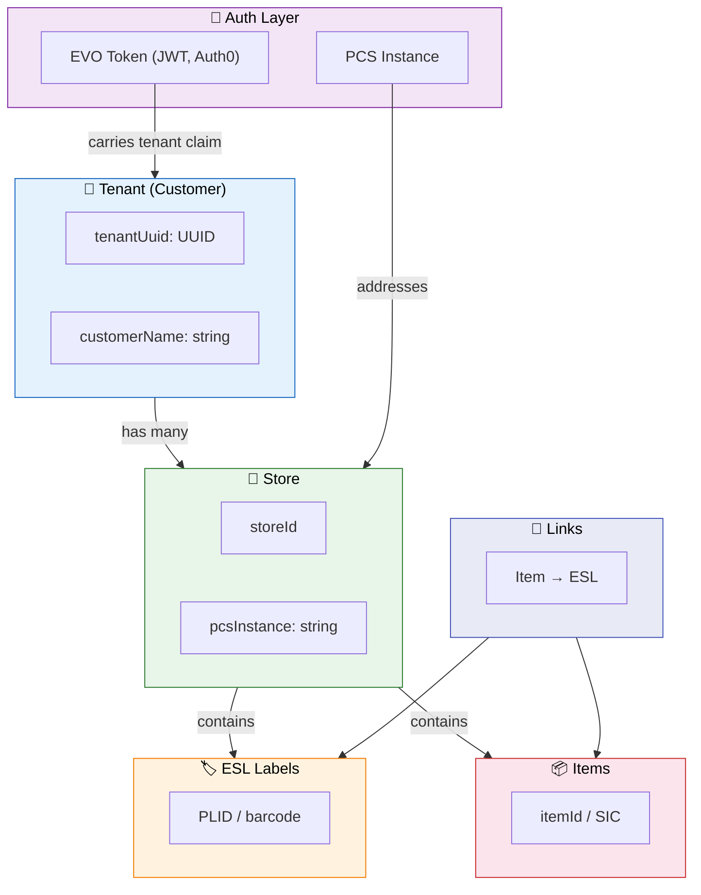
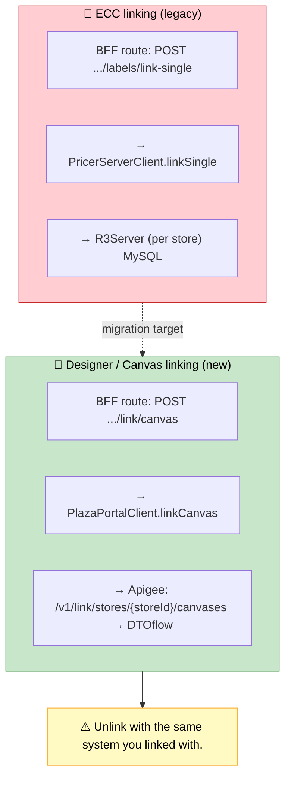
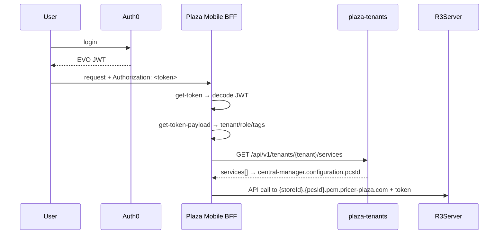
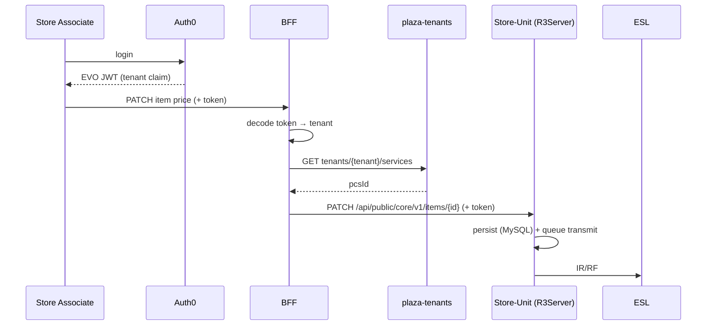
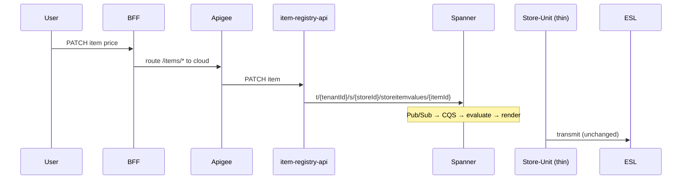

# 05 — Core Concepts Deep Dive: Link · Tenant · EVO Token · PCS Instance

> **Scope:** Four cross-cutting concepts in the Pricer platform — what each is, how it's implemented **in code**, how they relate, and how Replatforming changes them.
>
> **Validated:** 2026-06-17 against repo code, live GCP Spanner DDL (`platform-dev-p01`), and live Jira. **No personal Confluence pages were used.** Builds on [02 — Tenant Model](02-tenant-model.md).
>
> **Accuracy note — this is a corrected version** of the earlier `Core-Concepts-Deep-Dive.md` draft. Corrections made after code verification: the `customerName` line number, the helm domain (`pcm.pricer-plaza.com`, **not** `pricer-cloud.com`), the EVO-token middleware (takes a `JwtDecoder` and **decodes** — it does not validate), the PCS-id resolution (reads the `central manager` service's `configuration.pcsId`, cached), the Designer-link client (`PlazaPortalClient`, not an `apigeeClient`), and the EVO claim key (namespaced URI). Each is flagged inline with ✅ *verified* / ✏️ *corrected*.

---

## 1. The big picture: how these concepts fit together



---

## 2. Tenant

### 2.1 What it is
A **tenant** is a Pricer customer — a retail chain. Every piece of data is scoped to a tenant; tenants are isolated from one another. (Full treatment in [02 — Tenant Model](02-tenant-model.md).)

### 2.2 Where tenants live (in code) ✏️ *corrected*
**Central-Manager** — [`CentralManagerProperties.java`](../../chain-management-centralization/central-manager/src/main/java/se/pricer/centralmanager/CentralManagerProperties.java):
```java
private String tenantUuid;    // line 96  — UUID identifying this PCS tenant
private String customerName;  // line 124 — human-readable name (e.g. "Coop")
```
> ✏️ The earlier draft put both fields on line 96; `customerName` is actually line 124.

**Helm** — [`helm/pricer-central-solution/values.yaml`](../../chain-management-centralization/helm/pricer-central-solution/values.yaml):
```yaml
tenantUuid:        # line 6  (set per deployment)
customerName:      # line 9
# Store-Unit hostnames resolve under the PCS parent domain, e.g.:
#   <store>.<pcsInstance>.pcm.pricer-plaza.com
# Auth0/EVO domain: auth.iam.pricer-plaza.com
```
> ✏️ The earlier draft showed `domain: {YOUR-NAME}.dev.pricer-cloud.com`. There is **no `pricer-cloud.com`** — the real parent domain is **`pcm.pricer-plaza.com`** (verified in the helm test values, e.g. `pcs-nightly.pcm.pricer-plaza.com`, and in the BFF URL builder, see §5).

### 2.3 How tenant id is used today (PCS) ✅
| Location | Use |
|----------|-----|
| Central-Manager MySQL | tenant scoping for stores/users |
| Store-Host | scopes Store-Unit K8s deployments (Helm `tenantUuid` injected into `store-unit-deployment.yaml`) |
| R3Server (Store-Unit) | each Store-Unit serves one tenant's store |
| EVO Tenant Service | resolves tenant → services (incl. the PCS instance — see §5) |

### 2.4 How tenant id will be used (DTOflow target) ✅
The tenant UUID becomes the first segment of every DTO id:
```
t/{tenantId}/s/{storeId}/{dtoType}/{id}
```
Isolation moves from *physical separation* (per-store DB) to a *row-key prefix* in shared Spanner. See [02 §5](02-tenant-model.md#5-how-isolation-works-in-the-target-dtoflow).

### 2.5 Tenant security isolation (PLT-2578) ✅ *live Jira*
Epic **PLT-2578 "Tenant Security Isolation Validation"** (Backlog, 2026-06-17) exists to prove tenant A cannot read tenant B's DTOs — i.e. that the `t/{tenantId}/` prefix is enforced in software on every read/write. With shared Spanner this is now a **software-enforced** boundary, so it is a top security concern, not a given.

---

## 3. Link

### 3.1 What it is
A **link** connects an item (product) to an ESL label: *"which product is shown on this label?"*

### 3.2 Link tables in Spanner ✅ *verified live (gcloud DDL)*
The `dtoflow` database has these link-related tables (confirmed in the live DDL): `link`, `ecclink`, `designerlink`, `studiolink`, `storeesl` (the ESL must be known before it can be linked). The generic `link` DTO row:
```sql
CREATE TABLE link (
  dto_type STRING(MAX) NOT NULL,
  id       STRING(MAX) NOT NULL,   -- t/{tenantId}/s/{storeId}/link/{...}
  DATA     BYTES(MAX),             -- protobuf-serialized payload
  checksum INT64,                  -- change/idempotency detection
) PRIMARY KEY(dto_type, id);
```
> ✅ This DDL matches the live Spanner schema exactly. Every DTO table in `dtoflow` follows the same `(dto_type, id) + DATA + checksum` shape.
> ⚠️ Which flow writes which table (ECC vs Designer vs Studio) is an interpretation — treat the per-table "owner" as approximate; the table set itself is verified.

### 3.3 The two linking systems ✅


### 3.4 Link flow (end-to-end, DTOflow) ✅ *service names verified live*
> ✏️ Re-grounded from code/live GCP (the earlier draft attributed this to a Confluence PoC page and named an "ECC Sync Service" that doesn't exist as a Cloud Run service).
```
1. Item is patched → item-registry(-api) writes storeitemvalues DTO to Spanner
2. Link write → link / designerlink DTO (+ storeesl) to DTOflow
3. Pub/Sub emits dtoflow-changes-link.v1
4. Pub/Sub emits dtoflow-changes-link.v1; CQS delivers to subscribed services (studio-link-evaluator or ecc-link-projector for ECC)
5. Renderer (studio-renderer / ecc-renderer) loads link + design + item → renders
6. Writes renderedimage DTO; emits dtoflow-changes-renderedimage.v1
7. dtoflow-transmission picks up renderedimage + storeesl
8. Delivers image to R3Server → basestation → ESL
```
(Cloud Run services `item-registry-api`, `link-registry`, `studio-link-evaluator`, `ecc-link-projector`, `studio-renderer`, `ecc-renderer`, `dtoflow-transmission` are all live in `platform-dev-p01`.)

### 3.5 From the Plaza Mobile BFF code ✏️ *corrected*
```typescript
// ECC linking — via PricerServerClient → R3Server  (labels-service.ts)
this.client.linkSingle(evoToken, pcsInstance, storeId, payload)
//   client: PricerServerClient
//   → POST https://{storeId}.{pcsInstance}.pcm.pricer-plaza.com/api/public/core/v1/labels/link-single

// Designer/Canvas linking — via PlazaPortalClient  (link-service.ts)
this.ppClient.linkCanvas(evoToken, storeId, payload)
//   ppClient: PlazaPortalClient   (NOT a separate "apigeeClient")
//   → POST ${PLAZA_APIGEE_URL}/v1/link/stores/{storeId}/canvases   (axios-plaza-portal-client.ts)
```
> ✏️ The earlier draft called this `this.apigeeClient.linkCanvas(...)`. The method lives on **`PlazaPortalClient`** (`ppClient`), which for canvas/designer operations targets the Apigee URL (`PLAZA_APIGEE_URL`). The endpoint path `/v1/link/stores/{storeId}/canvases` is correct; the BFF's own route is `POST .../link/canvas`.

---

## 4. EVO Token

### 4.1 What it is ✅
A **JWT issued by Auth0** (the EVO auth platform) that authenticates a user and carries identity, tenant, role and tags.

### 4.2 Flow


### 4.3 Middleware (verified from source) ✏️ *corrected*
[`get-token.ts`](../../plaza-mobile-ui-backend/src/core/koa-middlewares/get-token.ts):
```typescript
export const makeGetEvoTokenMiddleware = (jwtDecoder: JwtDecoder) => { /* ... */
  const token = headers.authorization ?? (headers.Authorization as string);
  const decodedToken = jwtDecoder.decode(token);     // DECODES (does not validate)
  ctx.state.evo = { ...ctx.state.evo, evoToken: token, decodedEvoToken: decodedToken };
};
```
> ✏️ The earlier draft showed `makeGetEvoTokenMiddleware(jwtSecret)` and said it "decodes **and validates**". It actually takes a **`JwtDecoder`** and only **decodes**; signature validation is the responsibility of downstream services (R3Server / EVO APIs).

[`get-token-payload.ts`](../../plaza-mobile-ui-backend/src/core/koa-middlewares/get-token-payload.ts):
```typescript
enum TokenPayload { TENANT = "https://pricer.com/tenant", ROLE = "...", TAGS = "..." }
ctx.state.evo.tenant = decodedEvoToken[TokenPayload.TENANT];
ctx.state.evo.role   = decodedEvoToken[TokenPayload.ROLE];
ctx.state.evo.tags   = decodedEvoToken[TokenPayload.TAGS];
```

[`get-pcs-id.ts`](../../plaza-mobile-ui-backend/src/core/koa-middlewares/get-pcs-id.ts):
```typescript
const tenantServicesData = await plazaPortalClient.getTenantServices(evoToken, tenant);
const cm = tenantServicesData.services.find(s => s.type === "central manager");
const pcsId = cm?.configuration?.pcsId;          // resolved from the CM service entry
cache.set(`pcs-id-${tenant}`, pcsId);            // cached per tenant
ctx.state.pcs.pcsInstance = pcsId;
```
> ✏️ The earlier draft implied `services.pcsId` directly. It actually finds the service whose `type === "central manager"` and reads `configuration.pcsId`, with per-tenant caching.

### 4.4 What the token contains ✏️ *corrected (claim keys are namespaced URIs)*
| Claim (key) | Example | Purpose |
|-------------|---------|---------|
| `sub` | `auth0\|user123` | user identity |
| `https://pricer.com/tenant` | `cb5ebe26-…` | **tenant UUID** (`TokenPayload.TENANT`) |
| role claim | `store-manager` | RBAC (`TokenPayload.ROLE`) |
| tags claim | `["store-1","store-2"]` | store-level access (`TokenPayload.TAGS`) |
| `exp` | `1718600000` | expiry |
> ✏️ Claims are **namespaced custom claims** (e.g. `https://pricer.com/tenant`), not bare `tenant`/`role`/`tags`. The exact role/tags URIs are defined in the `TokenPayload` enum.

### 4.5 Token validation in Central-Manager ✅ *verified (controllers exist)*
- [`WebAuthenticationController`](../../chain-management-centralization/central-manager/src/main/java/se/pricer/centralmanager/api/priv/web/auth/controller/WebAuthenticationController.java) — web login/JWT
- [`ApiOpenPrivateAuth0V1Controller`](../../chain-management-centralization/central-manager/src/main/java/se/pricer/centralmanager/api/open/priv/auth0/v1/ApiOpenPrivateAuth0V1Controller.java) — Auth0 integration (also a `v2`)
- [`ApiInternalCentralV2EvoTokenController`](../../chain-management-centralization/central-manager/src/main/java/se/pricer/centralmanager/api/internal/central/v2/ApiInternalCentralV2EvoTokenController.java) — EVO token endpoints

For **service-to-service** auth (no human token), CM uses an M2M token — see [07 — M2M Token Manager](07-m2m-token-manager-deep-dive.md).

---

## 5. PCS Instance

### 5.1 What it is ✅ *PCS = "Pricer Central Solution"*
A **PCS instance** identifies a specific **Pricer Central Solution** deployment that serves a tenant's stores. It is the bridge between the EVO cloud layer and the PCS Store-Units.
> ✅ "PCS = Pricer Central Solution" is confirmed in code: the CM i18n string `systemPage.centralManagerVersionName=Pricer Central Solution Version:` and the helm chart name/README (`pricer-central-solution`). (Watch out: some informal docs expand PCS as "Pricer Cloud Solution" — the codebase uses **Central**.)

### 5.2 How it's resolved ✅
```mermaid
flowchart LR
    BFF["BFF get-pcs-id"] -->|GET /api/v1/tenants/{tenant}/services| TS["plaza-tenants"]
    TS -->|services[type='central manager'].configuration.pcsId| BFF
    BFF -->|build URL| R3["https://{storeId}.{pcsInstance}.pcm.pricer-plaza.com"]
```

### 5.3 In code ✅ *verified*
[`axios-pricer-server-client.ts`](../../plaza-mobile-ui-backend/src/common/axios-pricer-server-client.ts):
```typescript
getPricerServerUrl(pcsInstance, storeId) =>
  `https://${storeId}.${pcsInstance}.pcm.pricer-plaza.com`   // (line 559)
// e.g. GET ${psUrl}/api/public/core/v1/items/${itemId}?projection=...
```

### 5.4 PCS instance vs tenant ✅
| Concept | What | Example |
|---------|------|---------|
| Tenant UUID | the customer (chain) | `cb5ebe26-…` |
| PCS instance | the PCS deployment serving that tenant | a `pcsId` string from the tenant's `central manager` service config |
Today the relationship is effectively **1 tenant → 1 PCS instance**. In the DTOflow target it becomes **many tenants → one shared Spanner** (row-key isolation), so the PCS-instance addressing matters less for cloud-served APIs (but remains for the edge Store-Units).

---

## 6. How everything connects

### Today


### DTOflow target


---

## 7. Summary

| Concept | What | Where it lives | Replatforming change |
|---------|------|----------------|----------------------|
| **Tenant** | retail customer (chain) | CM MySQL, EVO Tenant Service, DTOflow row keys | becomes prefix `t/{uuid}/s/{store}/…` |
| **Link** | item↔ESL connection | R3Server MySQL today; Spanner `link`/`designerlink` target | moves to shared Spanner; ECC→Designer |
| **EVO Token** | Auth0 JWT for a user | Auth0 → BFF → downstream | unchanged (already cloud) |
| **PCS Instance** | a Pricer **Central** Solution deployment | resolved via Tenant Service `services[].configuration.pcsId` | less relevant for cloud APIs; still addresses edge Store-Units |

---

### Related: [02 Tenant](02-tenant-model.md) · [04 Target Architecture](04-target-architecture.md) · [07 M2M Token Manager](07-m2m-token-manager-deep-dive.md)
