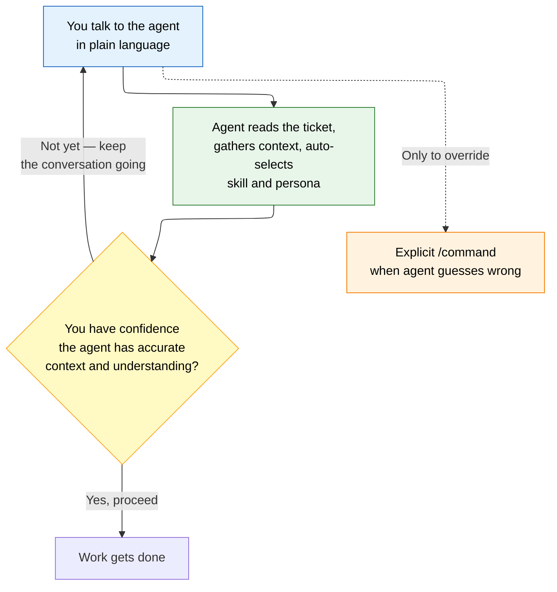
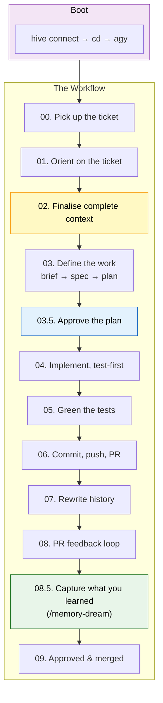
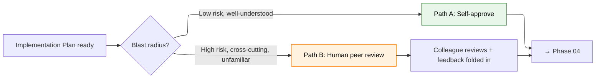
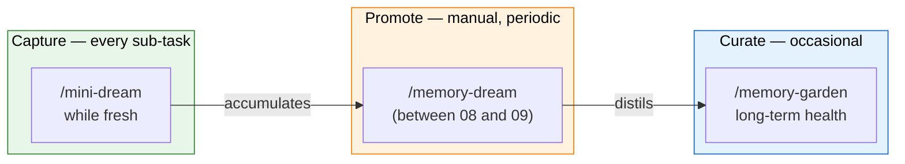
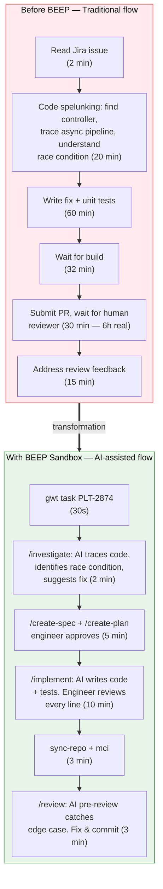

#06 — Beep Sandbox: The AI Development Workflow

> **Purpose:** A developers map of how we build with agents in the sandbox. You talk to the agent in plain language — *"read PLT-1234 and tell me what we're doing"* — and the agent reads the ticket, gathers context, and figures out which skill or persona to use. This guide explains both layers so you know the vocabulary and know when to take the wheel.
>
> **Engine:** Claude Code (`cc`) or Antigravity (`agy`) — identical skills on either.
>
> *"Talk first. The skills fire underneath."*

---

## Core philosophy



> **Rule of thumb:** Lead with conversation. Reach for the explicit `/command` only when you want to force a stage, the agent skipped one, or you're still learning the map.
>
> **Key distinction:** You don't describe the ticket to the agent — you *instruct* it to go read the ticket itself. The agent fetches it from Jira, indexes the context, and picks the right approach. This is conversation, not dictation.
>
> **The conversation is an iterative loop, not a one-shot.** If the agent's initial understanding isn't good enough, you keep talking — offer more details, point it to a related ticket, share a Confluence page, ask it to re-analyse. You only proceed when *you* have confidence the agent has accurate context and understanding.

---

## Two layers, one conversation

| Layer | What it is | How you interact |
|-------|-----------|------------------|
| **The conversation** *(the layer you live in)* | You talk to the agent in plain language. *"Read PLT-1234 and tell me what we're doing."* The agent reads the ticket, gathers context, and figures out which skills or personas to invoke. If its understanding isn't accurate, you refine — you point to related tickets, share Confluence pages, clarify. You almost never type a slash-command directly. | Natural language with the agent, iteratively until you're confident |
| **The skills & personas** *(what happens underneath)* | Every stage below maps to a concrete skill and a persona. The agent picks the right one based on your conversation. We name them here so you can learn the map, and force a stage by hand with a `/command` when the agent guesses wrong. | Agent auto-selects; you use `/command` only to override |

---

## The engineer day at a glance

The normal flow is simple: connect to the sandbox, start or resume a task, sync and build from the fast volume, implement in small steps, use skills for planning and review, persist useful knowledge, then clean up worktrees at the end of the day.

| ☀️ **Morning** |       | 📋 **Task Start** |
|-----------------|-------|-------------------|
| `hive-connect` |       | `gwt task PLT-XXXX` |
| `cd <repo>` |       | 🔄 **Daily Loop** |
| `agy` |       | `sync-repo` → build → code → test → commit |

| 📐 **Strategy-first** |       | 🧠 **Knowledge + Cleanup** |
|------------------------|-------|----------------------------|
| `/create-spec` |       | `mini-dream` / `/memory-dream` |
| `/create-plan` |       | commit `.ai-memory/` |
| `/implement` |       | `gclean` |
| `/review` |       |       |

---

## What the BEEP Sandbox is and why it matters

| Layer | Repo | Purpose |
|-------|------|---------|
| **Sandbox** | `beep-gemini-sandbox` (v7.11.0) | Docker container where AI agents and engineers work, isolated from the host machine. Provides credentials broker, `sandbox-guard` safety, and fast rsync-to-volume builds. |
| **Scaffold** | `beep-dot-ai-root` (v0.5.0) | Provides 27 skills, 11 personas, and roughly 30 rules. Enforces a strategy-first workflow: no code before an approved plan. |

> **Tip — Why engineers use it:** Isolation from the host, faster builds, brokered access to Jira/Confluence/GCP, persistent containers, and a design-then-plan-then-implement workflow that is easier to supervise and scale.

- **Isolation** — work happens inside a container, not directly on the host. `sandbox-guard` blocks risky actions such as `git push --force`, shell substitutions, and destructive repository deletion patterns.
- **Speed** — builds run from `/workspace/.build/<repo>/` after rsync from the bind mount. For large Maven repositories, build time can drop from about 32 minutes to about 3 minutes.
- **Credentials broker** — Jira, Confluence, and GCP access are brokered through the sandbox, so agents do not need raw API keys stored on disk.
- **Persistence** — the container stays up between sessions, so there is no daily rebuild requirement.
- **Strategy-first execution** — engineers can use the scaffold's skills and personas to structure work before implementation starts.

---

## One-time setup

On a fresh machine or fresh clone, add the sandbox `bin/` directory to your PATH, then start the sandbox container.

```bash
# 1. Add the sandbox bin/ directory to your PATH
#    This lets you run hive-* commands from anywhere.
#    In the sandbox repo root:
echo "export PATH=\"$(pwd)/bin:\$PATH\"" >> ~/.zshrc
source ~/.zshrc

# 2. Start the sandbox container
cd beep-gemini-sandbox
./setup.sh
hive-up
```

> **After setup:** day-to-day entry is usually just `hive connect`.

---

## Before the conversation: boot sequence

It starts in your terminal — connect to the hive, move into the project, launch the engine. Everything after that is conversation.

```bash
hive connect              # join the sandbox hive
cd projects/<project>     # into the repo you're working in
agy                       # launch the agent  ·  or  cc  for Claude Code
```

- `hive connect` waits for the container to be running and for the initialization marker `/tmp/.hive-init-complete`, then runs `docker exec -it -u sandbox beep-agent bash -li`.
- `agy` launches the Antigravity CLI, the primary Go-based agent engine. Settings live in `~/.antigravity/settings.json`. `gemini` still exists as a fallback.
- **Persistent container** — no daily rebuild is expected.

> **Note:** Two phases double as Jira state changes — shown here for a **TODO → In Progress → Code Review** board. Boards differ per team; the agent reads the live transitions for the ticket rather than hard-coding any IDs.

---

## The development workflow: 00 → 09



---

### 00 — Pick up the ticket

With the agent running, start work on the ticket and branch off fresh `main` — never work on it directly.

Three ways to start — pick the phrasing that fits you, or just say what comes naturally. The agent understands the intent.

```
› "Have a look at PLT-1234"
› "Start work on PLT-1234 for me"
› "I need to pick up PLT-1234"
```

**Agent runs:** `/start-issue` · `/jira-workflow` · `new-branch` · `jira-proxy do-transition`

| Ticket state | Before | After |
|-------------|--------|-------|
| Jira | TODO | → In Progress |

---

### 01 — Orient on the ticket

Point at the ticket and ask the agent to index and understand — not act yet.

```
› "Read the ticket and tell me what we're doing — don't touch anything yet"
› "Give me a quick overview of PLT-1234"
› "Summarise what this ticket is about"
```

**Agent runs:** `jira-proxy get-issue` · `/memory-recall` · `/ask`

If the agent's summary isn't accurate, keep the conversation going: *"read this related ticket too"*, *"check the Confluence design doc linked in the description"*, *"no, the scope is actually broader — here's what I mean"*.

---

### 02 — Finalise complete context

> **⛔ Gate — Context must be complete and agreed before a single document is written.**
> This is where beginners under-invest — and the whole plan inherits the gap.

Pull from every source until the picture is whole: indexed repos, Atlassian, and live GCP state.

```
› "Cross-check the Confluence design and the live deployment before we plan"
› "Read through all linked resources — I want the full picture"
› "Dig into this: related repos, docs, and what's running right now"
```

**Agent runs:** Atlassian (Jira · Confluence) · `/gcp-k8s-troubleshoot` · `/grill-with-docs` · `/grill-me`

This is the most iterative phase. You and the agent go back and forth until you're satisfied it has complete context. Don't rush it.

---

### 03 — Define the work: brief → spec → plan

Three escalating documents, each reviewed by the architect before the next begins. The output is an approved Implementation Plan.

```
› "Draft a brief, turn it into a spec, then break it into a phased plan — have the architect review each step"
› "Let's architect a solution — start with a brief and work up to a plan"
› "I need a spec and implementation plan for this"
```

**Agent runs:** `/create-spec` → `/create-plan` → `/review-doc`

**Personas:** `product-analyst` · `architect`

> **⛔ Hard stop.** The agent must pause and ask you about anything unclear before finalising — never let it paper over ambiguity.

---

### 03.5 — Approve the plan



| Path | When to use |
|------|-------------|
| **A — Self-approve** | The fast path for well-understood, contained work. You read and accept the plan yourself. |
| **B — Human peer review** | For higher-risk, cross-cutting, or unfamiliar work. Route the plan to a colleague, fold in feedback, then proceed. |

Both paths converge on Phase 04. Pick by blast radius and your own confidence.

---

### 04 — Implement, test-first

Design the tests before the implementation — TDD is mandatory. Define behaviour with a failing test, then build the plan phase by phase.

```
› "Design the test plan first, then implement phase 1"
› "Write tests first, then build it — TDD for phase 1"
› "Start implementing — tests before code"
```

**Agent runs:** `/design-tests` → `/implement`

**Personas:** `tester` · `security-reviewer` *(auto, on sensitive diffs)*

---

### 05 — Green the tests

Run the tests and fix until everything passes. Not done until the new tests and the full suite are green.

```
› "Run the tests and fix issues until they all pass"
› "Make sure everything is green"
› "Verify the build and run all tests"
```

**Agent runs:** `/verify` · `/coverage`

---

### 06 — Commit, push, PR

Approve the commit, push the branch, open the PR. Conventional Commits; `Closes #ID` in the body; push the explicit branch name.

```
› "Commit this, push, and open the PR"
› "I'm happy with it — push it up and open a PR"
› "Let's get this reviewed — open a PR"
```

**Agent runs:** `/changelog` · `/jira-workflow` · `jira-proxy do-transition`

| Ticket state | Before | After |
|-------------|--------|-------|
| Jira | In Progress | → Code Review |

---

### 07 — Rewrite history

After a while on a branch, clean the commits into logical, reviewable units. Verifies parity with the original tree.

```
› "Rewrite the history into clean logical commits"
› "Clean up the commit history before we merge"
› "Rebase and squash into meaningful commits"
```

**Agent runs:** `/rewrite-history`

> **Note:** Force-push is blocked in-sandbox — push a fresh branch, or have a human do the force-push externally.

---

### 08 — PR feedback loop

Have the agent read what others and the bots left, act on it, and re-request review. Always resolve the thread once the fix is committed.

```
› "Read the review comments, address them, then re-request review"
› "Check the PR feedback and work through it"
› "Go through the comments, fix what needs fixing, and re-request"
```

**Agent runs:** `/resolve-copilot-comments` · `/resolve-wiz-findings` · `/review-change`

---

### 08.5 — Capture what you learned

Before closing out, crystallise the key insight from this work. This feeds the memory cadence and makes future similar tasks faster for everyone.

```
› "Crystallise what we learned from this"
› "Save the key insights — I want to remember this next time"
› "Capture takeaways before we close out"
```

**Agent runs:** `/memory-dream`

---

### 09 — Approved & merged

PR reviewed and approved. Merge is Rebase Merge for linear history — and in-sandbox the human performs the merge. Then archive the plan and refresh documentation.

```
› "Archive the plan and refresh the docs"
› "Merge and close out — then archive"
› "Merge it, archive the plan, update the docs"
```

**Agent runs:** `/archive-plan` · `/refresh-docs` · `/mini-dream`

---

## Context window awareness — avoiding the "dumb zone"

As a session progresses, the agent's context window fills up. Past a certain point — roughly 50% of the configured limit — the agent enters what's known as the **"dumb zone"**: it starts forgetting earlier instructions, misinterpreting requests, or producing lower-quality output. This is not a bug; it's a fundamental property of how LLMs work.

### How the sandbox helps you monitor this

In the sandbox you can configure a context window limit. For a 1,000,000-token window, a recommended aggressive limit is **200,000 tokens**. The sandbox shows you how close you are to this limit with a color-coded indicator:

| Usage | Color | What it means |
|-------|-------|---------------|
| Below 50% | 🟢 Green | Safe zone — plenty of room |
| At 50% | 🟡 Yellow | Approaching the limit — start planning a restart |
| At 100% | 🔴 Red (flashing) | Critical — the agent is in the dumb zone |

### When you feel uncomfortable, restart cleanly

The workflow is a simple three-step cycle:

```
/handoff   →   /clear   →   /pickup
```

| Step | Command | What it does |
|------|---------|-------------|
| 1 | `/handoff` | Agent summarises the current session into a markdown file (`CURRENT_STATE.md`), runs `/mini-dream` to crystallise key insights, and saves everything so the next session can pick up seamlessly |
| 2 | `/clear` | Starts a fresh, empty agent session with a clean context window |
| 3 | `/pickup` | The new agent session orients itself — identifies which branch you're on, reads the `CURRENT_STATE.md` handoff document, re-establishes context, and confirms it's ready to continue |

> **Why this matters:** A 10-second restart cycle is far more productive than pushing deeper into the dumb zone. The `/handoff` document ensures zero context is lost. Make this part of your rhythm — especially after complex investigations, large code generations, or before the yellow zone.

---

## Once you trust the loop: the escape hatch

For low-risk, well-scoped work, the whole chain — brief → spec → plan → implement → verify → archive — collapses into one autonomous run. Mention it to beginners as the thing you *graduate* to, not the default you start with.

| Command | What it does |
|---------|-------------|
| `/beep-it` | Auto-approves the gates end-to-end |
| `/auto-implement` | Runs uninterrupted on edits and local commits — still blocked from push, PR, and Jira |

---

## Strategy-first workflow with skills

> **Default pattern:** `/create-spec` → `/create-plan` → `/implement` → `/review` → `/archive-plan`

The harness is not only a sandbox; it is also a structured AI work system. The intended model is to clarify the problem first, then plan, then implement, then review and archive. This reduces thrash and makes AI work easier to supervise.

### Core workflow skills

| Skill | Produces | Typical persona | When to use it |
|-------|----------|-----------------|----------------|
| `/create-spec` | Technical specification | `architect` | At the start of a meaningful change |
| `/create-plan` | Phased implementation plan | `architect` / `implementer` | Before coding begins |
| `/implement` | Code and tests | `implementer` | After plan approval |
| `/review` | General code review | `reviewer` | Before merge or handoff |
| `/review-change`, `/review-doc` | Focused review output | `reviewer` | For narrower validation |
| `/security-review` | Security assessment | `security-reviewer` | For auth, data isolation, or risky surfaces |
| `/design-tests` | Test plan | `tester` | Before implementation or before release |
| `/archive-plan`, `/resume-plan` | Plan lifecycle management | `implementer` | For pausing and resuming structured work |
| `/memory-recall`, `/memory-dream`, `/memory-remember`, `/memory-garden` | Knowledge capture and reuse | `librarian` | To preserve useful insight across sessions |
| `/manage-dependencies` | Dependency update guidance | `dependency-manager` | During dependency maintenance |
| `/prepare-release` | Release readiness output | `release-engineer` | Before shipping or coordinating release work |

**Other skills:** `analyze-video`, `ask`, `branch-cleanup`, `generate-barcodes`, `integrity-check`, `investigate`, `presentation-generator`, `refresh-docs`, `workspace-manager`.

**Personas (11):** `architect`, `auditor`, `dependency-manager`, `designer`, `implementer`, `librarian`, `product-analyst`, `release-engineer`, `reviewer`, `security-reviewer`, `tester`.

---

## Knowledge persistence

- `mini-dream` — quick crystallization after a sub-task.
- `/memory-dream` — fuller, skill-driven knowledge capture (between 08 and 09 in the workflow).
- `/memory-recall` — retrieve prior insight.
- `/memory-remember` — store knowledge.
- `/memory-garden` — maintain the memory store.

> **Best practice:** commit new `.ai-memory/*.md` files together with the related code. This keeps implementation context and learned insight in the same change history.

Source: `CLAUDE.md` §5 Memory & Protocols, §8 Orchestration, and `rules/global/04-memory-discipline.md`.

---

## External services: Jira, Confluence and GCP

The sandbox exposes common external systems through broker-backed commands and shims. These commands are intended to be used directly, without extra path prefixes.

```bash
jira PLT-2378                  # formatted human-readable summary
jira-proxy get-issue PLT-2378  # raw JSON (default for programmatic use)
confluence ...                 # Confluence fetch
```

- `jira-proxy` maps to `broker/jira-proxy.sh`.
- `confluence` maps to `broker/confluence-proxy.sh` through the global shim in `bin/confluence`.
- These are **global shims**, so no `bin/` prefix is needed.
- Per `CLAUDE.md` §7, a read-only Jira inquiry should run `jira-proxy get-issue <ID>` immediately and does not need to wait for planning or skill-search loops.
- GCP access flows through the sandbox credentials broker, giving agents access to Cloud Run, Spanner, Pub/Sub, and GKE metrics.

<details>
<summary>Outside the sandbox</summary>

When working outside the container, equivalent access typically comes from configured MCP servers or the standard `gcloud` and `gh` CLIs. The exact path depends on the host setup, but the important distinction is that the sandbox centralizes and brokers credentials for the agent environment.
</details>

---

## The memory cadence



| Cadence | Action | Skill | What it does |
|---------|--------|-------|-------------|
| **Every sub-task** | Capture | `/mini-dream` | Crystallise a technical insight the moment a sub-task lands. High frequency, low ceremony. |
| **Manual, periodic** | Promote | `/memory-dream` | A collaborative cleanup cycle that distils raw mini-dreams across many sessions into high-signal *team* insights. Run after a cluster of work — not per PR. |
| **Occasional** | Curate | `/memory-garden` | Consolidate, promote, and archive the knowledge base so it stays high-signal over time. |

> **Why `/memory-dream` is run by hand:** The auto-dream git hooks execute as the `broker` user, which can't reach `/home/sandbox` — so they never fire in the sandbox. A deliberate manual run is the reliable mechanism, not a fallback.

---

## End of day cleanup

Cleanup is intentionally lightweight. The standard command is:

```bash
gclean    # remove merged branches + their worktrees
```

This removes merged branches and their related worktrees, helping keep the local environment tidy without manual branch gardening.

Source: `bin/gclean` → `build-helpers.sh` `gclean()` (line 620).

---

## How the sandbox accelerates Development

| Replatforming challenge | BEEP solution |
|-------------------------|---------------|
| Large Maven repos such as R3Server and CM take about 32 minutes to build | Rsync-to-volume builds reduce this to roughly 3 minutes |
| Multiple epics need to move in parallel | Parallel worktrees through `gwt`, each with its own fast build directory |
| Cloud infrastructure changes need safer validation | Container isolation plus `sandbox-guard` protections against destructive operations |
| Cross-team work requires coordination and clarity | Strategy-first workflow: `/create-spec` → `/create-plan` → `/implement` → `/review` |
| Knowledge is easily lost between sessions or contributors | `mini-dream` into `.ai-memory/`, then commit it with the code |
| Engineers need live Jira and Confluence context while coding | Broker-backed `jira-proxy` and `confluence` commands inside the container |
| New engineers need to get productive faster | AI agents can work across all nine repositories with live Jira and GCP context |

---

## Before BEEP vs With BEEP — A Day in the Life

### The two paths



### Time comparison

| Step | Before BEEP | With BEEP | What changed |
|------|-------------|-----------|--------------|
| Understanding the code | 20 min reading manually | 2 min with `/investigate` | AI traces the async pipeline in seconds |
| Writing the fix | 60 min coding + testing | 10 min reviewing AI code | Engineer shifts from **writer** to **curator** |
| Build | 32 min (`mvn install`) | 3 min (`sync-repo + mci`) | Fast volume build is the biggest single speed gain |
| Code review | 30 min waiting for human | 3 min AI pre-review + 1h human final check | Review happens before the PR, not after |
| Context switch | 15 min stash/restore | 0 min (separate worktree) | Parallel worktrees eliminate switch cost |
| **Total active time** | **~127 min** | **~18 min** | Engineer spends time on decisions, not keystrokes |

> **Practical takeaway:** if you remember only one model, remember this: **connect to the sandbox, use worktrees, build from the fast volume, plan before coding, and persist useful knowledge as you go.**

---

## Two things to encode as team policy

### 1. Make the context gate non-negotiable (Phase 02)

The most common beginner failure is jumping to "build me X" before Phase 02 is complete. Every weakness in the plan traces back to a gap here. The guide should make this gate feel mandatory, not optional.

### 2. The fork is your governance hook (Phase 03.5)

Phase 03.5 is the natural place to set a team rule — e.g. *Path B (human review) is mandatory for anything touching auth or shared infrastructure.* An agent peer review via `/review-doc` complements, but never replaces, the human path.

---

## Quick reference: all commands and skills

| Command / Skill | What it does | Where it comes from |
|-----------------|-------------|---------------------|
| `export PATH="<sandbox-repo>/bin:$PATH"` | **One-time:** add sandbox commands to PATH | `bin/add-to-path.sh` |
| `hive-up` / `hive-down` / `hive-rebuild` / `hive-reset` | Start, stop, rebuild, or reset the container | `bin/hive-*` |
| `hive-connect` | **Enter** the running container | `bin/hive-connect` |
| `agy` | Launch the Antigravity CLI agent | Installed in the container |
| `gwt task` / `gwt add` / `gwt hotfix` / `gwt status` | Manage worktrees and task branches | `build-helpers.sh` |
| `sync-repo` | Rsync current repo to the fast build volume | `build-helpers.sh` |
| `mci` / `mcci` / `mdr` / `gci` / `gcci` / `nci` / `nbt` / `ntest` / `goci` / `gotest` | Convenience aliases for build and test | `build-helpers.sh` |
| `gclean` / `gsync` / `gundo` | Git and worktree helper operations | `bin/*` and build helpers |
| `jira` / `jira-proxy` / `confluence` | Jira summary, Jira JSON, and Confluence access | `bin/*` backed by `broker/*-proxy.sh` |
| `/start-issue` | Create branch from Jira issue, transition TODO→In Progress | Skill |
| `/create-spec` | Write technical specification | Skill · `architect` persona |
| `/create-plan` | Break spec into phased implementation plan | Skill · `architect` persona |
| `/implement` | Write code and tests from approved plan | Skill · `implementer` persona |
| `/review` | General code review | Skill · `reviewer` persona |
| `/security-review` | Security assessment for sensitive surfaces | Skill · `security-reviewer` persona |
| `/design-tests` | Design test plan before implementation | Skill · `tester` persona |
| `/verify` / `/coverage` | Run tests and check coverage | Skill |
| `/changelog` | Generate conventional commit message | Skill |
| `/rewrite-history` | Clean up commit history into logical units | Skill |
| `/resolve-copilot-comments` / `/resolve-wiz-findings` | Address PR and security bot feedback | Skill |
| `/mini-dream` | Quick crystallisation after a sub-task | Skill |
| `/memory-dream` | Fuller knowledge capture (between 08 and 09) | Skill · `librarian` persona |
| `/memory-recall` / `/memory-remember` / `/memory-garden` | Knowledge retrieval, storage, and curation | Skill · `librarian` persona |
| `/archive-plan` / `/resume-plan` | Pause and resume structured work | Skill · `implementer` persona |
| `/grill-with-docs` / `/grill-me` | Cross-check context against docs | Skill |
| `/gcp-k8s-troubleshoot` | Query GCP live state for context | Skill |
| `/handoff` | Summarise session into CURRENT_STATE.md + mini-dream | Skill |
| `/clear` | Start a fresh, empty agent session | Skill |
| `/pickup` | Orient on branch and handoff doc, re-establish context | Skill |
| `/beep-it` | Auto-approve gates end-to-end (escape hatch) | Skill |
| `/auto-implement` | Uninterrupted run on edits and local commits | Skill |
| `cdp` / `garden` / `use-java` / `yq` | Workspace, memory, JDK, and YAML helpers | `bin/*` |