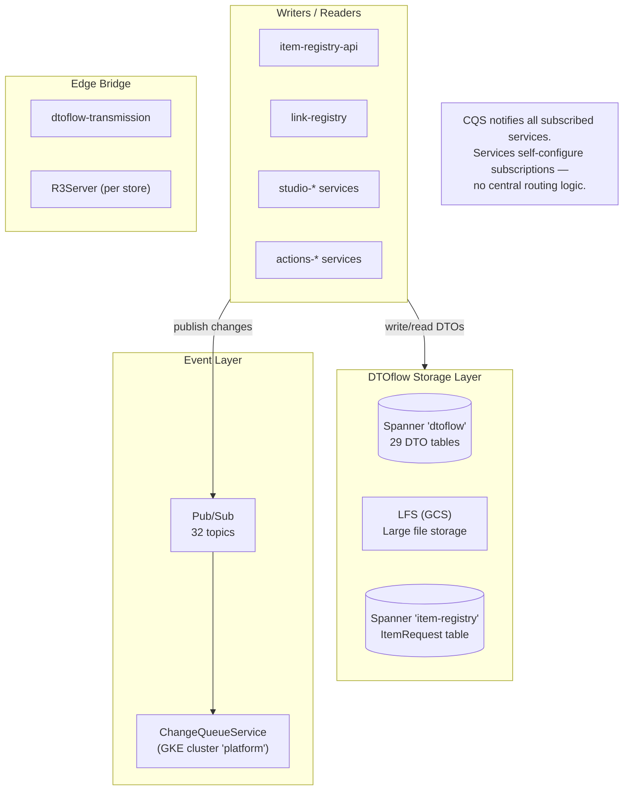
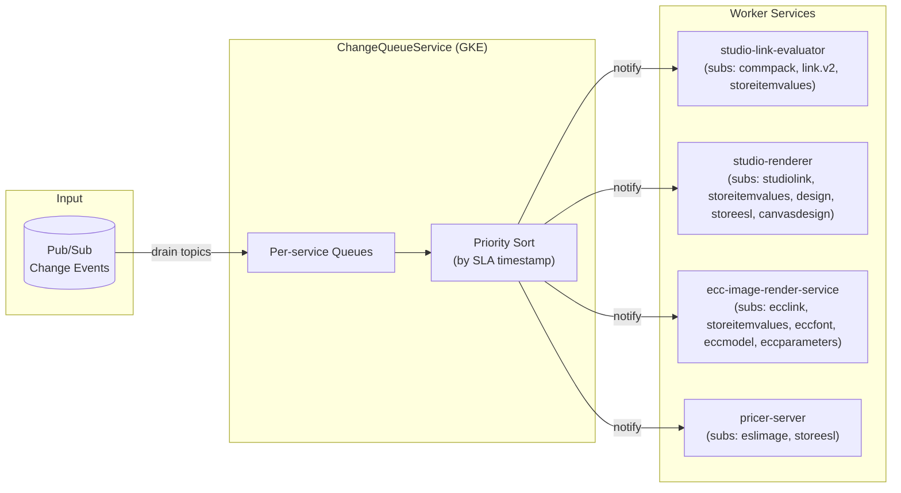
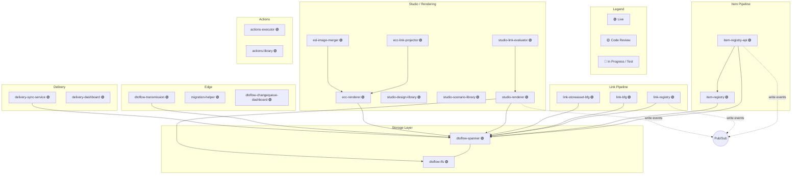
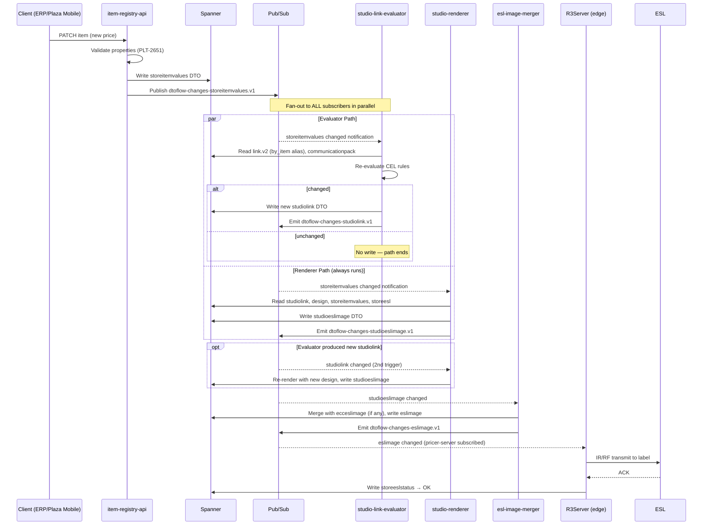
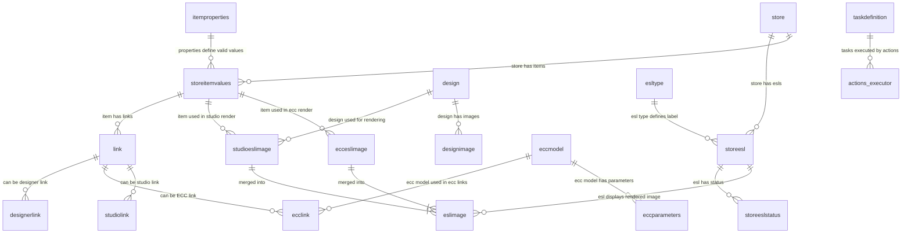
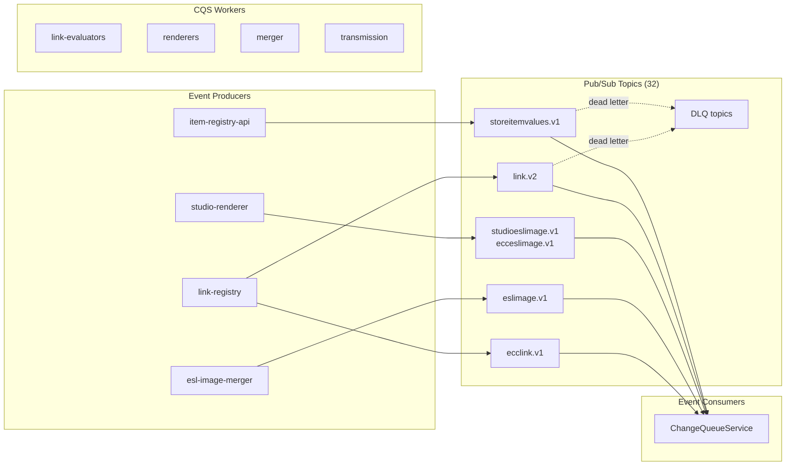

# DTOflow — Deep Dive
> **The cloud data backbone of the Replatforming platform**
> **2026-06-29 correction:** CQS descriptions corrected throughout — it is a subscription-based fan-out layer with no routing logic of its own. Services self-configure their subscriptions. Architecture and section 8 diagrams updated to remove arrows that implied CQS routes to specific services.
>
> **2026-06-30 validation:** Jira statuses refreshed against live PLT project. PLT-2483 now **Ready for Deploy** (Johan Ekman). PLT-1870 in **Test** (Daniel Pettersson). PLT-2354 moved to **In Progress**.

---

## Architecture Overview

DTOflow is a **typed data platform** built on GCP. Services write typed DTOs to Spanner, changes are published as typed events on Pub/Sub, and the ChangeQueueService (CQS) delivers events to subscribing services. The pattern is **state → event → react**: services own their state, communicate through events, and downstream services react asynchronously.



---

## 1. Storage Layer — Spanner Tables

The `dtoflow` database has 29 tables. Each table follows the same schema pattern:

| Column | Type | Purpose |
|--------|------|---------|
| `dto_type` | STRING(MAX) | Namespace/partition key (e.g., "storeitemvalues") |
| `id` | STRING(MAX) | Unique record ID within the type |
| `DATA` | BYTES(MAX) | Protobuf-serialized DTO payload |
| `checksum` | INT64 | Integrity verification |

**Primary key:** `(dto_type, id)` — allows efficient partitioning by type.

### Table Inventory by Domain

#### Item Domain
| Table | Purpose | Status |
|-------|---------|--------|
| `storeitemvalues` | Current price/properties per store per item | ✅ Live |
| `itemproperties` | Item property definitions (what properties are valid per store) | ✅ Live |
| `itemprocessingparameters` | Item processing configuration | ✅ Live |

#### Link Domain
| Table | Purpose | Status |
|-------|---------|--------|
| `link` | Core item-to-label associations | ✅ Live |
| `designerlink` | Designer/Canvas link records | ✅ Live |
| `ecclink` | Legacy ECC link records | ✅ Live |
| `studiolink` | Studio link records | ✅ Live |

#### ESL / Label Domain
| Table | Purpose | Status |
|-------|---------|--------|
| `storeesl` | ESL labels in a store (physical label inventory) | ✅ Live |
| `storeeslstatus` | ESL status reports (last ACK, battery, etc.) | ✅ Live |
| `esltype` | ESL type definitions (form factor, resolution) | ✅ Live |
| `esldriver` | ESL driver/hardware configuration | ✅ Live |

#### Rendering / Image Domain
| Table | Purpose | Status |
|-------|---------|--------|
| `renderedimage` | Rendered label images (output of studio/ecc renderers) | ✅ Live |
| `eslimage` | ESL image variants | ✅ Live |
| `studioeslimage` | Studio-generated ESL images | ✅ Live |
| `ecceslimage` | ECC-generated ESL images | ✅ Live |
| `eccimage` | ECC base images | ✅ Live |
| `designimage` | Design image assets | ✅ Live |

#### Design / Template Domain
| Table | Purpose | Status |
|-------|---------|--------|
| `design` | Design definitions (label layouts) | ✅ Live |
| `canvasdesign` | Canvas-based designs | ✅ Live |
| `canvastype` | Canvas type definitions | ✅ Live |
| `palette` | Color palette definitions | ✅ Live |
| `font` | Font definitions | ✅ Live |
| `eccfont` | ECC-specific fonts | ✅ Live |

#### ECC Model Domain
| Table | Purpose | Status |
|-------|---------|--------|
| `eccmodel` | ECC model definitions (label templates) | ✅ Live |
| `eccparameters` | ECC parameter configurations | ✅ Live |

#### Store / Configuration Domain
| Table | Purpose | Status |
|-------|---------|--------|
| `store` | Store metadata | ✅ Live |
| `communicationpack` | Communication pack configurations | ✅ Live |
| `taskdefinition` | Action task definitions | ✅ Live |
| `aliases` | ID alias mappings (dto_type → alias) | ✅ Live |

### Item-Registry Database (separate)

| Table | Columns | Purpose |
|-------|---------|---------|
| `ItemRequest` | tenantId, storeId, requestId, receivedTime, processedTime, type, status | Tracks item patch/delete requests through processing |

**1 table.** Used by item-registry-api to manage async item operations.

---

## 2. Event Layer — Pub/Sub Topics

**32 topics** in project `platform-dev-p01`. The naming convention is:

```
dtoflow-changes-<dto-type>.v1
```

Each DTO type gets its own change topic. When a record is written or updated in Spanner, the writing service publishes a change event to the corresponding topic.

### Known Topics by Domain

| Topic Pattern | Consumers |
|---------------|-----------|
| `dtoflow-changes-storeitemvalues.v1` | CQS → link-evaluator, renderer |
| `dtoflow-changes-link.v1` → migrated to `link.v2` | CQS → renderer |
| `dtoflow-changes-renderedimage.v1` | CQS → transmission |
| `dtoflow-changes-storeesl.v1` | CQS → status tracking |
| `dtoflow-changes-storeeslstatus.v1` | Status monitoring |
| `dtoflow-changes-ecclink.v1` | CQS → ECC rendering |
| `dtoflow-changes-designerlink.v1` | CQS → studio rendering |
| DLQ topics | Dead letter queues for failed events |
| Sync job topics | Periodic sync triggers |

> **Note:** 32 topics total. The full list can be retrieved via `gcloud pubsub topics list --project=platform-dev-p01`.

---

## 3. ChangeQueueService (CQS) — Subscription Fan-Out

CQS is the **subscription-based fan-out layer** that bridges Pub/Sub events to downstream service reactions. CQS has **no routing logic of its own** — each service declares its own subscriptions at startup via `CreateOrConfigureQueue`. CQS simply delivers notifications to whichever queues subscribed to a given DTO type.



**Status:** 🟡 In Progress (Johan Ekman, PLT-169). GKE cluster `platform` is running. CQS client integration in R3Server (PLT-1870, Daniel Pettersson) is in **Test**.

### Architecture Pattern

```
Service declares subscriptions at startup → DTO is written → Pub/Sub event → CQS delivers to every subscribed queue → each service dequeues independently
```

Each service **owns its own CQS queue** (PLT-2792, Bart De Boer — In Progress) and declares which DTO types it subscribes to. This means multiple services can subscribe to the same DTO type and all receive notifications in parallel — there is no sequential "dispatcher" or "orchestrator."

---

## 4. Service Inventory & Dependency Graph

All 21 Cloud Run services in `europe-north1`:



### Service Maturity

| Service | Status | Notes |
|---------|--------|-------|
| dtoflow-spanner | ✅ Live | Core Spanner access service |
| dtoflow-lfs | ✅ Live | Large file storage (GCS-backed) |
| item-registry-api | ✅ Live | REST/gRPC item CRUD endpoint |
| item-registry | ✅ Live | Item state machine worker |
| link-registry | ✅ Live | Link CRUD |
| link-bfg | ✅ Live | Bulk link operations |
| link-storeasset-bfg | ✅ Live | Store-asset link operations |
| studio-renderer | ✅ Live | Label image rendering |
| studio-link-evaluator | ✅ Live | Link-to-design evaluation |
| studio-design-library | ✅ Live | Design template storage |
| studio-scenario-library | ✅ Live | Scenario management |
| ecc-renderer | ✅ Live | ECC rendering |
| ecc-link-projector | 🟢 Live | ECC link projection — Johan Ekman (merged 2026-06-23) |
| esl-image-merger | 🟢 Live | Image merging — Johan Ekman (merged 2026-06-23) |
| migration-helper | 🟢 Live | Migration support — Johan Ekman (merged 2026-06-23) |
| actions-executor | ✅ Live | Plaza Actions flash task executor |
| actions-library | ✅ Live | Plaza Actions task library |
| dtoflow-transmission | ✅ Live | Cloud→edge bridge |
| dtoflow-changequeue-dashboard | ✅ Live | CQS monitoring UI |
| delivery-sync-service | ✅ Live | Delivery sync |
| delivery-dashboard | ✅ Live | Delivery progress dashboard |

---

## 5. gRPC Client Libraries

DTOflow exposes auto-generated **gRPC clients** for type-safe access:

| Client | Language | Repository |
|--------|----------|------------|
| `evo-dtoflow-protos` | Protobuf | `PricerAB/evo-dtoflow-protos` |
| `evo-dtoflow-grpc-clients-java` | Java | `PricerAB/evo-dtoflow-grpc-clients-java` |
| `evo-dtoflow-grpc-clients-node` | Node.js | `PricerAB/evo-dtoflow-grpc-clients-node` |

These clients abstract the DTO serialization/deserialization and provide type-safe methods for reading and writing each DTO type. The root source of truth for all DTO schemas is the `evo-dtoflow-protos` repository.

---

## 6. Key Data Flow: Item Update End-to-End

This is the flow that exercises the most DTOflow components:



---

## 7. DTOflow Spanner Table Relationships (Entity Model)



---

## 8. Pub/Sub Event-Driven Topology



---

## 9. Current Status Summary

| Component | Count/Version | Status |
|-----------|--------------|--------|
| Cloud Run services | 21 (21 live) | ✅ |
| Spanner tables (`dtoflow`) | 29 DTO tables | ✅ |
| Spanner tables (`item-registry`) | 1 table (ItemRequest) | ✅ |
| Pub/Sub topics | 32 | ✅ |
| gRPC clients (Java) | `evo-dtoflow-grpc-clients-java` | ✅ |
| gRPC clients (Node) | `evo-dtoflow-grpc-clients-node` | ✅ |
| CQS (GKE) | Running on `platform` cluster | 🟡 In Progress |
| CQS client in R3Server (PLT-1870) | Test (Daniel Pettersson) | 🟡 |
| storeitemvalues export (PLT-2483) | Ready for Deploy (Johan Ekman) | 🟡 |
| DTOflow PROD-ready (PLT-2118) | In Test | 🟡 |
| Services own CQS queues (PLT-2792) | In Progress | 🟡 |
| Per-API-path routing (PLT-2101) | Not started | 🔴 |