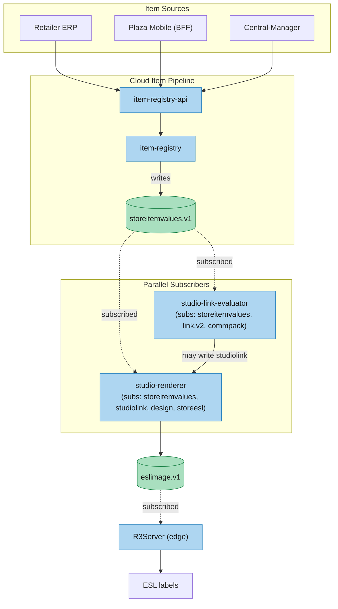
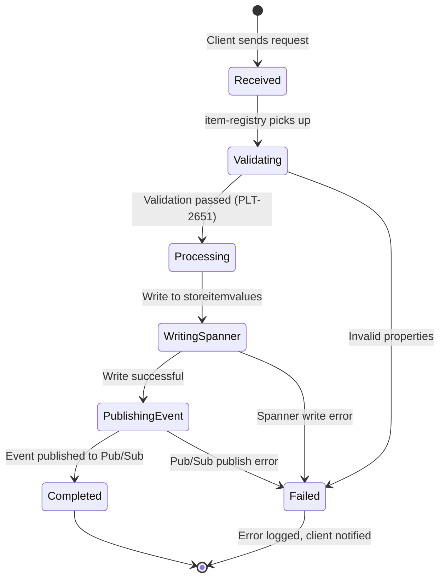
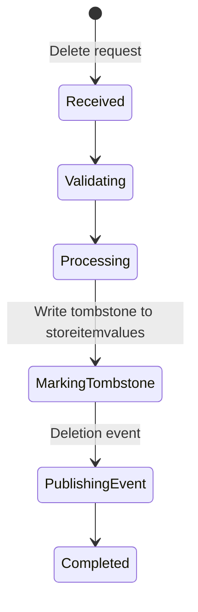
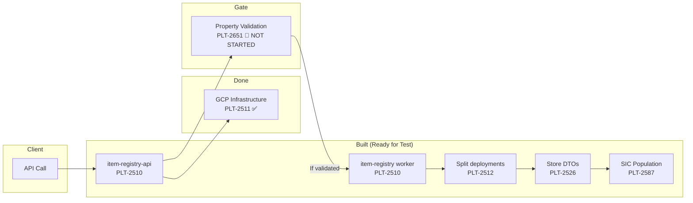
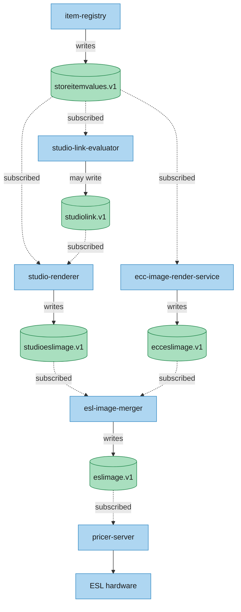

# Item Pipeline — Deep Dive
> **End-to-end analysis of how item data flows from client to ESL in the target architecture**.  
> **Last validated:** 2026-06-25 against GCP `platform-dev-p01`, Jira epics, and repository analysis

---

## Architecture Overview

The Item Pipeline is the most critical data flow in the Replatforming program. It moves item data (prices, properties, status) from retail systems through the cloud platform and ultimately to ESL labels on store shelves.



---

## 1. The Item Concept

An **item** in Pricer's system represents a product sold in a retail store. Each item has:

| Attribute | Description | Source of Truth |
|-----------|-------------|-----------------|
| Item ID | Pricer's internal unique identifier | R3Server → Cloud |
| SIC | Store Item Code — the retailer's own identifier | R3Server → Cloud (PLT-2274) |
| Price | Current shelf price | Retailer ERP / Plaza Mobile |
| Properties | Custom attributes per store/tenant (e.g., weight, promo flags) | Retailer ERP |
| Status | Active, discontinued, out-of-stock | Retailer ERP |
| Links | Associations to ESL label designs | Link Pipeline |

### SIC (Store Item Code)

Customers often identify items by their **own SKU system** rather than Pricer's internal ID. SIC support allows mapping:

```
Retailer SKU "ABC-12345" ↔ Pricer Item ID "item_9876"
```

Two modes:
- **Default** (PLT-2277): One SIC scheme for all items in a store
- **Customized** (PLT-2278): Per-customer SIC mapping rules — blocked, depends on item APIs

---

## 2. Components — Detailed Breakdown

### 2.1 Entry Points

#### Client-Facing APIs (R3Server — Today)
Currently, item CRUD is handled by R3Server's REST API at:
```
GET    /core/v1/items/{itemId}        — Get item details
POST   /core/v1/items/{itemId}        — Create/update item
PATCH  /core/v1/items/{itemId}        — Partial update (price change)
DELETE /core/v1/items/{itemId}        — Remove item
```

These are called by:
- **Plaza Mobile BFF** — store associates scanning items, checking prices
- **Central-Manager** — multi-store bulk item operations (PATCH/DELETE + CSV import/export)
- **Plaza Mobile frontend** — item search via BFF

#### Per-API-Path Routing (Ingress — PLT-2101)
The migration mechanism. The ingress-nginx is configured to route:
```
/store.pcm.pricer-plaza.com/api/.../items/* → cloud (item-registry-api)
/store.pcm.pricer-plaza.com/api/.../private/* → R3Server (stays)
```

**Status:** 🔵 Selected for Development. Not yet started (Saikiran Katta, currently on vacation). Without this, item traffic cannot be incrementally shifted to the cloud.

#### Apigee Gateway
Used for newer cloud-native integrations (Designer, studio, actions). Also routes item search queries to `item-registry-api`.

---

### 2.2 item-registry-api (Cloud Run — REST/gRPC Endpoint)

**Service:** `item-registry-api` — the cloud-side item API endpoint.

| Aspect | Detail |
|--------|--------|
| **Protocol** | REST + gRPC (dual) |
| **Port** | Standard Cloud Run (auto-assigned) |
| **Status** | ✅ Live, partially built |
| **Repository** | `PricerAB/platform-item-registry` |

**What it does:**
- Accepts item PATCH/CREATE/DELETE requests from clients
- Validates incoming item data (PLT-2651 — **not yet implemented**)
- Writes requests to `ItemRequest` table in `item-registry` Spanner database
- Delegates async processing to `item-registry` worker
- Returns status/result to the calling client

**Key story:** PLT-2510 — "Implement the item-registry endpoints and business logic"
- Written and merged directly to main branch (no PR)
- Status: 🟡 Ready for Test, but blocked by PLT-2651 (property validation)
- Assignee: Unassigned

**Endpoints (target):**
```
PATCH  /t/{tenantId}/s/{storeId}/items/{itemId}    — Update item
POST   /t/{tenantId}/s/{storeId}/items              — Create item
DELETE /t/{tenantId}/s/{storeId}/items/{itemId}    — Delete item
GET    /t/{tenantId}/s/{storeId}/items/{itemId}    — Get item
GET    /t/{tenantId}/s/{storeId}/items             — Search/list items
```

The `t/{tenantId}/s/{storeId}` prefix is the tenant+store isolation pattern. Every request is scoped to a specific store within a specific tenant.

**What's missing:**
- Item property validation (PLT-2651) — the API currently accepts any custom properties without checking if they're valid per store
- Once validation is implemented, the endpoints are ready for Test

---

### 2.3 item-registry (Cloud Run — State Machine Worker)

**Service:** `item-registry` — the async processor that handles item state transitions.

| Aspect | Detail |
|--------|--------|
| **Role** | State machine worker |
| **Status** | ✅ Live, partially built |
| **Deployments** | Planned split into 2 deployments (PLT-2512) |

**What it does:**
- Reads pending `ItemRequest` records from Spanner
- Processes each request through its state machine:
  ```
  Received → Validating → Processing → Completed / Failed
  ```
- For successful writes: writes the `storeitemvalues` DTO to Spanner
- Publishes change event to Pub/Sub: `dtoflow-changes-storeitemvalues.v1`
- For deletions: marks the record as tombstoned, publishes change event

**Key story:** PLT-2512 — "Split item registry into 2 deployments"
- Separates read-path from write-path for better scaling
- Status: 🟡 Ready for Test

---

### 2.4 Spanner Storage

#### Database: `item-registry`
| Table | Purpose | Used By |
|-------|---------|---------|
| `ItemRequest` | Tracks each item request through processing (tenantId, storeId, requestId, receivedTime, processedTime, type, status) | item-registry-api writes, item-registry reads/updates |

This is a **request tracking table** — it holds the processing state of each item operation, not the item data itself.

#### Database: `dtoflow` — relevant tables
| Table | Purpose | Key Fields |
|-------|---------|------------|
| `storeitemvalues` | Current item price/properties per store | dto_type="storeitemvalues", id={tenant_store_item}, DATA (protobuf), checksum |
| `itemproperties` | Valid property definitions per store | dto_type="itemproperties", id={property_key}, DATA (protobuf) |
| `itemprocessingparameters` | Item processing configuration | dto_type="itemprocessingparameters", id={config_key}, DATA (protobuf) |

**The `DATA` column** is a protobuf-serialized payload. The schema is defined by the DTO type — gRPC clients provide type-safe access.

**Data flow:**
```
1. Client sends item data → item-registry-api
2. Validation checks itemproperties table for valid property definitions (PLT-2651)
3. item-registry writes to storeitemvalues table
4. Checksum ensures data integrity
```

---

### 2.5 Pub/Sub — Change Events

When an item is written or updated, the item-registry publishes to:

```
dtoflow-changes-storeitemvalues.v1
```

**Event payload:** Contains the storeitemvalues DTO data and change type (CREATE/UPDATE/DELETE).

**Consumers:**
- **studio-link-evaluator** — subscribes to `storeitemvalues.v1` via CQS; re-evaluates CEL rules against new item values
- **studio-renderer** — also subscribes to `storeitemvalues.v1`; renders with current studiolink + new item values
- **ecc-image-render-service** — subscribes to `storeitemvalues.v1` (via `by_item` alias on `ecclink`)

Multiple services subscribe to the same topic and all receive notifications in parallel — there is no sequential dispatch.

**Dead letter queue:** Failed events go to a DLQ topic for manual inspection.

---

### 2.6 Item Property Validation (PLT-2651 — The Gate)

**This is the single concrete technical task blocking the entire Item Pipeline.**

**The problem:**
```
item-registry-api accepts:
  { "price": 9.99, "weight": "500g", "promo": "BOGO" }
  
But there's no check if "weight" or "promo" are valid properties for this store.
```

**What needs to be built:**
- When a store is onboarded, its valid item properties are defined in the `itemproperties` Spanner table
- Before writing to `storeitemvalues`, the item-registry must query `itemproperties` and validate that all provided properties exist
- Properties that don't exist should be rejected or flagged

**Why it's complex:**
- Properties vary per store (a grocery store needs "weight" and "best-before", a clothing store needs "size" and "color")
- Properties vary per tenant (retailer-specific custom fields)
- The validation needs to handle partial updates (PATCH) — a client should be able to update only the price without resending all properties
- The `itemproperties` table must be populated before validation can work

**This is a single story, well-scoped.** Written June 1. No assignee, no comments, no sub-tasks.

---

### 2.7 SIC Population (PLT-2587)

**Purpose:** Populate SIC (Store Item Code) mappings in the item registry so items can be looked up by the retailer's own identifier.

**What it does:**
- Reads SIC-to-item mappings from R3Server export
- Writes them to the item-registry
- Enables lookup by SIC alongside item ID

**Status:** 🟡 Ready for Test. Depends on upstream item pipeline being operational.

---

### 2.8 Multistore Support (PLT-2526)

**Purpose:** Handle item operations that span multiple stores — a chain-wide price update or a batch deletion.

**What it does:**
- Accepts a list of storeIds in a single request
- Fans out the operation to each store's `storeitemvalues` record
- Uses store DTOs for efficient batch processing

**Status:** 🟡 Ready for Test. Depends on deployment split (PLT-2512).

**Why it's complex:**
- A chain may have hundreds of stores — a single request can fan out to hundreds of Spanner writes
- Partial failure handling: what happens if store 50 of 200 fails?
- Transactional integrity across stores is not possible in Spanner (no cross-row transactions at that scale)
- The client needs async polling to get results

---

## 3. Item Pipeline State Machine

Every item operation goes through a state machine:



**For deletions:**


---

## 4. Data Flow for Each Operation Type

### 4.1 Item Price Change (PATCH)

The most common operation. A store manager changes a price.

```
1. Plaza Mobile/BFF → Ingress
   PATCH /api/v1/stores/{storeId}/items/{itemId}
   Body: { "price": 9.99 }

2. Ingress routes to item-registry-api (if PLT-2101 active) or R3Server (today)

3. item-registry-api:
   a. Validates tenantId, storeId, itemId exist
   b. Writes ItemRequest to Spanner (status=Received)
   c. Returns 202 Accepted with requestId

4. item-registry picks up ItemRequest:
   a. Validates "price" is a valid property for this store (PLT-2651)
   b. Reads current storeitemvalues from Spanner
   c. Merges the new price with existing values
   d. Writes updated storeitemvalues to Spanner
   e. Publishes dtoflow-changes-storeitemvalues.v1

5. Downstream Execution (both paths run in parallel):
   a. studio-renderer (subscribes to storeitemvalues.v1): renders with existing studiolink + new item values
   b. studio-link-evaluator (also subscribes to storeitemvalues.v1): re-evaluates; if result unchanged, no write
   c. If evaluator writes new studiolink → renderer gets 2nd trigger → renders again with new design
   d. esl-image-merger → transmission → R3Server → ESL
```

**Estimated latency budget:**
| Step | Time | Cumulative |
|------|------|------------|
| Client → API | ~50ms | 50ms |
| Validation | ~20ms | 70ms |
| Spanner write | ~50ms | 120ms |
| Pub/Sub publish + fan-out | ~100ms | 220ms |
| Render (with existing studiolink) | ~500ms | 720ms |
| Merge + eslimage write | ~100ms | 820ms |
| Transmission → R3Server | ~100ms | 920ms |
| IR/RF transmit | ~100ms | 1020ms |

**Total: ~1-2 seconds** from price change to label update. This matches the current R3Server timing.

### 4.2 Item Creation (POST)

```
1. Client: POST /api/v1/stores/{storeId}/items
   Body: { "itemId": "new-item-1", "price": 5.99, "properties": {...} }

2. item-registry-api creates ItemRequest with type=CREATE

3. item-registry:
   a. Validates all properties against store's itemproperties table
   b. Creates new storeitemvalues record in Spanner
   c. Publishes creation event
```

### 4.3 Item Deletion (DELETE)

```
1. Client: DELETE /api/v1/stores/{storeId}/items/{itemId}

2. item-registry-api creates ItemRequest with type=DELETE

3. item-registry:
   a. Writes tombstone to storeitemvalues (marks as deleted, doesn't remove)
   b. Publishes deletion event

4. Downstream Execution (both paths run in parallel):
   link-registry (subscribes to storeitemvalues.v1) → finds associated links
   studio-link-evaluator → re-evaluates → renderers → esl-image-merger → transmission → ESL clears
```

**Status:** Not yet built. Same gate as PATCH (PLT-2651).

---

## 5. Complexity Factors

### 5.1 Tenant Isolation

Every item record is scoped to a tenant:
```
t/{tenantId}/s/{storeId}/items/{itemId}
```

**Challenge:**
- A missing `t/{tenantId}` check can leak data between retailers
- PLT-1996 (tenant-id check) was recently closed — all DTOflow servers now validate tenant IDs
- But the item-registry must also enforce this in its own logic

### 5.2 Partial Updates (PATCH Semantics)

A PATCH request should only modify the fields that are sent:
```
Before: { price: 10.00, weight: "500g", promo: null }
PATCH:  { price: 8.99 }
After:  { price: 8.99, weight: "500g", promo: null }
```

**Challenge:**
- Must read-then-write (read current storeitemvalues, merge, write back)
- Read-modify-write is not atomic in the target architecture
- Concurrent PATCH requests could overwrite each other
- Solution: Optimistic concurrency using checksum — read checksum, write with condition that checksum hasn't changed

### 5.3 Bulk Operations (Central-Manager Use Case)

Central-Manager sends item updates for multiple stores simultaneously:
```
PATCH /api/v1/stores
Body: { "storeIds": ["store-1", "store-2", ..., "store-200"],
        "items": [{ "itemId": "item-1", "price": 9.99 }, ...] }
```

**Challenge:**
- 200 stores × 1000 items = 200,000 individual writes
- Each write is a separate Spanner operation
- No cross-store transaction possible
- Client needs async polling with requestId
- Failure handling: partial success needs clear reporting

### 5.4 Property Validation (PLT-2651)

The item-registry must know what properties are valid before accepting data.

**Challenge:**
- The `itemproperties` table must be populated first — this requires a setup step per store
- What happens if a retailer adds a new property type? The table must be updated
- Properties can be required or optional — different validation rules
- The validation logic must be fast (under 20ms) to avoid latency impact

### 5.5 SIC Mapping (PLT-2274)

Items identified by the retailer's own SKU need bidirectional mapping:
```
Retailer SKU → Pricer Item ID (when importing)
Pricer Item ID → Retailer SKU (when exporting)
```

**Challenge:**
- A single retailer SKU may map to different Pricer items in different stores
- SIC mapping requires the item-registry to be operational first
- Customized mapping (PLT-2278) means per-customer rules — high complexity

### 5.6 Data Migration from R3Server

Existing items are stored in per-store MySQL databases in R3Server. Moving them to Spanner requires:

- **Bulk load** (PLT-2598) — initial load of all items. Done (closed).
- **Realtime sync** (PLT-2483) — continuous export of changes. In Code Review.
- **Shadow Mode** (PLT-2354) — run both systems in parallel. Selected for development.

**Challenge:**
- The bulk load was a one-time migration. Ongoing sync needs CDC (Change Data Capture) from MySQL
- MySQL CDC is expensive — the current approach uses application-level export (R3Server publishes changes), not binlog-based CDC
- This means R3Server must be modified to export every item change (PLT-2483)

---

## 6. Current Item Pipeline Status



**What's built and ready:**
| Story | Component | Status | Assignee |
|-------|-----------|--------|----------|
| PLT-2510 | item-registry-api endpoints + logic | 🟡 Ready for Test | Unassigned |
| PLT-2512 | Split into 2 deployments | 🟡 Ready for Test | Unassigned |
| PLT-2526 | Store DTOs for multistore | 🟡 Ready for Test | Unassigned |
| PLT-2587 | Populate SICs in registry | 🟡 Ready for Test | Unassigned |
| PLT-2511 | GCP resources (infrastructure) | ✅ Done | Daniel Pettersson |

### 5.4 Property Validation (PLT-2651)

| Ticket | Topic | Status | Notes |
|--------|-------|--------|-------|
| PLT-2651 | Item property validation | 🔴 Blocked & Unassigned | ROOT BLOCKER: No validation logic exists. Must be built before APIs accept data. |
| PLT-2378 (Epic) | Item Patch APIs - Core | 🔴 Blocked & Unassigned | ADR exists, 4 child stories ready, but PLT-2651 is the gatekeeper. |

### 5.5 SIC Mapping (PLT-2274)

| Ticket | Topic | Status | Notes |
|--------|-------|--------|-------|
| PLT-2278 | Customized SIC handling | 🔴 Blocked & Unassigned | SIC mapping needs working item APIs |
| PLT-2274 (Epic) | SIC Support | 🔴 Blocked | Downstream of item pipeline |

---

## 7. Interaction with Other Pipelines

DTOflow has **no central orchestrator**. Each service subscribes to the DTO types it needs. When item-registry writes `storeitemvalues`, CQS fans out the notification to every subscriber in parallel:



**What depends on the Item Pipeline:**
- **Link Pipeline** — link-registry stores item-to-ESL associations. Item ID must exist before a link can be created
- **Rendering Pipeline** — renderer needs item data (price, properties) to generate label images
- **Shadow Mode** — requires realtime item export (PLT-2483) to validate the pipeline end-to-end
- **Consumer APIs** — Plaza Mobile and Central-Manager cannot migrate item operations until the pipeline is live

---

## 8. Key Risks

| Risk | Impact | Mitigation |
|------|--------|------------|
| **PLT-2651 not assigned** | Entire Item Pipeline blocked | Clear the validation story — it's well-scoped, single story |
| **4 ready stories unassigned** | No one driving them through Test | Assign reviewer for the queue |
| **Per-API-path routing (PLT-2101) not started** | Cannot shift item traffic incrementally | Needs attention after Saikiran returns from vacation |
| **SIC complexity underestimated** | Customized mapping may require significant design work | Start with default SIC (PLT-2277 — Ready for Test) |
| **Bulk operation failure handling** | Partial success in multistore operations is complex | Build async polling from the start |
| **Data consistency during migration** | R3Server and cloud may diverge | Shadow Mode validation (PLT-2354) catches this |

---

## 9. Current Status Summary

| Component | Status | What's Left |
|-----------|--------|-------------|
| item-registry-api endpoints | 🟡 Ready for Test | Implement PLT-2651 (validation), then deploy |
| item-registry worker | 🟡 Ready for Test | Depends on API endpoints |
| Split deployments | 🟡 Ready for Test | Depends on worker |
| Store DTOs for multistore | 🟡 Ready for Test | Depends on split |
| SIC population | 🟡 Ready for Test | Depends on multistore |
| GCP infrastructure | ✅ Done | Nothing |
| **Property validation (PLT-2651)** | 🔴 **Not started** | Single story, needs implementation |
| **Item Patch APIs (PLT-2378 — Epic)** | 🔴 **Blocked** | Gated by PLT-2651 |
| Per-API-path routing (PLT-2101) | 🔵 Selected | Not started |
| Shadow Mode (PLT-2354) | 🟡 Selected | Needs item export pipeline |