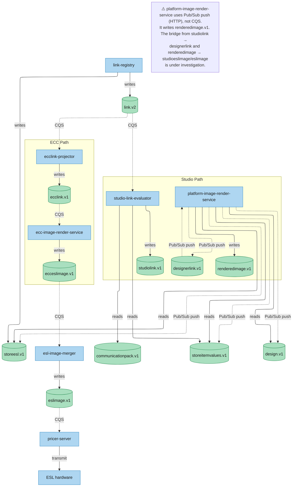
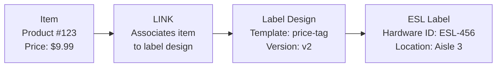
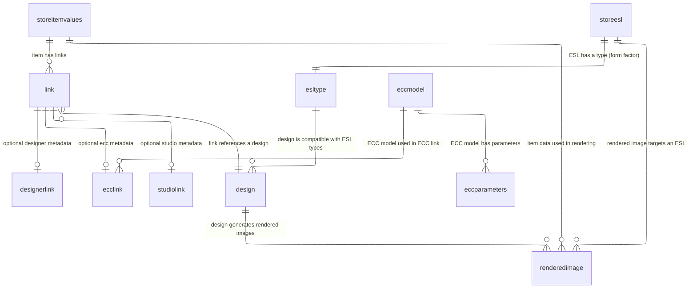
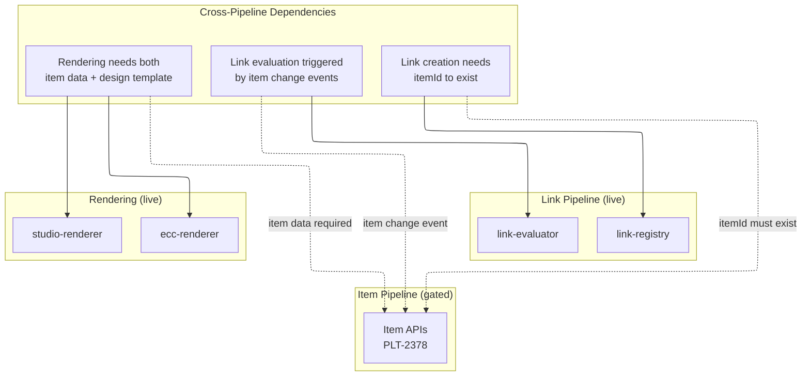

# Link Pipeline — Deep Dive
> **End-to-end analysis of how item-to-label associations flow from creation to ESL display**
> **Last validated:** 2026-07-01 — **Code-verified** against `PricerAB/platform-evaluation-engine` (Java) and `PricerAB/platform-image-render-service` (TypeScript). Corrections: evaluator uses CEL tree-walking with accumulated && expressions, forced_design_id bypass, mass re-evaluation on CommunicationPack change. Renderer uses Pub/Sub push (not CQS), writes `renderedimage.v1` (not `studioeslimage.v1`). Architecture diagram updated.

---

## Architecture Overview

The Link Pipeline manages **item-to-label associations** — determining which ESL labels are connected to which products, and triggering re-rendering when associations change. It sits between the Item Pipeline (item data) and the Rendering Pipeline (label images). Services subscribe to DTO changes independently — there is no central orchestrator.



**Current status:** ✅ **Fully live.** Link-registry, link-bfg, link-storeasset-bfg, studio-link-evaluator, ecc-link-projector, and esl-image-merger are all deployed and operational.

---

## 1. The Link Concept

A **link** is the association between an item (product) and an ESL label design. It answers the question: "which label design should this item display?"



### Link Types

| Type | Source | Description | Status |
|------|--------|-------------|--------|
| **Designer Link** | Studio Designer / Canvas | Modern cloud-native linking via Studio UI. Item + design template = label. | ✅ **Live** — routes via Apigee |
| **ECC Link** | Legacy ECC system | Legacy linking system. Item + ECC model = label. Being superseded by Designer. | 🟡 **Live but migrating** — ECC rendering services in Code Review |
| **Studio Link** | Studio Scenario Library | Scenario-based linking. Items linked under specific conditions/promotions. | ✅ **Live** |
| **Bulk Link** | Central-Manager | Chain-wide link operations — link/unlink items across multiple stores simultaneously. | ✅ **Live** via link-bfg |
| **Store Asset Link** | Store management | Links specific store assets (e.g., shelf hardware) to label configurations. | ✅ **Live** via link-storeasset-bfg |

### Link Lifecycle

```
1. Create: Designer creates link (item + design → label)
2. Evaluate: When item data changes, evaluator checks which links affected
3. Render: Affected links trigger re-rendering of label images
4. Transmit: Rendered images sent to store → ESL updates
5. Unlink: When item is removed or design changes, link is broken
6. Auto-unlink: (PLT-2363) — Future: automatic unlinking based on rules
```

---

## 2. Components — Detailed Breakdown

### 2.1 link-registry (Cloud Run)

**Service:** `link-registry` — the core link CRUD service.

| Aspect | Detail |
|--------|--------|
| **Protocol** | gRPC (auto-generated clients) |
| **Status** | ✅ **Live** |
| **Repository** | `PricerAB/platform-link-service` |

**What it does:**
- Stores and retrieves link records in Spanner
- Supports all link types: designerlink, ecclink, studiolink
- Publishes link change events to Pub/Sub when links are created, updated, or deleted
- Provides read endpoints for clients (Plaza Mobile link queries, Central-Manager link views)

**Endpoints (target):**
```
POST   /links                    — Create link
GET    /links/{linkId}           — Get link details
PATCH  /links/{linkId}           — Update link
DELETE /links/{linkId}           — Delete/unlink
GET    /items/{itemId}/links     — Get all links for an item
GET    /labels/{barcode}/links   — Get link for a specific label
```

**Spanner tables it writes to:**
| Table | Content |
|-------|---------|
| `link` | Core link records (item→design→label associations) |
| `designerlink` | Designer-specific link metadata |
| `ecclink` | ECC-specific link metadata (model references, parameters) |
| `studiolink` | Studio-specific link metadata (scenario references) |

---

### 2.2 link-bfg (Cloud Run — Bulk Operations)

**Service:** `link-bfg` — Bulk Link operation service.

| Aspect | Detail |
|--------|--------|
| **Role** | Batch link processing |
| **Status** | ✅ **Live** |
| **Use case** | Central-Manager chain-wide link operations |

**What it does:**
- Accepts bulk link/unlink requests spanning multiple stores
- Processes large batches asynchronously (hundreds of stores, thousands of links)
- Handles fan-out across stores, similar to multistore item operations
- Reports progress through async polling (requestId pattern)

**Typical operation:**
```
POST /links/bulk
Body: {
  "storeIds": ["store-1", ..., "store-100"],
  "itemIds": ["item-1", ..., "item-500"],
  "designId": "design-weekly-promo-v3",
  "operation": "LINK"
}
```
→ Fans out to create 50,000 individual link records across 100 stores
→ Publishes batch change event to Pub/Sub
→ Returns requestId for progress tracking

**Why it's complex:**
- 100 stores × 500 items = 50,000 individual link writes to Spanner
- No cross-store transactions — must handle partial failures
- Clients need async polling to get results
- Rollback on partial failure is manual or needs compensating operations

---

### 2.3 link-storeasset-bfg (Cloud Run — Store Asset Operations)

**Service:** `link-storeasset-bfg` — Store Asset link operations.

| Aspect | Detail |
|--------|--------|
| **Role** | Store-specific asset-to-label linking |
| **Status** | ✅ **Live** |

**What it does:**
- Links specific store hardware/assets (shelves, displays) to label configurations
- Handles the physical store layout integration — which labels are on which shelf
- Used when store layouts change or new ESLs are installed

**Relationship to other services:**
- `link-bfg` handles item-to-design linking
- `link-storeasset-bfg` handles physical-asset-to-label linking
- Together they form the complete link chain: item → design → label physical location

---

### 2.4 studio-link-evaluator (Cloud Run)

**Service:** `studio-link-evaluator` — evaluates which design should be shown for each ESL.

| Aspect | Detail |
|--------|--------|
| **Role** | CEL rule evaluation engine |
| **Status** | ✅ **Live** |
| **Subscribes to** | `communicationpack.v1`, `link.v2`, `storeitemvalues.v1` |

**What it does:**
- Subscribes to `storeitemvalues.v1`, `link.v2`, and `communicationpack.v1` via CQS
- When a link is created/changed or item data changes, fetches the relevant `link.v2`, `communicationpack`, and `storeitemvalues`
- **Tree-walking algorithm:** depth-first traverses the CommunicationPack scenario tree:
  - Each scenario's `cel_expression` is accumulated with `&&` from parent nodes
  - Child scenarios are tried first — **first match wins**
  - If no children match, the current node's expression is evaluated against three variable maps: `item` (custom properties), `link` (location, facings), `device` (ESL type from barcode)
  - A **pre-check** scans the CEL expression with regex and returns `false` if any referenced property is missing from the maps — preventing silent failures
  - If expression evaluates `true`, returns that scenario's `design_ids`
- **Forced designs:** If `forced_design_id` is set on the link, uses it directly — **no CEL evaluation** (manual override)
- Resolves design IDs to full Spanner keys: `t/{tenantId}/designs/{id}`
- Filters by **ESL type compatibility** — the design's `compatible_esltype_ids` must include the ESL's type
- If the evaluation result differs from the current `studiolink.design_id`, writes a new `studiolink.v1`; if unchanged, writes nothing (idempotency gate)
- **Mass re-evaluation on CommunicationPack change:** reads ALL tenant links and re-evaluates every studio link — the most expensive operation. Uses `putMany()` for batch writes.

**Evaluation logic:**
```
Input:  storeitemvalues changed for item-123
Fetch:  link.v2 by_item alias → [link-456, link-789]
        communicationpack → scenario rules
Evaluate: CEL expressions against item properties
          forced_design_id wins unconditionally if set
          otherwise, scenario rules select based on conditions
Output: if winning design changed → write new studiolink; else → no write
```

**Why this matters:**
- The evaluator's idempotency gate prevents unnecessary re-rendering — if item data changes but the winning design doesn't, no `studiolink` is written
- It runs **in parallel** with the renderer, not before it — both subscribe to `storeitemvalues.v1`. The renderer always renders the first time with the existing `studiolink` + new item values. If the evaluator later produces a new `studiolink`, the renderer gets a second trigger.
- This is NOT a sequential "evaluate → render" pipeline. It's a parallel fan-out with the evaluator acting as a potential second trigger.

---

### 2.5 Spanner Storage — Link Tables

The `dtoflow` database contains 4 link-related tables:

| Table | Key Fields | Content |
|-------|------------|---------|
| `link` | dto_type="link", id={link_id} | Core link: itemId, designId, eslId, tenantId, storeId, status (ACTIVE/INACTIVE/DELETED) |
| `designerlink` | dto_type="designerlink", id={link_id} | Designer metadata: canvasId, designVersion, creationTimestamp, author |
| `ecclink` | dto_type="ecclink", id={link_id} | ECC metadata: eccModelId, parameters, renderingHints |
| `studiolink` | dto_type="studiolink", id={link_id} | Studio metadata: scenarioId, conditions, priority, validityPeriod |

**Table relationships:**
```
link (core)
  ├── has one → designerlink (if created in Designer)
  ├── has one → ecclink (if created in ECC)
  ├── has one → studiolink (if created in Studio)
  └── references → storeitemvalues (via itemId)
  └── references → renderedimage (via designId + itemId)
```

Each link record uses the standard DTOflow schema:
```sql
CREATE TABLE link (
  dto_type STRING(MAX) NOT NULL,  -- "link"
  id STRING(MAX) NOT NULL,        -- unique link identifier
  DATA BYTES(MAX),                -- protobuf-serialized link data
  checksum INT64,                 -- integrity check
) PRIMARY KEY(dto_type, id);
```

---

### 2.6 Pub/Sub — Link Change Events

When link records are created, updated, or deleted, `link-registry` publishes change events.

**Topics:**
| Topic | Description | Status |
|-------|-------------|--------|
| `dtoflow-changes-link.v1` | Original link change topic | ✅ Live |
| `link.v2` | Migrated topic — improved schema | ✅ Live |
| `dtoflow-changes-ecclink.v1` | ECC-specific link changes | ✅ Live |
| `dtoflow-changes-designerlink.v1` | Designer-specific link changes | ✅ Live |

**Event flow when a link is created:**
```
1. Designer creates link in Studio UI
2. Studio calls link-registry via Apigee
3. link-registry writes to Spanner (link + designerlink tables)
4. link-registry publishes to link.v2 topic
5. CQS picks up event → dispatches to studio-link-evaluator
6. studio-link-evaluator confirms the link → dispatches to renderer
7. Renderer generates label image with the linked design + item data
```

---

## 3. Key Data Flows

### 3.1 Designer Creates a Link (New Label)

```
Studio/Designer ──→ Apigee ──→ link-registry ──→ Spanner (write link + designerlink)
  │
  └──→ Pub/Sub link.v2 ──→ CQS ──→ studio-link-evaluator (evaluate)
                                          │
                                          ├── forced_design_id? → skip CEL
                                          └── depth-first traverse scenario tree
                                              └──→ write studiolink ──→ (projector?) → designerlink ──→ Pub/Sub Push
                                                                                                      │
                                                                                                      └──→ platform-image-render-service (fabric.js render)
                                                                                                                      │
                                                                                                                      └──→ write renderedimage.v1 ──→ (bridge?) → eslimage → transmission
```

**Status:** ✅ End-to-end live. All services in the chain are operational.

### 3.2 Item Price Change → Links Re-evaluated

```
Item Pipeline writes storeitemvalues.v1 → Pub/Sub fans out to all subscribers
                                          │
                    ┌─────────────────────┴─────────────────────┐
                    ▼                                             ▼
        studio-link-evaluator (CQS)                  platform-image-render-service (Pub/Sub push)
        (subs: storeitemvalues.v1)                   (handles: designerlink, storeitemvalues, design, canvasdesign, storeesl)
                    │                                             │
        Fetch link.v2 (by_item alias)                Fetch current designerlink, design JSON from LFS,
        Fetch communicationpack                       storeitemvalues, font DTOs
        Depth-first traverse scenario tree            fabric.js: parse SVG, apply propertyMappings,
        with accumulated && CEL expressions            render canvas → PNG
                    │                                             │
        If winning design changed:                    Write renderedimage.v1 to Spanner
          Write new studiolink.v1 ──────────────→    (plus upload PNG to LFS)
        (forced_design_id bypasses CEL)               
                                                     Renderer may get 2nd trigger if
                                                     designerlink is updated from new studiolink
```

**Status:** ✅ Link evaluation is live. Both evaluator and renderer subscribe to `storeitemvalues.v1` and run in parallel.

### 3.3 Bulk Link — Chain-Wide Promotion

```
Central-Manager ──→ Apigee ──→ link-bfg ──→ Spanner (50,000 link writes)
                                                  │
                                                  └──→ Pub/Sub link.v2 ──→ CQS ──→ evaluator → renderer → transmission
```

**Status:** ✅ Live. link-bfg handles the fan-out.

### 3.4 ECC Link Creation (Legacy)

```
ECC System ──→ Apigee ──→ link-registry ──→ Spanner (write link + ecclink)
                                                  │
                                                  └──→ Pub/Sub link.v2 ──→ CQS
                                                                                  │
                                                                                  └──→ ecc-link-projector (project - NEW 🟡)
                                                                                            │
                                                                                            └──→ write ecclink ──→ CQS ──→ ecc-renderer ──→ esl-image-merger
```

**Status:** 🟡 Core ECC rendering live. Two new services (ecc-link-projector, esl-image-merger) in Code Review extend ECC capabilities.

---

## 4. The Link→Item→Rendering Chain

How links connect items to rendered labels — the complete data model:



**Key relationships:**
- An **item** can have many **links** (a product shown on multiple labels in different store sections)
- A **link** references one **design** (the label template) and optionally one item
- A **design** is compatible with specific **ESL types** (a large label can't fit on a small ESL)
- A **rendered image** is the output of applying a **design** + **item data** + **ESL type constraints**

---

## 5. Link Types Comparison

| Aspect | Designer Link (Modern) | ECC Link (Legacy) | Studio Link |
|--------|----------------------|-------------------|-------------|
| **Source** | Studio Designer UI | Legacy ECC tools | Studio Scenario Library |
| **API Path** | Apigee → link-registry | Apigee → link-registry | Apigee → link-registry |
| **Storage** | link + designerlink tables | link + ecclink tables | link + studiolink tables |
| **Rendering** | studio-renderer | ecc-renderer + ecc-link-projector | studio-renderer |
| **Flexibility** | High — WYSIWYG designer | Low — template-based | Medium — condition-based |
| **Migration path** | ✅ Already cloud-native | 🟡 Being replaced by Designer | ✅ Already cloud-native |
| **Status** | ✅ Live | 🟡 Live, migrating | ✅ Live |

---

## 6. The Studio/Designer Ecosystem

The Designer/Studio services are closely related to the Link Pipeline. They provide the design templates that links reference.

### Studio Services

| Service | Role | Status |
|---------|------|--------|
| **studio-design-library** | Stores design templates (label layouts) | ✅ Live |
| **studio-scenario-library** | Stores scenarios (conditional designs for promotions) | ✅ Live |
| **studio-link-evaluator** | Evaluates which links are affected by changes | ✅ Live |
| **studio-renderer** | Generates label images from design + item data | ✅ Live |

### Designer/Canvas Integration

The Designer (Canvas) is a separate UI tool that creates label designs. It interacts with the Link Pipeline through Apigee:

```
Designer (Canvas)
  → Apigee → studio-design-library (save design)
  → Apigee → link-registry (create link between item and design)
  → Apigee → studio-renderer (preview rendered label)
```

**Status:** ✅ The entire Designer → Link → Render flow is cloud-native and operational.

---

## 7. ECC Link System (Legacy — Being Superseded)

ECC is the legacy linking and rendering system. It is being progressively replaced by the Designer/Studio pipeline.

### ECC Services

| Service | Role | Status | Repository |
|---------|------|--------|------------|
| **ecc-renderer** | Renders ECC label images | ✅ Live | `PricerAB/platform-ecc-renderer` |
| **ecc-link-projector** | Projects ECC links onto label templates | 🟡 Code Review | New service by Johan Ekman |
| **esl-image-merger** | Merges multiple ESL image layers | 🟡 Code Review | New service by Johan Ekman |

### ECC Data Tables

| Table | Content |
|-------|---------|
| `eccmodel` | ECC model definitions (the template structure) |
| `eccparameters` | ECC parameter configurations per model |
| `ecclink` | ECC-specific link records (item + model association) |
| `eccfont` | ECC-specific fonts |
| `eccimage` | ECC base images |
| `ecceslimage` | ECC-generated ESL images |

### Migration Path

```
Today:  R3Server runs ECC rendering locally
        ↓
Phase 1: Cloud ECC rendering (ecc-renderer + ecc-link-projector + esl-image-merger)
         ↓
Future:  Designer/Studio replaces ECC entirely
         (PLT-2359 — ECC Links & Rendering Support, Backlog, Unassigned)
```

---

## 8. Link Pipeline vs Item Pipeline Dependencies



**What the Link Pipeline needs from the Item Pipeline:**
- **Item IDs must exist** before a link can be created (can't link a non-existent item)
- **Item change events** trigger link re-evaluation (price change → re-render linked labels)
- **Item data** is required for rendering (a label shows the item's current price)

**What the Link Pipeline provides to the Item Pipeline:**
- **Link resolution** — "which labels show this item?" — used by Plaza Mobile's item detail view
- **Link status** — "is this item linked to any labels?" — used by Central-Manager

**Since the Link Pipeline is fully live and the Item Pipeline is gated, the current state is:**
- Links can be created for items that exist in the cloud (from bulk load, PLT-2598)
- But item changes from clients (price updates) cannot yet trigger link re-evaluation
- The link evaluator works, but it has no item change events to react to

---

## 9. Current Status Summary

| Component | Status | What's Left |
|-----------|--------|-------------|
| **link-registry** | ✅ **Live** | Nothing — core CRUD operational |
| **link-bfg** (bulk operations) | ✅ **Live** | Nothing — batch processing works |
| **link-storeasset-bfg** | ✅ **Live** | Nothing — store asset linking works |
| **studio-link-evaluator** | ✅ **Live** | Nothing — evaluation engine operational |
| **studio-design-library** | ✅ **Live** | Nothing — design storage works |
| **studio-scenario-library** | ✅ **Live** | Nothing — scenario storage works |
| **studio-renderer** | ✅ **Live** | Nothing — rendering pipeline works |
| **ecc-renderer** | ✅ **Live** | Nothing — ECC rendering works |
| **ecc-link-projector** | 🟢 **Live** | Merged 2026-06-23. Separates projection from rendering logic |
| **esl-image-merger** | 🟢 **Live** | Merged 2026-06-23. Extracts layer merging into dedicated service |
| **Unified Linking API** (PLT-2360) | 🔴 **Backlog, Unassigned** | Not started |
| **Auto-Unlink** (PLT-2363) | 🔴 **Backlog, Unassigned** | Not started |
| **ECC Links & Rendering** (PLT-2359 — Epic) | 🔴 **Backlog, Unassigned** | Not started |
| **Linked Item APIs** (PLT-2357 — Epic) | 🔴 **Backlog, Bart De Boer** | Not started |
| **Linked Item APIs - Devices** (PLT-2358 — Epic) | 🔴 **Backlog, Unassigned** | Not started |

### Summary

```
✅ Link Pipeline is the most mature pipeline in the platform.
   Core services live and operational.
   
🟡 2 new ECC services in Code Review (ecc-link-projector, esl-image-merger).
   Once merged, ECC rendering coverage increases.
   
🔴 Phase 1 link features (Unified Linking API, Auto-Unlink, ECC full support)
   are in backlog and represent the next wave of link pipeline work.
   
🔴 Cross-pipeline dependency: Link re-evaluation triggered by item changes
   is blocked by the Item Pipeline gate (PLT-2651).