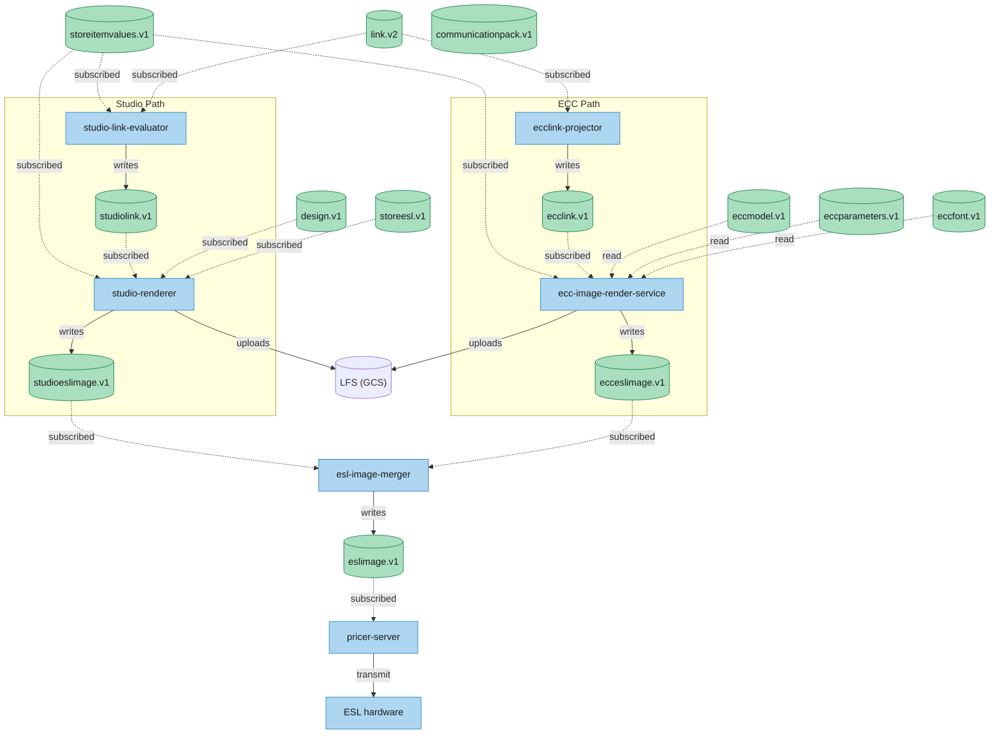
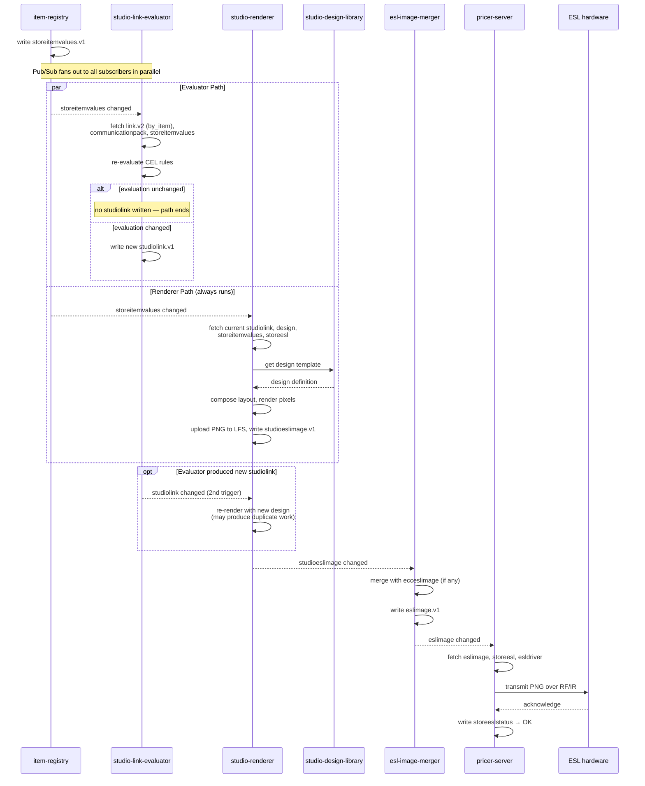
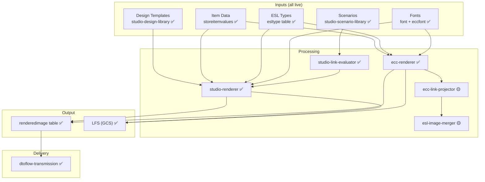

# Rendering Pipeline — Deep Dive
> **End-to-end analysis of how label images are generated from designs and item data**
> **Last validated:** 2026-06-25 against GCP `platform-dev-p01`, Jira epics, and repository analysis

---

## Architecture Overview

The Rendering Pipeline converts **item data + design templates** into **label images** that are transmitted to ESL hardware. It is the visual output layer of the platform — what the customer actually sees on the shelf.



**Current status:** ✅ **Fully live.** Studio rendering, ECC rendering, design library, ecc-link-projector, and esl-image-merger all operational.

---

## 1. The Rendering Concept

Rendering is the process of combining **item data** (price, name, properties) with a **design template** (layout, fonts, colors) to produce a **label image** that fits a specific **ESL type** (screen size, resolution, form factor).

```
[Item Data] ───┐
               ├──→ [Rendering Engine] ──→ [Label Image (PNG/1-bit)]
[Design] ──────┘
                     ↑
                [ESL Type Constraints]
                (screen width, height, dpi, b/w or color)
```

### Key Concepts

| Concept | Description |
|---------|-------------|
| **Design Template** | A label layout created in Designer (Canvas) or ECC. Defines where each field (price, name, barcode) appears on the label |
| **Item Data** | The current values for each field — price, product name, promotional text, barcode, etc. |
| **ESL Type** | The physical label hardware characteristics — screen dimensions, resolution, color support. Determines how the design is scaled/fit |
| **Rendered Image** | The output — a pixel-accurate image ready for transmission to a specific ESL |
| **LFS** | Large File Service (GCS-backed) — stores rendered images that exceed Spanner's size limits |

### Rendering Pipeline Stages

```
1. Input Collection: Gather item data + design template + ESL type constraints
2. Layout Composition: Place fields (price, name, barcode) at design-specified positions
3. Image Rendering: Generate pixel-accurate bitmap for the target ESL screen
4. Post-Processing: Apply color mapping, dithering, format conversion (RGB → 1-bit for e-ink)
5. Storage: Write renderedimage to Spanner (metadata) + LFS (large payload)
6. Notification: Publish renderedimage change event to Pub/Sub
7. Dispatch: CQS routes rendered image to dtoflow-transmission → R3Server → ESL
```

---

## 2. Components — Detailed Breakdown

### 2.1 studio-renderer (Cloud Run)

**Service:** `studio-renderer` — the primary rendering engine for Designer/Canvas designs.

| Aspect | Detail |
|--------|--------|
| **Role** | Canvas/Studio label rendering |
| **Status** | ✅ **Live** |
| **Repository** | `PricerAB/platform-designer-service` |

**What it does:**
- Receives render requests from CQS (triggered by item changes or link changes)
- Fetches the design template from `studio-design-library`
- Fetches current item data from `storeitemvalues` in Spanner
- Fetches the target ESL type specifications from `esltype` table
- Composes the label: places each field (price, name, barcode, promo badge) at the position specified by the design
- Renders the composite image at the correct resolution for the target ESL
- Writes the result to `renderedimage` table in Spanner
- Stores large image payloads in LFS (GCS)
- Publishes `dtoflow-changes-renderedimage.v1` event

**Rendering pipeline inside studio-renderer:**
```
Input: designId, itemId, eslTypeId

1. Load design template (studio-design-library)
   └── Field positions, font sizes, colors, field types (text, barcode, image)

2. Load item data (storeitemvalues from Spanner)
   └── Price, product name, promotion text, barcode value, custom properties

3. Load ESL type specs (esltype from Spanner)
   └── Screen width (px), height (px), dpi, color depth (1-bit, grayscale, color)

4. Layout engine
   └── For each field in design:
       ├── Text field: render text with specified font, size, color at position
       ├── Barcode field: generate barcode image (EAN-13, QR, etc.) at position
       └── Image field: load image asset, scale and place at position

5. Render output
   └── Convert to ESL-native format (e.g., 1-bit e-ink bitmap)
   └── Apply dithering if needed (grayscale to 1-bit)

6. Store
   └── Write renderedimage to Spanner
   └── If image > Spanner limit, store payload in LFS

7. Publish event
   └── dtoflow-changes-renderedimage.v1
```

---

### 2.2 studio-design-library (Cloud Run)

**Service:** `studio-design-library` — stores and serves design templates.

| Aspect | Detail |
|--------|--------|
| **Role** | Design template storage |
| **Status** | ✅ **Live** |
| **Data** | Design definitions stored in Spanner `design` and `canvasdesign` tables |

**What it does:**
- Stores design templates created in the Designer (Canvas) UI
- Each design defines:
  - Canvas dimensions (matches a specific ESL type)
  - Field definitions (price at x=10,y=20, font size 24, bold)
  - Color scheme (black text on white background, red for promotions)
  - Barcode configuration (EAN-13 at x=5,y=80)
  - Images and logos (store logo, promotional badges)
- Serves designs to studio-renderer when rendering is requested
- Supports versioning — designs can be updated without breaking active links

**Spanner tables:**
| Table | Content |
|-------|---------|
| `design` | Core design definitions (layout, fields, colors) |
| `canvasdesign` | Canvas-specific design data (coordinates, layers) |
| `designimage` | Image assets embedded in designs |
| `palette` | Color palette definitions available for designs |

---

### 2.3 studio-scenario-library (Cloud Run)

**Service:** `studio-scenario-library` — manages conditional rendering scenarios.

| Aspect | Detail |
|--------|--------|
| **Role** | Scenario/template management |
| **Status** | ✅ **Live** |

**What it does:**
- Stores **scenarios** — conditional rules that determine which design to use based on item properties
- Example scenario: "If item.price <= $5.00, use 'budget-friendly' design; else use 'standard-price' design"
- Scenarios are used by `studiolink` records to support dynamic label switching
- Enables promotional pricing displays without manual label updates

**Scenario evaluation flow:**
```
1. CQS sends render request with item data
2. studio-link-evaluator checks if link has a scenario reference
3. If yes: scenario-library evaluates conditions against current item data
4. Returns the winning design template
5. studio-renderer renders the winning design with item data
```

---

### 2.4 studio-link-evaluator (Cloud Run)

**Service:** `studio-link-evaluator` — determines which links need re-rendering when item data changes.

| Aspect | Detail |
|--------|--------|
| **Role** | Link evaluation for rendering |
| **Status** | ✅ **Live** |

Covered in detail in the [Link Pipeline Deep Dive](./11-link-pipeline-deep-dive.md). Key rendering relevance:

- When an item price changes, the evaluator checks which links use that item
- For each affected link, it checks if the linked design includes the changed field (e.g., if only "warehouse location" changed, labels showing "price" don't need re-render)
- Returns the filtered list of links that need re-rendering to CQS
- CQS dispatches rendering jobs to studio-renderer

---

### 2.5 ecc-renderer (Cloud Run)

**Service:** `ecc-renderer` — the legacy ECC rendering engine.

| Aspect | Detail |
|--------|--------|
| **Role** | ECC label rendering |
| **Status** | ✅ **Live** |
| **Repository** | `PricerAB/platform-ecc-renderer` |

**What it does:**
- Renders labels using **ECC models** — the legacy template system
- ECC models are templates that combine item data with predefined layouts
- Supports ECC-specific features: parameter-based rendering, model inheritance
- Being progressively replaced by studio-renderer (Designer/Canvas)

**ECC vs Studio rendering:**

| Aspect | Studio Renderer | ECC Renderer |
|--------|----------------|--------------|
| **Template source** | Designer (Canvas) UI | ECC model definitions |
| **Flexibility** | High — WYSIWYG design editor | Medium — parameterized templates |
| **Field types** | Text, barcode, images, shapes | Text, barcode (limited) |
| **Color support** | Grayscale, 1-bit e-ink | 1-bit e-ink only |
| **Migration status** | ✅ Current | 🟡 Being replaced |

---

### 2.6 ecc-link-projector (Cloud Run — NEW)

**Service:** `ecc-link-projector` — projects ECC links onto label templates.

| Aspect | Detail |
|--------|--------|
| **Role** | ECC link-to-render projection |
| **Status** | 🟡 **Code Review** |
| **Author** | Johan Ekman |

**What it does:**
- Takes an ECC link (item + eccModel association)
- Projects the link onto the ECC model template
- Determines how the item data maps to the model's renderable fields
- Outputs a "render projection" that ecc-renderer can consume directly
- Separates the link evaluation logic from the rendering logic (previously coupled)

**Why this service exists:**
```
Before: ECC link evaluation + rendering were coupled in ecc-renderer
After:  ecc-link-projector handles projection, ecc-renderer handles pixel output
         └── Better separation of concerns, easier to test, replaceable components
```

---

### 2.7 esl-image-merger (Cloud Run — NEW)

**Service:** `esl-image-merger` — merges multiple image layers for ESL output.

| Aspect | Detail |
|--------|--------|
| **Role** | Multi-layer image merging |
| **Status** | 🟡 **Code Review** |
| **Author** | Johan Ekman |

**What it does:**
- Takes multiple rendered layers (background, price text, promo overlay, barcode)
- Merges them into a single ESL-ready image
- Handles layer ordering, transparency, and format conversion
- Outputs the final 1-bit e-ink bitmap ready for transmission

**Why this service exists:**
- Labels can have multiple visual layers (base design + price change overlay + promotional badge)
- Previously, layer merging was done inside ecc-renderer or studio-renderer
- Extracting it into a dedicated service allows both renderers to use it
- Enables more complex layering scenarios in the future

---

## 3. Spanner Storage — Rendering Tables

The `dtoflow` database contains these rendering-related tables:

### Output Tables

| Table | Content | Size Consideration |
|-------|---------|-------------------|
| `renderedimage` | Rendered label images (metadata + payload) | Payload can exceed Spanner limits → use LFS |
| `eslimage` | ESL-specific image variants (per ESL type) | Multiple variants per render |
| `studioeslimage` | Studio-rendered ESL images | Same as eslimage but Studio-sourced |
| `ecceslimage` | ECC-rendered ESL images | Same as eslimage but ECC-sourced |

### Design Tables

| Table | Content | Used By |
|-------|---------|---------|
| `design` | Design template definitions | studio-renderer |
| `canvasdesign` | Canvas-specific design layouts | studio-renderer |
| `designimage` | Image assets embedded in designs | studio-renderer |
| `palette` | Color palette definitions | studio-renderer |

### ECC Model Tables

| Table | Content | Used By |
|-------|---------|---------|
| `eccmodel` | ECC model (template) definitions | ecc-renderer |
| `eccparameters` | ECC parameter configurations | ecc-renderer |

### Font Tables

| Table | Content | Used By |
|-------|---------|---------|
| `font` | Font definitions for Studio/Canvas | studio-renderer |
| `eccfont` | ECC-specific font definitions | ecc-renderer |

### Image Asset Tables

| Table | Content | Used By |
|-------|---------|---------|
| `eccimage` | ECC base image assets | ecc-renderer |

**Rendered image schema:**
```sql
CREATE TABLE renderedimage (
  dto_type STRING(MAX) NOT NULL,  -- "renderedimage"
  id STRING(MAX) NOT NULL,        -- unique image identifier
  DATA BYTES(MAX),                -- protobuf: image metadata + payload or LFS reference
  checksum INT64,
) PRIMARY KEY(dto_type, id);
```

The `DATA` protobuf contains:
```protobuf
message RenderedImage {
  string design_id = 1;
  string item_id = 2;
  string esl_type_id = 3;
  string store_id = 4;
  string tenant_id = 5;
  int32 width_px = 6;
  int32 height_px = 7;
  int32 dpi = 8;
  bytes image_data = 9;       // May be empty if stored in LFS
  string lfs_reference = 10;  // Reference if stored in LFS
  string format = 11;         // "PNG", "1-bit", "e-ink"
  int64 rendered_at = 12;
  string checksum = 13;
}
```

---

## 4. Key Rendering Flows

### 4.1 Item Price Change → Label Re-rendered

The most common rendering flow. A price change triggers the full rendering pipeline. Both evaluator and renderer are triggered in parallel — there is no "shortcut" or "bypass."



**Status:** ✅ End-to-end live. The entire chain from item change → direct rendering → merging → transmission is operational.

**Estimated latency:**
| Step | Time | Cumulative |
|------|------|------------|
| CQS → evaluator | ~50ms | 50ms |
| Link evaluation | ~200ms | 250ms |
| Design fetch | ~50ms | 300ms |
| Item data fetch | ~50ms | 350ms |
| Layout + pixel render | ~300ms | 650ms |
| Spanner write | ~50ms | 700ms |
| Pub/Sub + CQS dispatch | ~100ms | 800ms |
| Transmission → R3Server | ~100ms | 900ms |
| ESL update | ~100ms | 1000ms |

**Total: ~1 second** from item change to label update.

---

### 4.2 Designer Creates a New Label Design

A new design is created and linked to an item. The first render happens immediately after linking.

```
1. Designer creates design in Canvas UI
   └── studio-design-library saves to Spanner (design + canvasdesign tables)

2. Designer creates link (item + design)
   └── link-registry writes link record

3. link-registry publishes link.v2 event
   └── CQS picks up → dispatches render

4. studio-renderer renders the label
   └── Fetches design → fetches item data → renders → stores → publishes event

5. dtoflow-transmission dispatches to store
   └── R3Server transmits to ESL
```

**Status:** ✅ End-to-end live.

---

### 4.3 ECC Rendering (Legacy Path)

ECC rendering follows a parallel flow, triggered by the same DTO changes as the Studio path. Both renderers subscribe independently to their respective input DTOs before converging at the merger.

```
1. link.v2 event (link-registry writes link.v2)
   └── ecclink-projector (subscribes to link.v2): projects to ecclink.v1
   
2. ecclink.v1 written → ecc-image-render-service (subscribes to ecclink.v1 via by_storeesl alias)
   └── Fetches eccmodel, eccparameters, eccfont, storeitemvalues
   └── Java2D renders PNG → uploads to GCS → writes ecceslimage.v1

3. ecceslimage.v1 written → esl-image-merger (subscribes to ecceslimage.v1)
   └── Merges with any studioeslimage counterpart; writes unified eslimage.v1

4. eslimage.v1 written → pricer-server (subscribes to eslimage.v1)
   └── Transmits to ESL hardware
```

**Status:** 🟡 Core ECC rendering (ecc-renderer) live. ecc-link-projector and esl-image-merger in Code Review — once merged, the ECC rendering pipeline gains the same separation of concerns as the Studio pipeline, funneling everything into a standardized `eslimage`.

---

### 4.4 Bulk Re-render (Chain-Wide Promotion)

When a chain runs a promotion, thousands of labels may need re-rendering simultaneously.

```
1. Central-Manager updates item prices across 200 stores
   └── Item Pipeline processes each update

2. Each item change triggers link evaluation
   └── studio-link-evaluator identifies affected links

3. CQS queues rendering jobs
   └── Prioritization ensures critical updates first

4. studio-renderer processes render queue
   └── May scale horizontally on Cloud Run

5. Each rendered image dispatched to its store
   └── dtoflow-transmission fans out across stores
```

**Scaling consideration:**
- 200 stores × 5000 item changes = potentially 1,000,000 re-renders
- Cloud Run auto-scales based on queue depth
- CQS prioritization prevents overwhelming the system
- Not all changes require re-render (evaluator filters)

---

## 5. Rendering Formats and ESL Types

### ESL Type Constraints

Each ESL label has physical characteristics that constrain rendering:

| ESL Type | Width (px) | Height (px) | DPI | Color Depth | Typical Use |
|----------|------------|-------------|-----|-------------|-------------|
| 2.1" segment | 128 | 32 | 100 | 1-bit | Small price tag |
| 2.9" graphic | 296 | 128 | 112 | 1-bit | Standard shelf label |
| 4.2" graphic | 400 | 300 | 120 | 1-bit | Large display |
| 7.5" graphic | 800 | 480 | 150 | 4-bit grayscale | Promotional display |
| 2.7" color | 264 | 176 | 110 | 3-bit color | Highlight/promotion |

**Design→ESL type compatibility:**
- Each design specifies which ESL types it supports
- If a design is linked to an ESL with unsupported dimensions, rendering fails
- The studio-link-evaluator checks compatibility before dispatching render jobs

### Image Formats

| Format | Used For | Notes |
|--------|----------|-------|
| 1-bit bitmap (XBM) | E-ink labels | Most common — e-ink displays are black/white |
| 4-bit grayscale | High-res labels | Dithering applied if source is color |
| 3-bit color | Color ESL labels | Limited color palette |
| PNG | Intermediate storage | Used in LFS before format conversion |

---

## 6. Large File Service (LFS) Integration

Rendered images can exceed Spanner's maximum row size (10 MiB). For large images:

```
Rendered image generated
  ├── If size < Spanner limit: stored inline in renderedimage.DATA column
  └── If size > Spanner limit: stored in LFS (GCS bucket)
        └── renderedimage.DATA contains LFS reference + metadata
```

**LFS bucket:** GCS bucket managed by `dtoflow-lfs` service.

**LFS reference format:**
```
lfs://dtoflow-lfs/renderedimage/{tenantId}/{storeId}/{imageId}
```

---

## 7. Rendering Pipeline Dependencies



**What the Rendering Pipeline needs from other pipelines:**
- **Item Pipeline:** Current item data (storeitemvalues) — the values to display on labels
- **Link Pipeline:** Which designs to use for each item (link records) — the template reference
- **ESL Type data:** The target screen specifications — determines output format
- **Transmission:** Delivery of rendered images to stores

**What depends on the Rendering Pipeline:**
- **Plaza Mobile:** Label image display (GET /labels/{barcode}/image)
- **Store UI:** Label preview and design verification
- **Actions (flash):** Rendered images are needed before flash can confirm

---

## 8. Rendering Complexity Factors

### 8.1 Design Compatibility

A design created for one ESL type may not work on another:
```
Design for 2.9" graphic (296×128) → ESL type 2.1" segment (128×32)
  └── Design too large → must be scaled down or rejected
```

**Challenge:**
- Designs must be validated against target ESL types before linking
- If a label is replaced with a different ESL type, existing designs may become incompatible
- Auto-scaling rarely works well on e-ink (text becomes unreadable)

### 8.2 Rendering Volume

A single chain-wide price update can trigger thousands of re-renders:
```
200 stores × 5000 items = 1,000,000 rendered images
Each render: ~300ms processing + ~50ms Spanner write
Total: 1M × 350ms = ~97 hours of rendering time
```

**Mitigation:**
- Cloud Run auto-scaling (potentially hundreds of concurrent instances)
- CQS prioritization (urgent price changes before cosmetic updates)
- The evaluator filters out links that don't display the changed field

### 8.3 Image Storage

Rendered images accumulate over time:
```
1 store × 10,000 labels × 10 re-renders/day × 30 days = 3M images
Each image: ~5-50 KB (1-bit e-ink bitmap)
Storage: 3M × 25 KB avg = ~75 GB/month per store
```

**Mitigation:**
- Only the latest rendered image per label is needed (old ones can be archived)
- LFS (GCS) is the primary store, Spanner holds metadata
- GCS lifecycle policies can auto-archive old images

### 8.4 Format Conversion

E-ink displays require specific image formats:
```
Source: RGB color (from Designer)
  → Grayscale conversion
  → Dithering (Floyd-Steinberg or ordered)
  → 1-bit threshold
  → XBM or proprietary e-ink format
```

**Challenge:**
- Each ESL manufacturer has a slightly different format requirement
- Some support grayscale, others only 1-bit
- Color ESLs (3-bit) require palette mapping
- The renderer must know the target ESL type's exact format specifications

### 8.5 ECC Migration

The ECC→Studio migration adds complexity:
```
Phase 1: Both renderers run in parallel (current)
  └── studio-renderer for Designer links
  └── ecc-renderer for ECC links
  └── Two rendering pipelines to maintain

Phase 2: ECC→Studio migration
  └── Convert ECC models to Designer templates
  └── Migrate existing links
  └── Decommission ecc-renderer

Future: Single rendering pipeline
  └── studio-renderer handles everything
```

---

## 9. Current Status Summary

| Component | Status | What's Left |
|-----------|--------|-------------|
| **studio-renderer** | ✅ **Live** | Nothing — primary rendering pipeline operational |
| **studio-design-library** | ✅ **Live** | Nothing — design storage works |
| **studio-scenario-library** | ✅ **Live** | Nothing — conditional scenarios work |
| **studio-link-evaluator** | ✅ **Live** | Nothing — link evaluation works (details in Link Pipeline doc) |
| **ecc-renderer** | ✅ **Live** | Nothing — legacy rendering operational |
| **ecc-link-projector** | 🟢 **Live** | Merged 2026-06-23. Separates projection from rendering logic |
| **esl-image-merger** | 🟢 **Live** | Merged 2026-06-23. Extracts layer merging into dedicated service |
| **LFS (GCS image storage)** | ✅ **Live** | Nothing — large file storage operational |
| **renderedimage table** | ✅ **Live** | Nothing — storage schema operational |
| **ECC full support** (PLT-2359 — Epic) | 🔴 **Backlog, Unassigned** | Not started |
| **Designer/Canvas → ECC migration** | 🔴 **Not planned** | Future scope |

### Summary

```
✅ Rendering Pipeline is fully live and production-ready.
   Studio rendering, ECC rendering, design library, and LFS all operational.
   The item→link→render→transmit→ESL chain works end-to-end.

🟡 2 new services in Code Review (ecc-link-projector, esl-image-merger).
   Once merged, ECC rendering achieves the same clean separation as Studio.

🔴 ECC→Designer migration (PLT-2359) is in backlog.
   Not blocking current operations — both pipelines run in parallel.