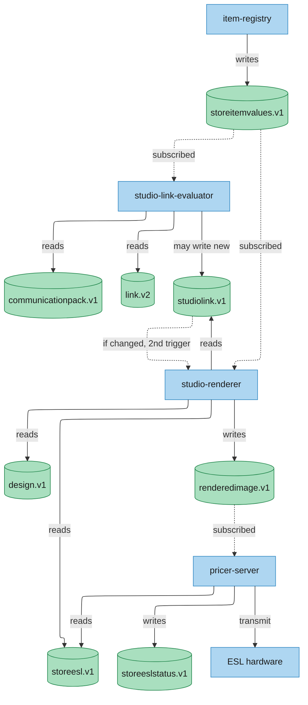
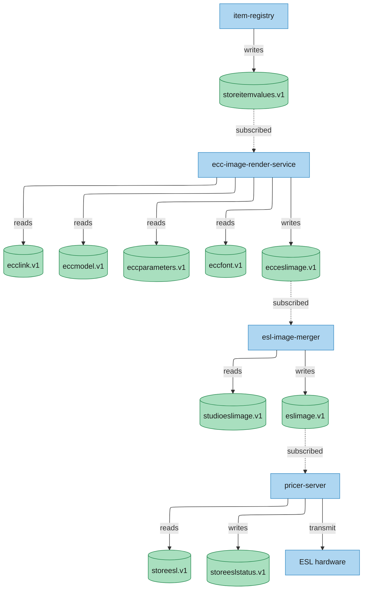
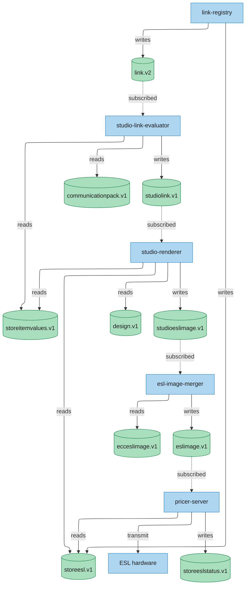
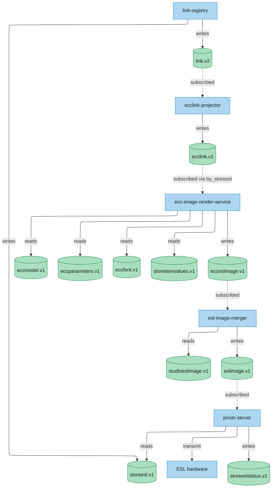
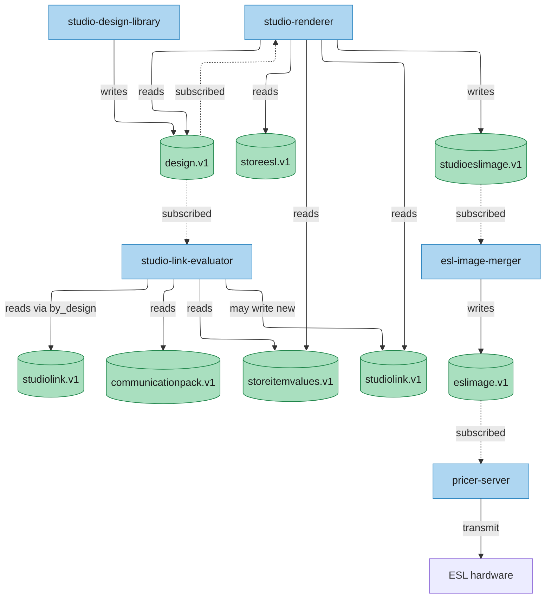

# 13 — Core Data Flows

> **Audience:** A new engineer or architect mapping out the event-driven behavior of DTOflow.  
> **Goal:** Understand the exact sequence of service invocations and DTO mutations across the core data paths.  
> **Source of Truth:** Validated against live GCP Pub/Sub topics (`platform-dev-p01`), Cloud Run service topology, the `evo-dtoflow-protos` central-documentation branch, and CQS queue subscription configs (as of 2026-06-29).

---

## Architectural Context

DTOflow is purely **event-driven** and **decentralized**. There is no central orchestrator. Instead:

1. A service mutates a DTO in Spanner.
2. The DTOflow Server publishes a change event to a DTO-specific Pub/Sub topic (e.g., `dtoflow-changes-storeitemvalues.v1`).
3. The **ChangeQueueService (CQS)** drains these Pub/Sub topics and delivers notifications to every service queue that **subscribed** to that DTO type. CQS has **no routing logic of its own** — each service declares its own subscriptions at startup via `CreateOrConfigureQueue`.
4. Each subscribing service dequeues, fetches the latest DTO from Spanner, processes it, and may write its own output DTOs — which in turn trigger their own subscribers.

**Key principle:** A single DTO write fans out to ALL subscribers in parallel. When `storeitemvalues` changes, both `studio-link-evaluator` AND `studio-renderer` receive the notification — they run concurrently, not sequentially. There is no "shortcut" or "bypass" — every subscriber gets every notification for the DTO types it registered.

### Current event subscriptions

> Source: Actual service code — `CqsSubscriptionManager.java` (evaluator), `routes/dtoflow-event.ts` (renderer), plus live Pub/Sub push configs.

| Service | Ingestion | Subscribed DTO types |
|---|---|---|
| `studio-link-evaluator` | **CQS pull** | `communicationpack.v1`, `link.v2`, `storeitemvalues.v1` |
| `platform-image-render-service` | **Pub/Sub push** (HTTP endpoint) | `designerlink.v1`, `storeitemvalues.v1`, `design.v1`, `canvasdesign.v1`, `storeesl.v1` |
| `pricer-server` | **CQS pull** | `renderedimage.v1`, `storeesl.v1` |
| `link-registry` | CQS pull | `link.v1` (legacy bridge only) |
| `ecc-link-projector` | CQS pull | `link.v2` |
| `ecc-image-render-service` | CQS pull | `ecclink.v1` (`by_storeesl` alias) |

**Key differences from the evaluator:** The renderer (`platform-image-render-service`, TypeScript) does **not** use CQS. It receives Pub/Sub push events via an HTTP endpoint — a different ingestion model from the evaluator's CQS long-polling. The evaluator and renderer both react to `storeitemvalues.v1` changes, but through different mechanisms. The renderer reads `designerlink.v1` (not `studiolink.v1`) — a bridge service converts `studiolink.v1` to `designerlink.v1` before the renderer sees it.

The `pricer-server` subscribes to `renderedimage.v1` (not `eslimage.v1`). The renderer writes directly to the `renderedimage` DTO. The `studioeslimage.v1` → `esl-image-merger` → `eslimage.v1` path is the **target architecture** (PLT-2487 image split), not what runs today.

### Diagram conventions

- **Blue boxes** = services (Cloud Run workers that subscribe and produce DTOs)
- **Green cylinders** = DTOs (data stored in Spanner, with Pub/Sub change topics)
- CQS is deliberately **not shown** in flow diagrams — it is a transparent fan-out layer, not a routing step. The subscription table above defines the wiring.
- Arrows show "writes/updates" (solid) and "reads/consumes" (dashed).

---

## Phase & Epic Overlay

> **Bridging architecture and delivery:** Each flow below maps to specific Milestones, Increments, and epics from the delivery framework ([doc 15](15-overall-status.md), [doc 00](00-replatforming-program-overview.md)). Use this table to connect "how the pipes work" (this doc) with "what we're building when" (the delivery docs).

| # | Flow | Phase / Milestone | Relevant Increment | Key Epics | Gate Status |
|---|------|-------------------|-------------------|-----------|-------------|
| **1** | Studio Item Update | **P0** validated via Shadow Mode · **P1** needed for cloud-native path | Inc 2.1 (export pipe) · M3 Inc 1 (item APIs) | PLT-2483 (storeitemvalues export), PLT-2651 (item validation), PLT-2378 (Patch APIs) | 🟡 P0: export pipe Ready for Deploy. 🔴 P1: item pipeline gated by PLT-2651 + PLT-2378 |
| **2** | ECC Item Update | **P0** Shadow Mode ECC rendering · **P2** full feature parity | Inc 2.1 (ECC data pipes) · Inc 2.2 (ECC rendering support) | PLT-2494/2495 (ECC export pipes), PLT-2359 (ECC rendering support, building early) | 🟡 In Progress — ECC Shadow Mode rendering being validated |
| **3** | Link → Render (Studio) | **P0** operational | Inc 2.2 (Shadow Mode orchestration) | PLT-2294 (Closed), PLT-2354 (Shadow Mode orchestration) | 🟢 Live end-to-end — the most mature flow |
| **4** | Link → Render (ECC) | **P0** operational | Inc 2.2 (Shadow Mode completion) | PLT-2773 (Closed), PLT-2771 (Closed), PLT-2359 (Inc 2.2) | 🟢 Live — ecclink-projector + ecc-renderer operational |
| **5** | Design Publication | **P0** operational | Inc 2.2 (Shadow Mode validation) | PLT-2354 (Shadow Mode orchestration) | 🟢 Live — mass re-render via ReEnqueue fan-out |

**How to read this table:**
- **🟢 Live** = flow works end-to-end today in Shadow Mode (label transmit dropped)
- **🟡 In Progress** = partially operational; epics actively being built
- **🔴 Gated** = blocked by one or more unassigned/blocked epics
- See [doc 15 §8](15-overall-status.md#8-executive-summary) for the program-at-a-glance status of all flows

---

## 1. Studio Item Update Flow

**Trigger:** `item-registry` writes a new `storeitemvalues` DTO (price change, property update, etc.)

This is the most common flow. Both evaluator and renderer are triggered in parallel. The evaluator may or may not produce a new `studiolink` — if it doesn't, the renderer still renders with the existing link + new item values. If the evaluator *does* produce a new studiolink, the renderer gets a second trigger and may do double work (render the old design, then render the new design).

**Walkthrough:**
1. `item-registry` writes `storeitemvalues` to Spanner. Pub/Sub emits `dtoflow-changes-storeitemvalues.v1`.
2. CQS delivers the notification to **both** `studio-link-evaluator` and `studio-renderer` queues in parallel.
3. **Evaluator path:** fetches `link.v2` (via `by_item` alias), `communicationpack`, and the new `storeitemvalues`. Re-evaluates CEL rules. If the winning design or render context changed, writes a new `studiolink`. If unchanged, writes nothing — the pipeline stops for the evaluator.
4. **Renderer path (always runs):** fetches the current `studiolink`, `design`, `storeesl`, and `storeitemvalues`. Renders a new PNG, uploads to LFS, writes `studioeslimage`.
5. If step 3 produced a new `studiolink`, the renderer receives a **second** notification (since it also subscribes to `studiolink.v1`) and renders again with the new design. This is the "double render" scenario — the renderer may produce two `studioeslimage` records (old design, then new design).
6. `esl-image-merger` (subscribes to `studioeslimage.v1` and `ecceslimage.v1`) merges into the final `eslimage`.
7. `pricer-server` (subscribes to `eslimage.v1`) fetches the image, transmits to ESL hardware, writes `storeeslstatus`.

**Efficiency note:** In most cases (simple price change, same design), the evaluator produces no change, so only one render occurs. The evaluator's idempotency gate prevents unnecessary rendering downstream — but it never "blocks" or "shortcuts" the renderer; they simply run in parallel.

---

## 2. ECC Item Update Flow

**Trigger:** `item-registry` writes `storeitemvalues` for an item linked to an ECC label.

**Walkthrough:**
1. `item-registry` writes `storeitemvalues`. CQS delivers to `ecc-image-render-service` (subscribes to `storeitemvalues.v1` via `by_item` alias on `ecclink`).
2. EIRS batch-processes per tenant+store: fetches `ecclink`, `eccmodel`, `eccparameters`, `eccfont`, and all item values. Renders via Java2D, uploads PNGs to GCS, writes `ecceslimage` records via `putMany`.
3. `esl-image-merger` receives the `ecceslimage` notification, merges with any `studioeslimage` counterpart (Studio wins by default), writes unified `eslimage`.
4. `pricer-server` transmits to hardware.

---

## 3. Link Creation → Render Flow (Studio)

**Trigger:** `link-registry` creates a new `link.v2` with a Studio variant (`Single` or `FloatingCanvas`).

**Walkthrough:**
1. `link-registry` writes both `storeesl` (ESL registration) and `link.v2` (item→ESL association with design reference).
2. `studio-link-evaluator` (subscribes to `link.v2`) fetches the link, `communicationpack`, and `storeitemvalues`. Evaluates CEL rules to resolve the winning design. Writes `studiolink`.
3. `studio-renderer` (subscribes to `studiolink.v1`) fetches the evaluated link, `design`, `storeesl`, and `storeitemvalues`. Renders the label image. Writes `studioeslimage`.
4. Downstream: merger → `eslimage` → pricer-server → ESL hardware.
5. `pricer-server` also receives `storeesl` (it subscribes to `storeesl.v1`) — this triggers device registration for the new ESL.

---

## 4. Link Creation → Render Flow (ECC)

**Trigger:** `link-registry` creates a `link.v2` with an ECC variant (`EccSingle` or `MultiItem`).

**Walkthrough:**
1. `link-registry` writes `storeesl` + `link.v2`.
2. `ecclink-projector` (subscribes to `link.v2`) inspects the ESL type. If ECC: maps `link.v2` fields onto `ecclink` (resolves ECC model ID). If non-ECC: ensures any stale `ecclink` is deleted.
3. `ecc-image-render-service` (subscribes to `ecclink.v1` via `by_storeesl` alias) fetches `eccmodel`, `eccparameters`, `eccfont`, and `storeitemvalues`. Renders via Java2D, writes `ecceslimage`.
4. `esl-image-merger` merges with any `studioeslimage`, writes unified `eslimage`.
5. `pricer-server` transmits to hardware.

---

## 5. Design Publication Flow

**Trigger:** A designer publishes a design in Studio UI. `studio-design-library` writes a new `design.v1` DTO.

This is the heavy fan-out case. A single design change may affect every linked ESL across a multi-store tenant. The `ReEnqueue` streaming API is used to split the work into manageable batches.

**Walkthrough:**
1. `studio-design-library` writes `design.v1`. CQS delivers to both `studio-renderer` and `studio-link-evaluator`.
2. **Renderer path:** receives one `parent_id` notification for the design. Uses `ReEnqueue` to split into store-level batches, then per-ESL items — see CQS docs for the tiered split pattern. Renders every affected ESL.
3. **Evaluator path:** re-evaluates all links referencing this design (via `by_design` alias on `studiolink`). If the design change affects which design wins for any link, writes new `studiolink`.
4. Downstream: merger → eslimage → pricer-server → ESL hardware.

---

## Deprecated / Superseded DTOs

These DTOs are still in the system but no longer the primary path:

| DTO | Replaced by | Status |
|---|---|---|
| `designerlink.v1` | `studiolink.v1` | Phase 2 complete — `studio-link-evaluator` now writes `studiolink` directly |
| `renderedimage.v1` | `eslimage.v1` | Superseded by PLT-2487 image split. Bridge removal pending full pricer-server cutover |
| `link.v1` | `link.v2` | Read-only; no new records written. Full migration in ADR-003 |
