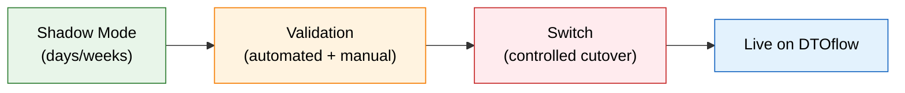
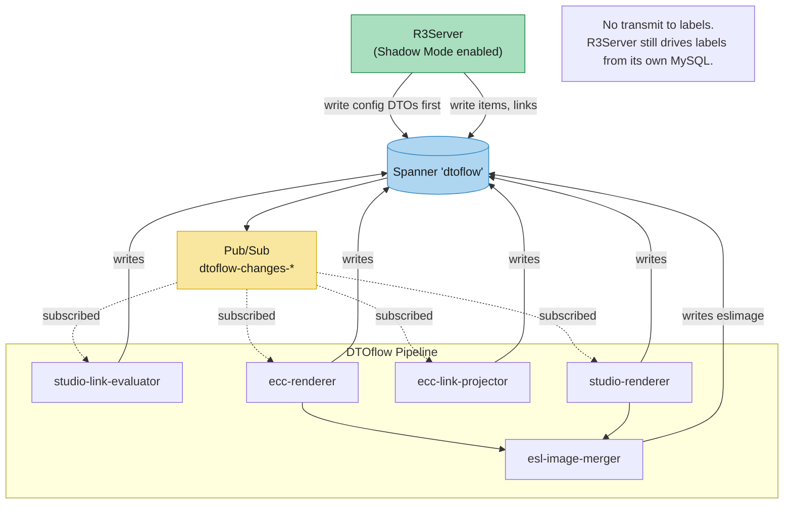
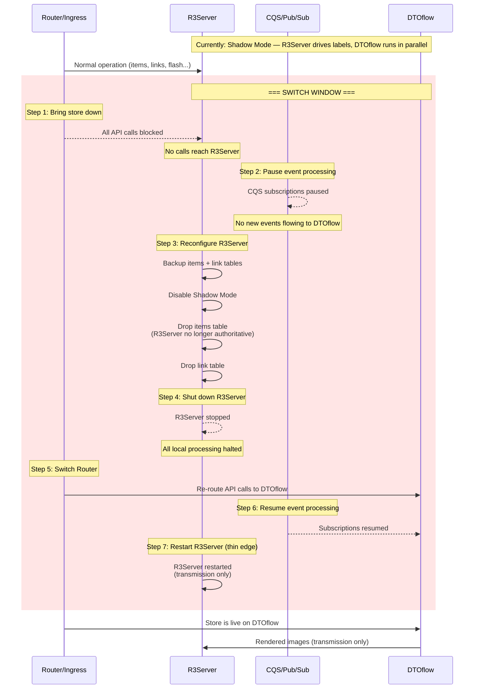

# 14 — Tenant Migration Guide

> **Scope:** The store-by-store migration process — how a Pricer Server (R3Server) store is migrated from standalone operation to running on the DTOflow cloud platform. Covers Shadow Mode, validation, switch-over, and migration candidates.
>
> **Validated:** 2026-06-30 — against live GCP services (`platform-dev-p01`), GitHub repos, and the PLT-2484/2487 handover diagrams.

---

## 1. Migration Overview

Migration is **store-by-store**, not tenant-wide. Each store runs through the same process independently — this lets us validate one store, learn, and then roll out to the rest.

| Phase | What happens | Risk to labels |
|-------|-------------|----------------|
| **Shadow Mode** | DTOflow pipeline runs in parallel with R3Server; labels still driven by R3Server | Zero |
| **Validation** | Compare cloud outputs against R3Server baselines; run API parity checks | Zero |
| **Switch** | Controlled cutover — R3Server becomes thin edge; DTOflow becomes authoritative | Brief window |

---

## 2. Shadow Mode Operation

### 2.1 What Shadow Mode Means During Migration

During Shadow Mode, the R3Server updates its **configuration** to enable data export to DTOflow. Once enabled:

- Every item update committed to the R3Server MySQL is **also published** to DTOflow as `storeitemvalues`
- The DTOflow pipeline processes changes **in parallel** — evaluator and renderer both receive notifications independently
- **DTOflow runs as the main flow** — changes are pushed to DTOflow and forwarded to Pub/Sub, triggering the full pipeline
- R3Server **continues** driving labels from its own MySQL — labels are unaffected

### 2.2 Data Push Order

Data is pushed to DTOflow by the CQS client running in R3Server (PLT-1870). The order of data pushed **does not matter** for most DTO types — each service reacts independently to whatever arrives. The one exception:

> **Config must be pushed first.** Configuration DTOs (`store`, `storeesl`, etc.) establish the store context. Without them, downstream services lack the metadata needed to process item/link events.

| Order | DTO type | Why |
|-------|----------|-----|
| 1 | Config DTOs (`store`, `storeesl`) | Store context — must exist before items/links |
| 2+ | `storeitemvalues`, links, etc. | Any order; services tolerate missing references and retry |

### 2.3 What DTOflow Does With Incoming Data

> **Key point:** In Shadow Mode, the entire DTOflow pipeline runs end-to-end — evaluate, render, merge — but **no images reach labels**. R3Server's own rendering+transmission continues independently.

---

## 3. Validation

Validation runs during Shadow Mode. Two tracks run in parallel:

### 3.1 Image Comparison

**Goal:** Prove DTOflow produces identical images to R3Server.

For every label in the store, compare the **last image rendered** by DTOflow against the **currently displayed image** from R3Server:

- Byte-level comparison of rendered bitmaps (or hash-based for efficiency)
- Track drift: if DTOflow renders a different image, log the diff for investigation
- Once 100% match is stable for a representative period (e.g., 24 hours with normal update volume), the rendering pipeline is considered validated

### 3.2 API Parity

**Goal:** Prove DTOflow APIs match R3Server functionality for this tenant.

Run a **comprehensive set of API calls** relevant to the specific tenant. Every API surface the tenant uses must behave identically:

- Item CRUD (PATCH/POST/DELETE items, item results)
- Link operations (create, update, unlink)
- Flash / display page changes
- Bulk operations (if the tenant uses them)
- Store configuration reads

Compare responses from R3Server (source of truth) vs. DTOflow (cloud). Any discrepancy is a migration blocker.

> **Scope is tenant-specific.** A tenant that doesn't use ECC linking doesn't need ECC API parity — validate only what that tenant actually uses.

---

## 4. Switch Procedure

The switch from Shadow Mode to live DTOflow is a **controlled, sequenced cutover**. The goal is to minimize the window where labels can't be updated while ensuring data consistency.

### Step-by-step

| Step | Action | Duration | Impact |
|------|--------|----------|--------|
| **1. Bring store down** | All API calls interrupted at router level. No calls reach R3Server. | Seconds | Store is "offline" — no updates possible |
| **2. Pause CQS** | Pause CQS subscriptions for this store's DTO types. Prevents DTOflow from processing events during reconfiguration. | Seconds | DTOflow pipeline paused |
| **3. Reconfigure R3Server** | While R3Server is still running (API calls blocked): backup items + link tables, disable Shadow Mode, drop the items and link tables. | Minutes | R3Server no longer authoritative for data |
| **4. Shut down R3Server** | Stop R3Server process. Guards against internal timers/background jobs. | Seconds | All local processing halted |
| **5. Switch Router** | Re-point API routes from R3Server to DTOflow Cloud Run services. | Seconds | API traffic now reaches the cloud |
| **6. Resume CQS** | Resume CQS subscriptions. DTOflow is now the authoritative source. | Seconds | DTOflow pipeline resumes; images flow to labels |
| **7. Restart R3Server** | Restart R3Server in thin-edge mode (transmission engine only, no MySQL data). | Seconds | Store is fully live on DTOflow |

> **Router level:** "Bring store down" should be implemented at the ingress/routing layer (Apigee or ingress-nginx), not at R3Server itself. The goal is to prevent any API call from reaching R3Server during the switch, without R3Server needing to be aware of the cutover.

### Rollback

If the switch fails, reverse the procedure:
1. Pause CQS subscriptions
2. Re-point router back to R3Server
3. Restore R3Server items/link tables from backup (taken in Step 4)
4. Re-enable Shadow Mode on R3Server
5. Restart R3Server
6. Resume CQS subscriptions

---

## 5. Migration Candidates

### Phase 0 — Internal Validation

| Store / Tenant | Description | Why First |
|---------------|-------------|-----------|
| **Replatforming-Dev** | Internal dev environment, not used by anyone | Zero impact if anything breaks; validates the migration procedure itself |
| **Evo-Se** | Main environment used by the dev team | Real-world usage patterns but still internal; low-risk validation |
| **Application-Stage** | Product validation environment | Last pre-prod check; validates against staging data |

### Phase 1 — Production

| Store / Tenant | Description | Risk Profile |
|---------------|-------------|-------------|
| **byPricer** | Demo environment | Low risk — demo data, not production; good first real-world test |
| **Landwaart AGF B.V** | Many updates, no PCS, EVO tokens only | Medium risk — simpler stack (no PCS dependency), active update patterns |
| **Spar-be** | ~13,000 ESLs, large stores | Higher risk — large scale validates performance; run after smaller stores succeed |

> **Selection principle:** Start with smallest, simplest stores (fewest features, lowest ESL count) and progress to larger ones. Each successful migration derisks the next.

---

## 6. Dependencies

Before any store can be migrated, these must be in place:

| Dependency | What | Status | Assignee |
|-----------|------|--------|----------|
| storeitemvalues export | PLT-2483 — Shadow Mode data pipe | 🟡 Ready for Deploy | Johan Ekman |
| CQS client in R3Server | PLT-1870 — exports item data to DTOflow | 🟡 Test | Daniel Pettersson |
| Item property validation | PLT-2651 — validates item properties end-to-end | 🔴 Blocked | Unassigned |
| Item Patch APIs | PLT-2378 — cloud APIs for item CRUD | 🔴 Blocked | Unassigned |
| Shadow Mode infrastructure | PLT-2354 — end-to-end shadow pipeline | 🟡 In Progress | Daniel Pettersson |
| API routing | PLT-2101 — per-API-path routing at ingress | 🟡 Selected for Dev | Saikiran Katta |
| Prod-ready DTOflow | PLT-2118 — production-grade DTOflow platform | 🟡 Test | Bart De Boer |

> **PLT-2651 and PLT-2378 are the critical blockers.** PLT-2651 gates the item pipeline itself (4 of 5 services built but can't validate properties). PLT-2378 gates the consumer API cutover — without cloud Item Patch APIs, the router has nowhere to re-route item traffic.

---

## 7. Migration Checklist (per store)

- [ ] Config DTOs (`store`, `storeesl`) pushed to DTOflow
- [ ] All items and links exported to DTOflow
- [ ] Shadow Mode enabled on R3Server
- [ ] Image comparison: 100% match for 24+ hours
- [ ] API parity: all tenant-relevant APIs validated
- [ ] Switch window scheduled (low-traffic period)
- [ ] Rollback plan documented and tested
- [ ] **Step 1:** Router blocks API calls to R3Server
- [ ] **Step 2:** CQS subscriptions paused
- [ ] **Step 3:** R3Server reconfigured (backup taken, Shadow Mode off, tables dropped)
- [ ] **Step 4:** R3Server shut down
- [ ] **Step 5:** Router re-pointed to DTOflow
- [ ] **Step 6:** CQS subscriptions resumed
- [ ] **Step 7:** R3Server restarted (thin edge, transmission only)
- [ ] Labels verified updating correctly post-switch

---

### Next: [15 — Overall Status →](15-overall-status.md)
