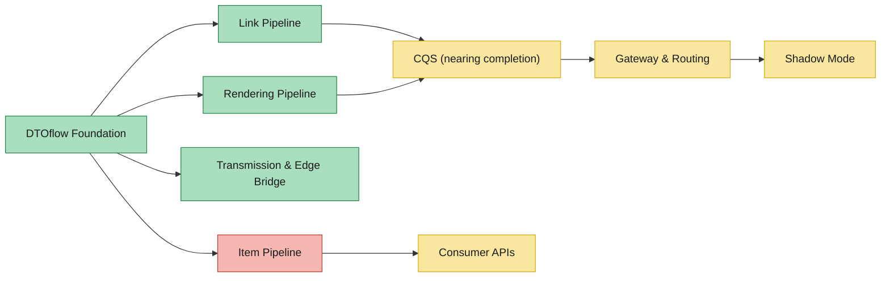

# 15 — Overall Status: Replatforming Architecture & Pipeline

> **Scope:** Executive-level status of the entire Replatforming program — Cloud Run services, key end-to-end flows, epic backlog, blockers, and next milestones.
>
> **Validated:** 2026-06-30 — against live GCP (`platform-dev-p01`, `europe-north1`), GitHub (`PricerAB` org), Jira (`project = PLT`), the `evo-dtoflow-protos` central-documentation branch, and the [Confluence Architecture & Pipeline Status page](https://pricer-org.atlassian.net/wiki/spaces/~71202026d6e29fd7314f1e915ad8754239598a/pages/10187767809/Replatforming+Architecture+Pipeline+Status) (last updated 2026-06-25).
>
> **2026-06-30 delta vs Confluence:** The three "in review" services on the Confluence page (ecc-link-projector, esl-image-merger, migration-helper) were actually merged on June 23, before the page was last updated — the page was slightly behind. All three are now confirmed deployed to Cloud Run.

---

## 1. Executive Summary

**The DTOflow cloud platform is largely live.** Link processing, rendering, and transmission are operational end-to-end. The primary delivery risk is concentrated in the **Item Pipeline**, where property validation (PLT-2651) blocks item-driven flows, directly impacting Plaza Mobile and Central-Manager migrations.

| Dimension | Status | Contributing Epics & Stories | Detail |
|-----------|--------|------------------------------|--------|
| **DTOflow Foundation** | 🟢 Live | **Done/Closed:** PLT-2294 (id & alias validation) ✅, PLT-2771 (ESL Image Merger) ✅, PLT-2773 (ECC Link Projector) ✅ · **In Progress:** PLT-2118 (DTOflow PROD-ready, Test · Bart De Boer), PLT-2336 (broadly accessible / PSC · Sreekanth), PLT-2478 (PS↔CQS/DTOflow design · Sreekanth) · **Selected:** PLT-171 (SLA/trackingId · Unassigned) · **Backlog:** PLT-170 (Write Protection), PLT-2444 (Status Reporting), PLT-2369 (Auto-scaling), PLT-2428 (Subscription System) · **Infrastructure (no epic):** Spanner instance `dtoflow` (29 tables, 1000 PU), Pub/Sub (32 topics), gRPC client libraries (Java + Node), GCS/LFS, `dtoflow-spanner` + `dtoflow-lfs` Cloud Run services | Spanner, Pub/Sub, gRPC, GCS/LFS — all operational. PLT-2118 (PROD-ready certification) in Test. PLT-2336 (PSC for broader access) in progress. |
| **Link Pipeline** | 🟢 Live | **Done/Closed:** PLT-2773 (ECC Link Projector service) ✅, PLT-2771 (ESL Image Merger) ✅, PLT-2577 (ESL reg in cloud) ✅ · **In Progress:** PLT-2484 (Link v1 DTO refactor · Bart De Boer), PLT-2359 (ECC Links & Rendering · Bart De Boer) · **Selected:** PLT-2357 (Linked Item APIs — Items · Unassigned), PLT-2358 (Linked Item APIs — Devices · Unassigned), PLT-2355 (Label Status APIs · Bart De Boer) · **Backlog:** PLT-2360 (Unified Linking API), PLT-2363 (Auto Unlink) · **Services deployed:** `link-registry`, `link-bfg`, `link-storeasset-bfg`, `studio-link-evaluator`, `ecc-link-projector`, `esl-image-merger`, `migration-helper` | Fully deployed; `link-registry` + `studio-link-evaluator` + `ecc-link-projector` all live. Link creation/deletion flows end-to-end through DTOflow. PLT-2484 (link v1 refactor) and PLT-2359 (ECC links) actively progressing. |
| **Rendering Pipeline** | 🟢 Live | **Done/Closed:** PLT-2771 (ESL Image Merger) ✅, PLT-2773 (ECC Link Projector) ✅, PLT-2573 (ECC Sync push — scope-out) ✅ · **In Progress:** PLT-2359 (ECC Links & Rendering · Bart De Boer) · **Backlog:** PLT-2361 (Segment Labels) · **Services deployed:** `studio-renderer` (Node.js), `studio-design-library`, `studio-scenario-library`, `ecc-renderer`, `ecc-link-projector`, `esl-image-merger` | Core path live; `studio-renderer` + `ecc-renderer` + `esl-image-merger` deployed. Studio path (item update → evaluator + renderer in parallel → merger → eslimage) operational. ECC rendering chain complete with ecc-link-projector + ecc-renderer. |
| **Transmission & Edge Bridge** | 🟢 Live | **Done/Closed:** PLT-2574 (Transmission integration — scope-out) ✅, PLT-2577 (ESL reg in cloud) ✅, PLT-2573 (ECC Sync — scope-out) ✅ · **In Progress:** PLT-2478 (PS↔CQS/DTOflow design · Sreekanth), PLT-2353 (Pricer Server config export · Bart De Boer) · **Services deployed:** `dtoflow-transmission` (v0.0.43) · **Store→cloud exports (Shadow Mode data pipes — see Shadow Mode row below):** PLT-2494 (ECC export), PLT-2495 (ECC fonts), PLT-2492 (ESL Status DTO) | `dtoflow-transmission` functional; cloud-to-edge bridge operational. Rendered images flow from Cloud Run → R3Server → basestation → ESL. Pricer Server config export (PLT-2353) now in progress. R3Server transmission engine stays on edge (never migrates). Store→cloud export data pipes listed under Shadow Mode.
| **CQS (ChangeQueueService)** | 🟡 Nearing completion | **In Progress:** PLT-169 (ChangeQueueService · Johan Ekman), PLT-2792 (services own CQS queues · Bart De Boer), PLT-2478 (PS↔CQS/DTOflow design · Sreekanth) · **Test:** PLT-1870 (CQS client in R3Server · Daniel Pettersson) · **Backlog:** PLT-2369 (Auto-scaling) · **Infrastructure:** GKE cluster `platform` (runs CQS), `dtoflow-changequeue-dashboard` (Cloud Run monitoring UI) | Core CQS (PLT-169) In Progress — GKE `platform` cluster running. R3Server client (PLT-1870) in Test. Services-own-queues pattern (PLT-2792) being built. CQS delivers Pub/Sub events to subscribed services in parallel — no central routing logic. |
| **Gateway & Routing** | 🟡 In progress | **In Progress:** PLT-2336 (DTOflow broadly accessible / PSC · Sreekanth) · **Selected:** PLT-2101 (API request routing · Saikiran Katta — on vacation), PLT-171 (SLA/trackingId · Unassigned) · **Backlog:** — · **Infrastructure:** Apigee API gateway (live), PCS ingress-nginx (existing) | Apigee live for newer integrations (Designer, studio, actions). PLT-2101 (per-API-path routing) not started — this is the mechanism that makes migration incremental (flip one API path to cloud, roll back by flipping it back). Saikiran on vacation; reassignment needed. PLT-2336 (PSC) in progress for private cloud access. |
| **Shadow Mode** | 🟡 In progress | **Core orchestration:** PLT-2354 (Shadow Mode · In Progress · Daniel Pettersson) · **Data pipes — Ready:** PLT-2483 (storeitemvalues export · Ready for Deploy · Johan Ekman), PLT-2496 (link export · Ready for Deploy · Unassigned) · **Data pipes — In Progress:** PLT-2494 (ECC params/images/models export · Johan Ekman) · **Data pipes — Selected:** PLT-2495 (ECC fonts export · Unassigned), PLT-2492 (ESL Status DTO · Unassigned) · **Data pipes — Unassigned (need owners):** PLT-2488 (itemproperties export), PLT-2714 (itemproperties startup export) · **Enablers — Test:** PLT-1870 (CQS client in R3Server · Daniel Pettersson) · **Enablers — In Progress:** PLT-2353 (config export · Bart De Boer) · **Enablers — Closed:** PLT-2497 (consume-ignore-linked mode) ✅ | Shadow Mode (PLT-2354) In Progress. Data pipe PLT-2483 (storeitemvalues export) Ready for Deploy. 5 export sub-tasks still need owners (PLT-2495, 2492, 2488, 2714). Config export (PLT-2353) now In Progress. CQS client (PLT-1870) in Test. Gate: all data pipes working → validate on `Replatforming-Dev` 24+ hrs with 100% image parity. |
| **Item Pipeline** | 🔴 Gated | **Blocked/Unassigned:** PLT-2651 (item property validation — **single clearest gate**), PLT-2378 (Item Patch APIs — Core — gates Plaza Mobile + CM) · **Blocked:** PLT-2274 (SIC Support · Daniel Pettersson — depends on PLT-2378) · **Closed:** PLT-2598 (Initial Bulk Item Load — scope-out) ✅ · **Backlog:** PLT-2350 (Timed Item Updates), PLT-2351 (Item Ingest Status — Extended), PLT-2352 (Item Ingest Status — Advanced), PLT-2436 (Item/Link via PFI) · **Services deployed:** `item-registry-api`, `item-registry` (both Quarkus Java — 4 of 5 services built) · **Child story:** PLT-2587 (Populate SICs in Item Registry) | 4 of 5 services built. **Blocked by PLT-2651** (item property validation — Unassigned). Item writes don't validate properties end-to-end, blocking all item-driven flows. PLT-2378 (Item Patch APIs) gates Plaza Mobile (`PATCH/DELETE /api/public/core/v1/items`) and Central-Manager (`PATCH/DELETE /api/public/multi-store/v2/multi-store-requests/items`). Both are **Blocked and Unassigned** — the highest-priority action in the program. |
| **Consumer APIs** | 🟡 Blocked | **Blocked (depends on Item Pipeline):** PLT-2378 (Item Patch APIs) — gates Plaza Mobile items + Central-Manager multi-store items · **Selected:** PLT-2357 (Linked Item APIs — Items · Unassigned), PLT-2358 (Linked Item APIs — Devices · Unassigned), PLT-2355 (Label Status APIs · Bart De Boer) · **Backlog:** PLT-2356 (Item Flash APIs — stays on R3Server edge by design) · **Already cloud-native:** Store UI (EVO Store Service), Plaza Actions (Apigee → actions services) | Items blocked on PLT-2378 + PLT-2651. Plaza Mobile item PATCH/search and Central-Manager multi-store item operations still rely on R3Server. Flash, map, display-page stay on R3Server edge (sub-second latency requirement). Store UI + Plaza Actions already 100% cloud. |
| **First tenant migration** | 🟡 Not started | **Gate decision:** PLT-2601 (First Tenant Selection · Backlog · Cristian Deaconeasa) · **Store onboarding:** PLT-2572 (Store Onboarding · Backlog), PLT-2575 (Store DTO Schema · Backlog) · **Security:** PLT-2578 (Tenant Isolation Validation · Backlog) · **Ops readiness:** PLT-2576 (Load Testing · Backlog), PLT-2579 (Monitoring & Dashboards · Backlog), PLT-2580 (Disaster Recovery · Backlog), PLT-2599 (Cutover & Rollback Runbook · Backlog), PLT-2430 (Integration Tests Delivery 1 · Backlog) · **Studio:** PLT-2600 (Studio Services Prod-Readiness · Backlog) · **Config:** PLT-2353 (Pricer Server config export · In Progress · Bart De Boer) · **Candidates identified:** byPricer, Landwaart AGF B.V, Spar-be (see [doc 14](14-tenant-migration.md)) | PLT-2601 in Backlog (Cristian Deaconeasa). No tenant formally selected — scope cannot be finalized without this decision. All store onboarding, ops readiness, tenant isolation, and cutover epics are in Backlog. Candidates identified in [doc 14](14-tenant-migration.md): byPricer (demo, zero risk) → Landwaart (produce retailer) → Spar-be (~13K ESLs).

---

## 2. Cloud Run Services — Full Inventory

All 21 services are deployed in `platform-dev-p01` (`europe-north1`), verified live 2026-06-30.

### Item Path

| Service | Tech | Status | Owns |
|---------|------|--------|------|
| `item-registry-api` | Quarkus Java | 🟢 Live | API gateway for items |
| `item-registry` | Quarkus Java | 🟢 Live | `storeitemvalues`, `itemproperties`, `itemprocessingparameters` |

### Link Path

| Service | Tech | Status | Owns |
|---------|------|--------|------|
| `link-registry` | Quarkus Java 21 | 🟢 Live | `storeesl`, `link.v2`, `store` |
| `link-bfg` | Quarkus Java | 🟢 Live | Bulk link operations |
| `link-storeasset-bfg` | Quarkus Java | 🟢 Live | Store asset bulk operations |

### Rendering Path (Studio)

| Service | Tech | Status | Owns |
|---------|------|--------|------|
| `studio-link-evaluator` | Quarkus GraalVM native | 🟢 Live | `studiolink` |
| `studio-renderer` | Node.js | 🟢 Live | `studioeslimage` |
| `studio-design-library` | Quarkus Java 21 | 🟢 Live | `design`, `canvasdesign`, `font`, `palette`, `esltype` |
| `studio-scenario-library` | Quarkus GraalVM native | 🟢 Live | `communicationpack` |

### Rendering Path (ECC — Legacy)

| Service | Tech | Status | Owns |
|---------|------|--------|------|
| `ecc-link-projector` | Quarkus Java | 🟢 Live | `ecclink` |
| `ecc-renderer` | Quarkus Java | 🟢 Live | `ecceslimage` |

### Image Merger

| Service | Tech | Status | Owns |
|---------|------|--------|------|
| `esl-image-merger` | Quarkus Java | 🟢 Live | `eslimage` |

### Edge Bridge

| Service | Tech | Status | Owns |
|---------|------|--------|------|
| `dtoflow-transmission` | Quarkus Java | 🟢 Live | Transmission to R3Server |

### Actions

| Service | Tech | Status | Owns |
|---------|------|--------|------|
| `actions-executor` | Quarkus Java | 🟢 Live | Task execution |
| `actions-library` | Quarkus Java | 🟢 Live | `taskdefinition` |

### Operations & Migration

| Service | Tech | Status | Owns |
|---------|------|--------|------|
| `delivery-sync-service` | Quarkus Java | 🟢 Live | Delivery synchronization |
| `delivery-dashboard` | Quarkus Java | 🟢 Live | Delivery monitoring UI |
| `dtoflow-changequeue-dashboard` | Quarkus Java | 🟢 Live | CQS monitoring UI |
| `migration-helper` | Quarkus Java | 🟢 Live | `link.v1↔v2` bridge, `designerlink↔studiolink` bridge |
| `dtoflow-spanner` | Quarkus Java | 🟢 Live | Spanner DTO read/write server |
| `dtoflow-lfs` | Quarkus Java | 🟢 Live | Large File System (GCS-backed) |

---

## 3. Key End-to-End Flows

From the Confluence status page (2026-06-25), three flows summarise the overall state:

| # | Flow | Status | Detail |
|---|------|--------|--------|
| 1 | **Item Price Change** | 🟡 Partially ready | Gated by item property validation (PLT-2651). Item update → evaluator + renderer → merger chain partially operational; item writes don't yet validate properties end-to-end. |
| 2 | **Link Creation** | 🟢 Live | The strongest proof point. Link creation/deletion flows through link-registry → evaluator → renderer → merger → transmission. Multiple services operational end-to-end. |
| 3 | **Item Deletion** | 🔴 Not ready | Path not yet built. Item deletion doesn't flow through DTOflow. |

> **Additional flows** (Design Publication, ESL Lifecycle, Flash/Display Page, ECC paths) are covered in detail in [13 — Core Data Flows](13-core-data-flows.md). Their statuses range from 🟢 (ECC link path, design publication path) to 🟡 (ESL lifecycle partial, Flash requires edge hardware).

---

## 4. Epic Status Summary

> Pulled from live Jira (`project = PLT`), 2026-06-30. Trust Jira over this table — it's a snapshot.

### Blockers

| Epic | Summary | Status | Owner | Why It Matters |
|------|---------|--------|-------|----------------|
| **PLT-2651** | Item property validation | 🔴 Gating | — | **Single clearest gate** on item-driven migration. 4 of 5 item pipeline services built; blocked by property validation. |
| **PLT-2378** | Item Patch APIs | 🔴 Blocked | **Unassigned** | Gates Plaza Mobile + Central-Manager item paths |
| **PLT-2274** | SIC Support | 🔴 Blocked | Daniel Pettersson | Depends on PLT-2378 |

### In Progress

| Epic | Summary | Status | Owner |
|------|---------|--------|-------|
| PLT-169 | ChangeQueueService | 🟡 In Progress | Johan Ekman |
| PLT-2354 | Shadow Mode | 🟡 In Progress | Daniel Pettersson |
| PLT-2336 | DTOflow broader accessibility (PSC) | 🟡 In Progress | Sreekanth S. Uppara |
| PLT-2478 | PS ↔ CQS/DTOflow design | 🟡 In Progress | Sreekanth S. Uppara |
| PLT-2792 | Services own CQS queues | 🟡 In Progress | Bart De Boer |
| PLT-2484 | Link v1 DTO refactor | 🟡 In Progress | Bart De Boer |

### In Test / Code Review

| Epic | Summary | Owner | Detail |
|------|---------|-------|--------|
| 🟡 PLT-2118 | DTOflow PROD-ready (Task & Scenario) | Bart De Boer | Foundation certification |
| 🟡 PLT-2483 | storeitemvalues export | Johan Ekman | Shadow Mode data pipe — **Ready for Deploy** |
| 🟡 PLT-1870 | CQS client in R3Server | Daniel Pettersson | R3Server side of work dispatch — in Test |

### Selected for Development

| Epic | Summary | Owner |
|------|---------|-------|
| PLT-2101 | API request routing | Saikiran Katta |
| PLT-171 | SLA & trackingId support | Unassigned |

### Recently Closed (6 epics)

PLT-2294 (id/alias validation), PLT-2598 (initial bulk item load), PLT-2577 (ESL registration in cloud), PLT-2574 (transmission service integration), PLT-2573 (ECC sync push). **Note:** some closures are scope-outs, not completions — re-read before assuming a capability exists.

### Recently Deployed (since Confluence page, 2026-06-25)

The Confluence page listed three services as "ready for review." All three have since been **merged and deployed** to Cloud Run:

| Service | PR | Merged |
|---------|-----|--------|
| `ecc-link-projector` | #15 feat(PLT-2773) | 2026-06-23 |
| `esl-image-merger` | #16 feat(PLT-2771) | 2026-06-23 |
| `migration-helper` | #15 feat/cqs-network-config | 2026-06-23 |

---

## 5. Migration Roadmap

| Phase | Target | Key Milestone | Timeline |
|-------|--------|---------------|----------|
| **Phase 0** | Internal tenants only | Shadow Mode demo works (PLT-2354) | Target July 2026 |
| **Phase 0** | Replatforming-Dev | First tenant fully migrated | After Shadow Mode validated |
| **Phase 0** | Evo-Se | Dev team on DTOflow | After Replatforming-Dev |
| **Phase 0** | Application-Stage | Product validation on DTOflow | After Evo-Se |
| **Phase 1** | byPricer (demo) | First production tenant | Q3 2026 |
| **Phase 1** | Landwaart AGF B.V | Active update patterns, no PCS | Q3 2026 |
| **Phase 1** | Spar-be (~13K ESLs) | Large-scale validation | Q3-Q4 2026 |
| **Phase 2** | Scale | More tenants, full feature parity | Q4 2026+ |

> See [14 — Tenant Migration Guide](14-tenant-migration.md) for the detailed per-store migration procedure.

---

## 6. Risks & Open Items

| Risk | Severity | Mitigation |
|------|----------|------------|
| **PLT-2651 — Item property validation** | 🔴 Critical | The single clearest gate on item-driven migration; blocks Item Pipeline (4 of 5 services built) |
| **PLT-2378 unassigned** | 🔴 Critical | Assign an owner; blocks consumer API cutover |
| **Shadow Mode sub-tasks unassigned** | 🟡 High | PLT-2494, 2495, 2492, 2488, 2714 need owners |
| **Bart De Boer owns 4+ critical epics** | 🟡 High | Spread ownership; bus factor risk |
| **PLT-2601 slipped to Backlog** | 🟡 Medium | First tenant selection moved from Selected for Dev to Backlog; drive to decision |
| **API routing not started** | 🟡 Medium | PLT-2101 — Saikiran on vacation; plan handover |
| **Review bottleneck** | 🟡 Medium | 6+ items waiting for Johan Ekman's review |
| **Ops readiness not started** | 🟡 Medium | Cutover (PLT-2599), monitoring (PLT-2579), DR (PLT-2580), runbooks (PLT-2581) all in backlog |

---

## 7. Infrastructure Health

| Component | Details | Status |
|-----------|---------|--------|
| **Spanner** | Instance `dtoflow`, 1000 PU, 29 DTO tables + `item-registry` | 🟢 Healthy |
| **Pub/Sub** | 32 topics (`dtoflow-changes-*`, DLQ, sync, item-registry-requests) | 🟢 Healthy |
| **GKE** | Cluster `platform` (runs CQS) | 🟢 Healthy |
| **Cloud Run** | 21 services, `europe-north1` | 🟢 All deployed |
| **GCS/LFS** | `dtoflow-lfs` — content-addressed SHA-256 storage | 🟢 Healthy |
| **Apigee** | API gateway — front door to Cloud Run | 🟡 PSC setup in progress (PLT-2336) |

---

## 8. What's Next (Priority Order — from Confluence)

1. **PLT-2651 — Item property validation** — the single clearest gate on item-driven migration. Unblocking this enables the item pipeline for Plaza Mobile and Central-Manager.
2. **PLT-2483 — storeitemvalues export** — needed for the Shadow Mode data pipe; **Ready for Deploy** (Johan Ekman).
3. **PLT-1870 — CQS client in R3Server** — finish the R3Server side of work dispatch; in **Test** (Daniel Pettersson).
4. **PLT-2118 — DTOflow PROD-ready** — formally certify the foundation for production use.
5. **PLT-2378 — Item Patch APIs** — still critical for consumer cutover; needs owner assignment.
6. **PLT-2101 — API routing** — needed for the switch procedure; Saikiran on vacation, plan handover.

> The three "in review" services from the Confluence page have all been deployed since the page was written — this item is cleared.

---

> **Refresh sources:**
> - GCP: `gcloud run services list --region=europe-north1 --project=platform-dev-p01`
> - Jira: `project = PLT AND issuetype = Epic ORDER BY status ASC`
> - Confluence: [Replatforming Architecture Pipeline Status](https://pricer-org.atlassian.net/wiki/spaces/~71202026d6e29fd7314f1e915ad8754239598a/pages/10187767809/Replatforming+Architecture+Pipeline+Status)

---

### Previous: [14 — Tenant Migration Guide](14-tenant-migration.md)
