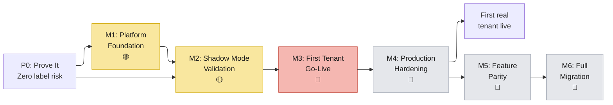
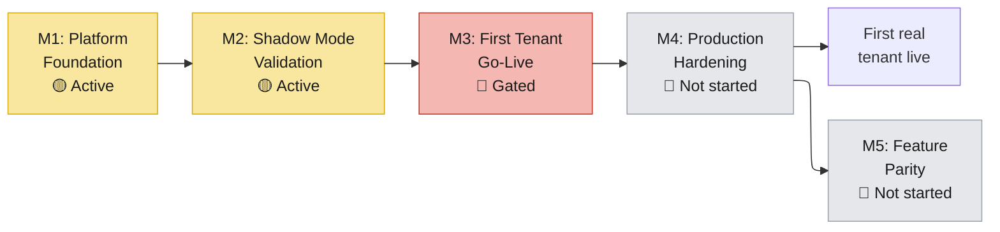

# 15 — Overall Status: Replatforming Program (v3)

> **Scope:** Live status of the Replatforming program — structured by the **Phase → Milestone → Increment → Epic** delivery framework ([doc 19](19-dimension-frameworks.md)).
>
> **Validated:** 2026-06-30 — against live GCP (`platform-dev-p01`, `europe-north1`), GitHub (`PricerAB` org), Jira (`project = PLT`), and the `evo-dtoflow-protos` central-documentation branch.
>
> **Status legend:** ✅ Closed = done · 🟢 Live = deployed · 🟡 In Progress / Test / Selected / Ready for Deploy = active · 🔴 Blocked = gated · 🔵 Backlog = not started

---

## 1. Program Structure

This doc uses the **Phase → Milestone → Increment → Epic** delivery hierarchy defined in [doc 19](19-dimension-frameworks.md). See that doc for the full explanation of each level.

Every epic carries a **Capability tag** — `[C1]` through `[C5]` — for architecture-level filtering. These are reference tags, not delivery levels. See [doc 19 §6](19-dimension-frameworks.md#6-capability-reference-tags) for definitions.

---

## 2. The Milestones

| Milestone | Phase | Goal | Increments | Gate |
|-----------|-------|------|-------------|------|
| **M1: Platform Foundation** | P0 | Core infrastructure live and certified | 3 | All three Increment demos pass |
| **M2: Shadow Mode Validation** | P0 | Cloud pipeline runs in parallel with edge. Zero label risk. | 3 | 24h parity across three tenants confirmed |
| **M3: First Tenant Go-Live** | P1 | Item and link API traffic cut over to cloud | 3 | One real tenant live for basic flows |
| **M4: Production Hardening** | P1 | Monitoring, load testing, DR, runbooks | 3 | All ops gates passed |
| **M5: Feature Parity** | P2 | Timed updates, ECC sync, autoscaling, SLAs | TBD | Feature parity with R3Server achieved |
| **M6: Full Migration** | P2 | All tenants migrated | TBD | All tenants on cloud |

### Current State

M1 and M2 are active. M3 is gated by two blocked epics (PLT-2651, PLT-2378). M4 and M5 are entirely in backlog.

---

## 3. Phase 0: M1 — Platform Foundation

| Inc | Name | Demo | Status |
|-----|------|------|--------|
| **1.1** | Core Event Routing | Dummy DTO → CQS → Cloud Run queue | 🟡 Active |
| **1.2** | Cloud/Edge Bridge | R3Server receives from cloud CQS | 🟡 Active |
| **1.3** | Production Ingress & Security | URL-path routing → PSC → private Cloud Run | 🟡 Not started |

### Increment 1.1: Core Event Routing

| Epic | Cap | Status | Assignee | Summary |
|------|-----|--------|----------|---------|
| — (infra) | `[C1]` | 🟢 Live | — | Spanner `dtoflow` (29 tables, 1000 PU), Pub/Sub (32 topics), gRPC clients (Java + Node), GCS/LFS, `dtoflow-spanner`, `dtoflow-lfs`, GKE `platform` |
| PLT-2294 | `[C1]` | ✅ Closed | Bart De Boer | ID & alias validation in DTOflow servers |
| PLT-169 | `[C1]` | 🟡 In Progress | Johan Ekman | ChangeQueueService — subscription-based event fan-out |
| PLT-2792 | `[C1]` | 🟡 In Progress | Bart De Boer | Services own their CQS queues |
| PLT-2478 | `[C1]` | 🟡 In Progress | Sreekanth S. Uppara | Pricer Server ↔ CQS / DTOflow integration design |

### Increment 1.2: Cloud/Edge Bridge

| Epic | Cap | Status | Assignee | Summary |
|------|-----|--------|----------|---------|
| PLT-1870 | `[C4]` | 🟡 Test | Daniel Pettersson | CQS client in R3Server — edge-side work dispatch |

### Increment 1.3: Production Ingress & Security

| Epic | Cap | Status | Assignee | Summary |
|------|-----|--------|----------|---------|
| PLT-2336 | `[C1]` | 🟡 In Progress | Sreekanth S. Uppara | DTOflow accessible via Private Service Connect |
| PLT-2101 | `[C1]` | 🟡 Selected | Saikiran Katta | Per-API-path routing at ingress — incremental migration mechanism |
| PLT-2118 | `[C1]` | 🟡 Test | Bart De Boer | DTOflow PROD-ready certification for Task & Scenario |

---

## 4. Phase 0: M2 — Shadow Mode Validation

| Inc | Name | Demo | Status |
|-----|------|------|--------|
| **2.1** | Core Data Tap | Price update in R3 → all DTOs in Spanner | 🟡 Active |
| **2.2** | Shadow Execution & Studio Parity | Item change → cloud render → transmit dropped | 🟡 Active |
| **2.3** | Multi-Tenant Shadow Validation | 24h parity on 3 tenants | 🔵 Not started |

### Increment 2.1: Core Data Tap

> This Increment has 8 epics (above the 2-4 target) because all export pipes share one dependency chain and one demo: "price update in R3 → all DTOs appear in Spanner." The pipes are individually small — most are 1-2 story points — and can be built in parallel once the first pipe (PLT-2483) proves the export mechanism.

| Epic | Cap | Status | Assignee | Summary |
|------|-----|--------|----------|---------|
| PLT-2353 | `[C4]` | 🟡 In Progress | Bart De Boer | Pricer Server config export to DTOflow |
| PLT-2483 | `[C4]` | 🟡 Ready for Deploy | Johan Ekman | `storeitemvalues` export — real-time item data pipe |
| PLT-2496 | `[C4]` | 🟡 Ready for Deploy | Unassigned | Link export — real-time link data pipe |
| PLT-2494 | `[C4]` | 🟡 In Progress | Johan Ekman | ECC params / images / models export |
| PLT-2495 | `[C4]` | 🟡 Selected | Unassigned | ECC fonts export |
| PLT-2492 | `[C4]` | 🟡 Selected | Unassigned | ESL Status DTO export |
| PLT-2488 | `[C4]` | 🟡 Selected | Unassigned | `itemproperties` export |
| PLT-2714 | `[C4]` | 🟡 Selected | Unassigned | `itemproperties` startup export |

### Increment 2.2: Shadow Execution & Studio Parity

| Epic | Cap | Status | Assignee | Summary |
|------|-----|--------|----------|---------|
| PLT-2497 | `[C4]` | ✅ Closed | Unassigned | consume-ignore-linked mode — label transmit safely dropped |
| PLT-2354 | `[C4]` | 🟡 In Progress | Daniel Pettersson | Shadow Mode orchestration — parallel cloud pipeline |

### Increment 2.3: Multi-Tenant Shadow Validation

No discrete epics. This Increment is a validation gate: run Shadow Mode on Replatforming-Dev, Evo-Se, and Application-Stage back-to-back for 24 hours with 100% rendered-image parity. Clears the Phase 0 gate.

---

## 5. Phase 1 Preview: M3 & M4

> **Increment decomposition pending.** Each Milestone will have 3 Increments (M3: Item+Link APIs → Security & Isolation → Tenant Switch; M4: Monitoring → Load Test → DR + Runbook). Epics listed below are flat until the Increment mapping is finalised. The two blocked epics in M3 are the highest-priority action in the program today.

### M3: First Tenant Go-Live

| Epic | Cap | Status | Assignee | Summary |
|------|-----|--------|----------|---------|
| PLT-2651 | `[C2]` | 🔴 Blocked | Unassigned | Item property validation — **single clearest gate on item-driven migration** |
| PLT-2378 | `[C2]` | 🔴 Blocked | Unassigned | Item Patch APIs — Core (gates Plaza Mobile + Central-Manager) |
| PLT-2274 | `[C2]` | 🔴 Blocked | Daniel Pettersson | SIC Support — items findable by Store Item Code |
| PLT-2598 | `[C2]` | ✅ Closed | Unassigned | Initial Bulk Item Load (scope-out) |
| PLT-2773 | `[C3]` | ✅ Closed | Johan Ekman | ECC Link Projector |
| PLT-2771 | `[C3]` | ✅ Closed | Unassigned | ESL Image Merger |
| PLT-2484 | `[C3]` | 🟡 In Progress | Bart De Boer | Link v1 DTO refactor |
| PLT-2357 | `[C3]` | 🟡 Selected | Unassigned | Linked Item APIs — Items |
| PLT-2358 | `[C3]` | 🟡 Selected | Unassigned | Linked Item APIs — Devices |
| PLT-2577 | `[C4]` | ✅ Closed | Unassigned | ESL registration in cloud |

### M4: Production Hardening

| Epic | Cap | Status | Assignee | Summary |
|------|-----|--------|----------|---------|
| PLT-2600 | `[C3]` | 🔵 Backlog | Unassigned | Studio Services Prod-Readiness certification |
| PLT-2601 | `[C5]` | 🔵 Backlog | Cristian Deaconeasa | First Tenant Selection — gate decision for Phase 1 scope |
| PLT-2572 | `[C5]` | 🔵 Backlog | Unassigned | Store Onboarding — repeatable store provisioning |
| PLT-2575 | `[C5]` | 🔵 Backlog | Unassigned | Store DTO Schema — store metadata in cloud |
| PLT-2578 | `[C5]` | 🔵 Backlog | Unassigned | Tenant Isolation Validation |
| PLT-2576 | `[C5]` | 🔵 Backlog | Unassigned | Performance & Load Testing — 652M items scale |
| PLT-2579 | `[C5]` | 🔵 Backlog | Unassigned | Monitoring & Dashboards |
| PLT-2580 | `[C5]` | 🔵 Backlog | Unassigned | Disaster Recovery — backups, restore, DR drills |
| PLT-2599 | `[C5]` | 🔵 Backlog | Unassigned | Cutover & Rollback Runbook |
| PLT-2581 | `[C5]` | 🔵 Backlog | Unassigned | Operational Runbooks |
| PLT-2430 | `[C5]` | 🔵 Backlog | Unassigned | Integration Tests Delivery 1 — automated E2E suite |

---

## 6. Phase 2: M5 — Feature Parity

All epics in backlog. PLT-2359 has early progress (Bart De Boer building ECC parity in parallel).

| Epic | Cap | Status | Assignee | Summary |
|------|-----|--------|----------|---------|
| PLT-171 | `[C1]` | 🟡 Selected | Unassigned | SLA & `trackingId` support |
| PLT-170 | `[C1]` | 🔵 Backlog | Unassigned | Write Protection — Auth0 JWT-based access control |
| PLT-2444 | `[C1]` | 🔵 Backlog | Unassigned | Status Reporting |
| PLT-2369 | `[C1]` | 🔵 Backlog | Unassigned | Auto-scaling |
| PLT-2350 | `[C2]` | 🔵 Backlog | Unassigned | Timed Item Updates |
| PLT-2351 | `[C2]` | 🔵 Backlog | Unassigned | Item Ingest Status — Extended |
| PLT-2352 | `[C2]` | 🔵 Backlog | Unassigned | Item Ingest Status — Advanced |
| PLT-2436 | `[C2]` | 🔵 Backlog | Unassigned | Item / Link via PFI |
| PLT-2359 | `[C3]` | 🟡 In Progress | Bart De Boer | ECC Links & Rendering — building early (Phase 2 scope) |
| PLT-2361 | `[C3]` | 🔵 Backlog | Unassigned | Segment Labels |
| PLT-2360 | `[C3]` | 🔵 Backlog | Unassigned | Unified Linking API |
| PLT-2363 | `[C3]` | 🔵 Backlog | Unassigned | Auto Unlink |
| PLT-2573 | `[C4]` | ✅ Closed | Unassigned | ECC Sync push (scope-out) |
| PLT-2574 | `[C4]` | ✅ Closed | Unassigned | Transmission service integration (scope-out — won't do) |
| PLT-2355 | `[C4]` | 🟡 Selected | Bart De Boer | Label Status APIs |
| PLT-2356 | `[C4]` | 🔵 Backlog | Unassigned | Item Flash APIs — stays on R3Server edge |
| PLT-2362 | `[C4]` | 🔵 Backlog | Unassigned | GeoPos Support |
| PLT-2428 | `[C5]` | 🔵 Backlog | Unassigned | Subscription System |
| PLT-2440 | `[C5]` | 🔵 Backlog | Unassigned | Webhook Events |

> **Note on PLT-2359:** Marked In Progress in M5 (Phase 2). Bart De Boer is building ECC parity early. The first real tenant (M3) uses Studio rendering only. This is early progress on a Phase 2 capability — not Phase 2 work blocking Phase 1.

### M6: Full Migration

Not yet scoped. Will be defined when M5 is underway.

---

## 7. Infrastructure Health

All services deployed in GCP project `platform-dev-p01`, region `europe-north1`.

| Component | Details | Status |
|-----------|---------|--------|
| **Spanner** | Instance `dtoflow`, 1000 PU, 29 DTO tables + `item-registry` (1 table) | 🟢 Healthy |
| **Pub/Sub** | 32 topics (`dtoflow-changes-*`, DLQ, sync, `item-registry-requests`) | 🟢 Healthy |
| **Cloud Run** | 21 services deployed | 🟢 All live |
| **GKE** | Cluster `platform` — runs ChangeQueueService | 🟢 Healthy |
| **GCS / LFS** | `dtoflow-lfs` — content-addressed SHA-256 storage | 🟢 Healthy |
| **Apigee** | API gateway — front door to Cloud Run | 🟡 PSC setup in progress (PLT-2336) |
| **Ingress** | PCS ingress-nginx — per-API-path routing not started (PLT-2101) | 🟡 Selected |

### Cloud Run Service Inventory

| Domain | Services |
|--------|----------|
| **Item** | `item-registry-api`, `item-registry` |
| **Link** | `link-registry`, `link-bfg`, `link-storeasset-bfg` |
| **Studio Rendering** | `studio-link-evaluator`, `studio-renderer`, `studio-design-library`, `studio-scenario-library` |
| **ECC Rendering** | `ecc-link-projector`, `ecc-renderer`, `esl-image-merger` |
| **Edge Bridge** | `dtoflow-transmission` |
| **Actions** | `actions-executor`, `actions-library` |
| **Operations** | `delivery-sync-service`, `delivery-dashboard`, `dtoflow-changequeue-dashboard`, `migration-helper` |
| **Storage** | `dtoflow-spanner`, `dtoflow-lfs` |

---

## 8. Executive Summary

**The DTOflow cloud platform is largely live.** 21 Cloud Run services deployed. Link processing, rendering, and transmission operational end-to-end. The primary delivery risk is concentrated in **M3 (First Tenant Go-Live)**, where two blocked epics — PLT-2651 (Item property validation) and PLT-2378 (Item Patch APIs) — gate all item-driven flows.

### Program at a Glance

| Milestone | Status | Key Signal |
|-----------|--------|------------|
| **M1: Platform Foundation** | 🟡 Active | CQS (1.1) In Progress; Edge Bridge (1.2) in Test; Ingress (1.3) not started |
| **M2: Shadow Mode Validation** | 🟡 Active | 2 data pipes Ready for Deploy (2.1); Shadow orchestration In Progress (2.2) |
| **M3: First Tenant Go-Live** | 🔴 Gated | 2 blocked & unassigned epics — highest-priority action in the program |
| **M4: Production Hardening** | 🔵 Not started | All 11 epics in Backlog |
| **M5: Feature Parity** | 🔵 Not started | 19 epics in Backlog; one with early progress |

### Key End-to-End Flows

| Flow | Status | Detail |
|------|--------|--------|
| **Link Creation → Render → Transmit** | 🟢 Live | `link-registry` → evaluator + renderer (parallel) → merger → `dtoflow-transmission` → R3Server → ESL |
| **Item Price Change → Render** | 🟡 Partially ready | Evaluator + renderer chain operational; gated by item property validation (PLT-2651) |
| **Item Deletion** | 🔴 Not built | Path not yet implemented |

---

## 9. Risks & Immediate Actions

### Critical

| Risk | Epic | Severity | Action |
|------|------|----------|--------|
| **Item property validation blocked** | PLT-2651 (`[C2]`) | 🔴 Critical | Unblock. 4 of 5 item pipeline services built. This is the single clearest gate. |
| **Item Patch APIs unassigned** | PLT-2378 (`[C2]`) | 🔴 Critical | Assign owner. Gates Plaza Mobile + Central-Manager cutover. |

### High Priority

| Risk | Severity | Action |
|------|----------|--------|
| **Shadow Mode sub-tasks unassigned** — PLT-2495, 2492, 2488, 2714 need owners | 🟡 High | Assign before next sprint |
| **Bart De Boer owns 4+ critical epics** across M1, M2, M3, M5 | 🟡 High | Spread ownership |
| **API routing not started** — PLT-2101, Saikiran on vacation | 🟡 Medium | Plan handover |
| **First tenant selection in Backlog** — PLT-2601 | 🟡 Medium | Drive criteria → decision |
| **Review bottleneck** — 6+ items waiting for Johan Ekman | 🟡 Medium | Distribute review load |
| **Ops readiness entirely in Backlog** — M4 has 11 epics, none started | 🟡 Medium | Begin sequencing before tenant cutover |

---

## 10. What's Next

In priority order:

1. **Unblock PLT-2651** (Item property validation) — the single clearest gate.
2. **Assign owner to PLT-2378** (Item Patch APIs) — gates both consumer API cutovers.
3. **Land PLT-2483** (storeitemvalues export) — Ready for Deploy, completes Inc 2.1.
4. **Finish PLT-1870** (CQS client in R3Server) — in Test, completes Inc 1.2.
5. **Certify PLT-2118** (DTOflow PROD-ready) — completes Inc 1.3.
6. **Drive PLT-2601** (First Tenant Selection) — from Backlog to decision, unlocks M3.

---

> **Refresh sources:**
> - GCP: `gcloud run services list --region=europe-north1 --project=platform-dev-p01`
> - Jira: `project = PLT AND issuetype = Epic AND labels in ("replatforming-phase-0","replatforming-phase-1","replatforming-phase-2") ORDER BY status ASC`

---

### Related docs

- [19 — Delivery Framework](19-dimension-frameworks.md) — the delivery hierarchy this doc uses
- [14 — Tenant Migration Guide](14-tenant-migration.md)
- [17 — Phase 1 Plan](17-phase-1-plan.md)
