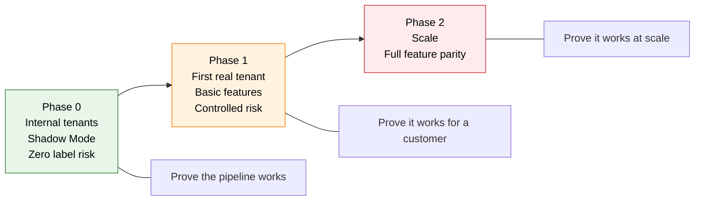
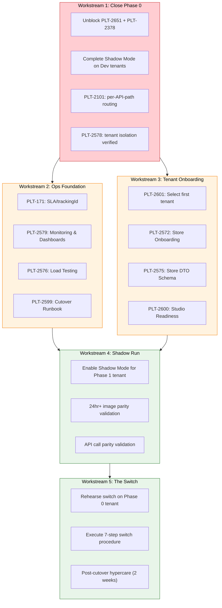

# 17 — Phase 1 Plan: First Real Tenant on DTOflow

> **Scope:** A high-level plan for Phase 1 of the Replatforming initiative — what must be built, what features are in-scope, the end-to-end flows that must work, the gaps between current state and Phase 1 readiness, and a sequenced migration strategy.
>
> **Audience:** Replatforming engineering lead and team. This is a *planning document* — it identifies what needs to happen and why. The solutions proposed for gaps are **realistic starting points** to be validated, not final designs.
>
> **Validated:** 2026-06-30 — against live Jira (`project = PLT`, all 17 critical epics), GCP `platform-dev-p01`, the onboarding doc set (docs 01–16), and the Confluence Architecture Pipeline Status page.
>
> **Companion docs:** [03 — Replatforming Deep Dive](03-replatforming-deep-dive.md) (epic backlog, Shadow Mode, phase model) · [04 — Target Architecture](04-target-architecture.md) (topology, hybrid boundary) · [13 — Core Data Flows](13-core-data-flows.md) (event-driven flows) · [14 — Tenant Migration](14-tenant-migration.md) (switch procedure) · [15 — Overall Status](15-overall-status.md) (pipeline maturity, risks).

---

## 1. Executive Summary

**Phase 1 is the first time a real, revenue-generating customer runs on the DTOflow cloud platform.** It follows Phase 0 (internal Shadow Mode validation) and precedes Phase 2 (full feature parity, many tenants).



**The current state (2026-06-30):** The DTOflow foundation is solid — 21 Cloud Run services deployed, link and rendering pipelines live, transmission operational. But Phase 1 is **gated on two unblocked epics** (PLT-2651 item property validation, PLT-2378 Item Patch APIs — both Blocked and Unassigned) and **one unstarted mechanism** (PLT-2101 per-API-path routing). The first tenant hasn't been formally selected (PLT-2601 in Backlog).

**This document answers:** What exactly constitutes "Phase 1 done," what features the first real tenant needs, what end-to-end flows must work, what's missing between now and then, and how to sequence the work.

---

## 2. What Phase 1 Is — and Isn't

### Phase 1 definition

| Dimension | Phase 1 |
|-----------|---------|
| **Goal** | One real, revenue-generating tenant live on the DTOflow cloud path for basic features |
| **Risk posture** | Controlled — the tenant is carefully selected, features are scoped to essentials, and the switch procedure (doc 14) is rehearsed on Phase 0 first |
| **Delivery model** | Per-API-path migration. Not a big bang. The tenant's R3Server keeps running (thin edge) for transmission, flash, and store map |
| **Tenants** | byPricer → Landwaart AGF B.V. → Spar-be (sequenced; see §10) |
| **What "done" looks like** | The tenant's item updates, link changes, and rendering flow entirely through DTOflow. R3Server does transmission only. Monitoring, switch runbook, and basic ops are in place. |

### What Phase 1 is NOT

- **Not** full feature parity with today's R3Server (that's Phase 2)
- **Not** a multi-tenant roll-out (one tenant at a time, validated between)
- **Not** a rewrite of the on-prem transmission or basestation layer (those stay on R3Server)
- **Not** an all-or-nothing switch — the per-API-path routing means individual APIs can be flipped and rolled back independently

---

## 3. Phase 0 Prerequisites — What Must Close Before Phase 1 Begins

Phase 1 cannot start until Phase 0 crosses these gates. These are the blocking dependencies.

### 3.1 The Three Critical Unblockers

| Epic | What It Is | Current | Action Needed |
|------|-----------|---------|---------------|
| **PLT-2651** | Item property validation in item-registry | 🔴 **Blocked / Unassigned** | Assign owner, implement JSON schema validation or CEL-based rules in `item-registry`. This is the **single clearest gate** on item-driven migration — 4 of 5 item pipeline services are built but can't validate properties end-to-end. |
| **PLT-2378** | Item Patch APIs — Core | 🔴 **Blocked / Unassigned** | Assign owner. This gates Plaza Mobile (`PATCH/DELETE /api/public/core/v1/items`) and Central-Manager (`PATCH/DELETE /api/public/multi-store/v2/multi-store-requests/items[.csv]`). Both consumer paths are blocked without it. |
| **PLT-2274** | SIC Support | 🔴 **Blocked** (Daniel Pettersson) | Depends on PLT-2378. SIC lets items be found by the customer's own Store Item Code. If the Phase 1 tenant's ERP identifies items by SIC, this is mandatory for item lookup. **Needs scoping** — some tenants may use Pricer item IDs exclusively; verify during tenant selection (PLT-2601). |

> **Why these are the highest-priority actions in the entire Replatforming program right now:** Without them, no real tenant item data flows through DTOflow. The link and render pipelines already work — but they have nothing to process if items can't be validated and written. SIC is tenant-dependent but must be assessed before committing to a Phase 1 target. **Assigning owners to PLT-2651 and PLT-2378 is the single most leveraged action a lead can take this week.**

### 3.2 Shadow Mode Gate (PLT-2354)

| Prerequisite | Status | Owner | Notes |
|-------------|--------|-------|-------|
| storeitemvalues export data pipe (PLT-2483) | 🟡 **Ready for Deploy** | Johan Ekman | The R3Server → DTOflow item data pipe |
| CQS client in R3Server (PLT-1870) | 🟡 **Test** | Daniel Pettersson | R3Server can receive cloud work |
| Consume-ignore-linked mode (PLT-2497) | ✅ Done | — | R3Server can shadow-consume without affecting labels |
| 5 export sub-tasks (PLT-2494, 2495, 2492, 2488, 2714) | 🔵 Defined, unassigned | **Unassigned** | ECC params/images/fonts export, ESL status export, itemproperties export |
| Replatforming-Dev tenant shadow run | Not started | — | 24+ hour run with 100% rendered-image parity |
| Evo-Se shadow run | Not started | — | Dev team's own tenant validated |
| Application-Stage shadow run | Not started | — | Product validation tenant |

**Gate criteria:** All 5 export sub-tasks assigned and completed. Store config (`store` DTO from PLT-2572/2575; runtime config via PLT-2353 or covered by export sub-tasks — assess overlap). Then `Replatforming-Dev` runs Shadow Mode for 24+ hours with 100% image parity → `Evo-Se` and `Application-Stage` validated.

### 3.3 Foundation & Routing Prerequisites

| Prerequisite | Status | Owner | Notes |
|-------------|--------|-------|-------|
| DTOflow PROD-ready (PLT-2118) | 🟡 Test | Bart De Boer | Formal production certification of the foundation |
| CQS core (PLT-169) | 🟡 In Progress | Johan Ekman | Must be deployed and stable |
| Services own CQS queues (PLT-2792) | 🟡 In Progress | Bart De Boer | Each service manages its own queue — prevents fan-out congestion |
| Link v1 DTO refactor (PLT-2484) | 🟡 In Progress | Bart De Boer | Separates ECC single case from link v1; needed for link pipeline correctness |
| DTOflow broader accessibility / PSC (PLT-2336) | 🟡 In Progress | Sreekanth S.U. | Private Service Connect for secure cloud access |
| **Per-API-path routing (PLT-2101)** | 🔵 Selected for Dev | Saikiran Katta (on vacation) | **Reassign immediately.** This is the mechanism that makes migration incremental. Without it, migration is all-or-nothing per store. |
| Tenant isolation verification (PLT-2578) | 🔴 Backlog | Unassigned | Must be proven before any real tenant data enters the platform |
| PS ↔ CQS/DTOflow design (PLT-2478) | 🟡 In Progress | Sreekanth S.U. | Integration design for how pricer-server talks to CQS |
| Config export to DTOflow (PLT-2353) | 🔴 Backlog | Unassigned | Pricer Server configuration available in cloud. This is distinct from store onboarding (PLT-2572) — config export pushes R3Server runtime configuration (not just store metadata) to DTOflow. May be partially covered by Shadow Mode sub-tasks (PLT-2488 itemproperties export); assess overlap during sprint planning. |

### 3.4 Organizational Prerequisites

| Item | Action |
|------|--------|
| **Review bottleneck** | 6+ items waiting for Johan Ekman's review. Distribute review load across the team. |
| **Saikiran vacation** | PLT-2101 (API routing) not started. Complete hand-over planning or reassign. |
| **Bus factor** | Bart De Boer, Johan Ekman, Daniel Pettersson, and Sreekanth S.U. own most critical epics. Spread ownership. |
| **Shadow Mode sub-tasks** | 5 export tasks (PLT-2494/2495/2492/2488/2714) need owners assigned before next sprint. |

---

## 4. Phase 1 Scope — What's In, What's Out

Phase 1 is **basic features for a simple tenant.** Not everything labeled `replatforming-phase-1` in Jira is needed for the first real tenant. The following is a ruthless prioritization.

### 4.1 IN SCOPE — Required for Phase 1

| Category | Epic / Work | Why It's Needed |
|----------|------------|-----------------|
| **Tenant & Store** | PLT-2572 — Store Onboarding | Repeatable process to add a tenant's stores to DTOflow. Without this, you can't onboard a real tenant at all. |
| **Tenant & Store** | PLT-2575 — Store DTO Schema | Store metadata (`store` DTO) must be available to all cloud services so they know the tenant exists. |
| **Tenant & Store** | PLT-2601 — First Tenant Selection | Formal decision on which tenant goes first, with criteria (feature profile, ESL count, update volume, integration complexity). Currently in **Backlog**. |
| **Security** | PLT-2578 — Tenant Isolation Verification | Automated tests proving tenant A cannot see tenant B's data. **Non-negotiable** before any real customer data enters the platform. |
| **Operations** | PLT-2579 — Monitoring & Dashboards | Must know if the cloud path is healthy before a customer depends on it. Structured logging, alerting on pipeline stalls, CQS queue depth monitoring. |
| **Operations** | PLT-2599 — Cutover & Rollback Runbook | Tested, rehearsed per-store switch procedure. Must include the 7-step switch (block router → pause CQS → reconfigure R3Server → shut down R3Server → switch router → resume CQS → restart thin edge) from [doc 14](14-tenant-migration.md) and a verified rollback path. |
| **Operations** | PLT-171 — SLA & trackingId Support | Priority timestamps so interactive operations (price changes) beat bulk imports in CQS queues. Without this, a bulk CSV upload could starve a store manager's single price change. |
| **Operations** | PLT-2576 — Performance & Load Testing | Prove the system handles the tenant's volume. For Landwaart and Spar-be specifically, this is critical. |
| **Studio** | PLT-2600 — Studio Services Prod-Readiness | Studio services (`studio-design-library`, `studio-scenario-library`, `studio-renderer`) must be production-hardened. The tenant's designs and scenarios are business-critical. |
| **Integration** | PLT-2430 — Integration Tests (Delivery 1) | Automated end-to-end tests exercising the full item-update → render → transmission chain. |

### 4.2 TBD — Assess During Tenant Selection (PLT-2601)

These epics may need to be in scope depending on which tenant is selected first. A simple tenant like byPricer may not need them; a full retailer like Landwaart or Spar-be likely will.

| Epic | What It Is | Decision Criterion |
|------|-----------|--------------------|
| **PLT-2274** — SIC Support | Items findable by Store Item Code | Does the tenant's ERP use SIC or Pricer item IDs? If SIC, this is mandatory. Currently Blocked (Daniel Pettersson), depends on PLT-2378. |
| **PLT-2357** — Linked Item APIs (Items) | "Show me all items for this store" through BFG layer | Does Plaza Mobile need to list items? The existing item search path may suffice. Assess during tenant feature profiling. |
| **PLT-2358** — Linked Item APIs (Devices) | "Show me all labels/devices for this store" | Does Plaza Mobile or Central-Manager need to list labels? Label status visibility may be covered by PLT-2492 (ESL status export) + basic monitoring. |
| **PLT-2355** — Label Status APIs | Consumer-facing "how many labels are OK/error/updating?" | Is this needed for Phase 1 ops, or does PLT-2492 (ESL status export to DTOflow) + monitoring dashboards suffice? The export path pushes status up; the API makes it queryable by consumers. |
| **PLT-2353** — Config Export to DTOflow | Pricer Server runtime configuration in cloud | Is this needed for Shadow Mode, or do the export sub-tasks (PLT-2488/2714 itemproperties, PLT-2494/2495 ECC params/fonts) cover it? Assess overlap. Currently Backlog — flagged as risk in the Roadmap doc. |

### 4.3 OUT OF SCOPE — Deferred to Phase 2

| Epic | What It Is | Why It Can Wait |
|------|-----------|-----------------|
| PLT-2350 | Timed Item Updates | Scheduled price changes. Complex; not needed for basic functionality. |
| PLT-2360 | Unified Linking API | The existing `link-registry` API is sufficient for Phase 1 link operations. |
| PLT-2363 | Auto Unlink | Labels auto-unlink when items deleted. Nice-to-have; manual unlink works. |
| PLT-2361 | Segment Label Support | 7-segment calculator-style labels. Niche feature. |
| PLT-2356 | Item Flash APIs | Real-time sub-second flash. **Keep this routed to R3Server edge** — the cloud round-trip would add unacceptable latency. This stays on-prem by design, not by omission. |
| PLT-2580 | Disaster Recovery (multi-region) | Limit Phase 1 to basic Spanner backups + documented restore procedure. Full multi-region DR is Phase 2. |
| PLT-2369 | Auto-scaling | Cloud Run's built-in scaling is sufficient for Phase 1 volumes. CQS-driven proactive scaling can wait. |
| PLT-170 | Write Protection (Auth0 JWT) | Tenant isolation (PLT-2578) provides the security boundary. Fine-grained write auth is Phase 2. |
| PLT-2351/2352 | Item Ingest Status (Extended/Advanced) | Basic status via trackingId is sufficient for Phase 1. |
| PLT-2444 | Status Reporting System | "How many items processed, how fast" — monitoring dashboards cover the basics. |
| PLT-2362 | GeoPos Support | Label positions (aisle/shelf). Not needed for basic operations. |
| PLT-2440 | Webhook Events | External system notifications. Phase 2. |
| PLT-2428 | Subscription/License System | Entitlement enforcement. Phase 2. |
| PLT-2427 | Configuration Management | Centralized config. Phase 2. |

### 4.4 Phase 1 Feature Summary

The Phase 1 tenant gets these capabilities through the cloud path:

| Feature | Cloud Path | Status |
|---------|-----------|--------|
| **Item price change → label update** | `item-registry-api` → Spanner → CQS → evaluator + renderer → merger → transmission → R3Server → ESL | 🔴 Gated on PLT-2651 + PLT-2378 |
| **Item deletion → label clear** | `item-registry-api` → tombstone → evaluator → unlink → render blank → transmission | 🔴 Not yet built; see gap §8.2 |
| **Link creation → label design** | `link-registry` → link.v2 → evaluator → renderer → merger → transmission | 🟢 Already live |
| **Link deletion → label revert** | `link-registry` → delete → evaluator → re-render → transmission | 🟢 Already live |
| **Design publication → mass re-render** | `studio-design-library` → design.v1 → renderer + evaluator → merger → transmission | 🟢 Already live |
| **Basic item search** | `item-registry-api` → Spanner lookup | 🟡 Partially built |
| **Label status visibility** | R3Server pushes `storeeslstatus` up | 🟡 In progress (PLT-2492, PLT-2487) |

**What stays on R3Server (by design, never migrates):** Transmission engine, basestation control, flash, display-page, store map/geo, local ESL status ACK handling.

---

## 5. Key Activities & Workstreams

Phase 1 breaks down into five logical workstreams, sequenced by dependency.



### Workstream 1: Close Phase 0 (The Gates)

| Step | What | Why First |
|------|------|-----------|
| 1a | **Assign PLT-2651, PLT-2378, and assess PLT-2274** | All three are on the item pipeline critical path. PLT-2651 and PLT-2378 are Blocked and Unassigned — they gate ALL item-driven flows. PLT-2274 (SIC) is tenant-dependent: determine during PLT-2601 whether the tenant's ERP uses SIC or Pricer item IDs. |
| 1b | **Implement PLT-2651** — item property validation | Write a JSON schema or CEL-based validation in `item-registry`. All item writes must pass validation before Spanner persistence. This is a well-scoped, single-story task. |
| 1c | **Implement PLT-2378** — Item Patch APIs | Wire up the Item Service to accept `PATCH/DELETE /api/public/core/v1/items` and `PATCH/DELETE /api/public/multi-store/v2/multi-store-requests/items`. Both Plaza Mobile and Central-Manager depend on this. |
| 1d | **Assign the 5 Shadow Mode export sub-tasks** | PLT-2494 (ECC params), PLT-2495 (ECC fonts), PLT-2492 (ESL status), PLT-2488 (itemproperties), PLT-2714 (itemproperties startup). |
| 1e | **Reassign PLT-2101** (API routing) | Saikiran is on vacation. Reassign to someone who can start immediately (Sreekanth S.U. handles PSC/Apigee and is a natural fit). |
| 1f | **Prove tenant isolation (PLT-2578)** | Automated tests: Tenant A's Spanner reads must never return Tenant B's data. Missing `t/{tenantId}` prefix = hard failure. |
| 1g | **Complete Shadow Mode on all 3 Phase 0 tenants** | Replatforming-Dev → Evo-Se → Application-Stage. 24+ hours each with 100% image parity. |

### Workstream 2: Ops Foundation

These can run partially in parallel with Workstream 1 (especially load testing design and monitoring setup).

| Step | What | Why |
|------|------|-----|
| 2a | **PLT-171** — SLA/trackingId | Interactive ops (single price change) must beat bulk imports in CQS queues. Implement priority timestamps. |
| 2b | **PLT-2579** — Monitoring | Dashboards for: CQS queue depth per service, Spanner latency, Cloud Run error rates, transmission success rates. Alert on pipeline stalls. |
| 2c | **PLT-2576** — Load Testing | Prove the system handles the Phase 1 tenant's peak volume. For Landwaart: active produce retailer with frequent updates. For Spar-be: ~13K ESLs. |
| 2d | **PLT-2599** — Cutover Runbook | Write, review, and rehearse the 7-step switch procedure from [doc 14](14-tenant-migration.md). Must include a tested rollback. |

### Workstream 3: Tenant Onboarding

| Step | What | Why |
|------|------|-----|
| 3a | **PLT-2601** — Select first tenant | Drive the decision: scorecard with feature profile, ESL count, update patterns, integration complexity, business risk. |
| 3b | **PLT-2572** — Store Onboarding | Build the repeatable process: register store in Spanner, create `storeesl` records, verify ESLs are reachable via transmission. |
| 3c | **PLT-2575** — Store DTO Schema | Ensure `store` DTO is available to all cloud services. |
| 3d | **PLT-2600** — Studio Readiness | The tenant's designs and scenarios must be production-hardened in `studio-design-library`, `studio-scenario-library`. |

### Workstream 4: Shadow Run (Per Tenant)

Before the switch, every Phase 1 tenant runs in Shadow Mode — the full cloud pipeline executes in parallel but doesn't touch real labels.

| Step | What | Success Criteria |
|------|------|-----------------|
| 4a | Enable Shadow Mode for the tenant | Config pushed first, then items, then links. Order enforced in the export pipe. |
| 4b | 24+ hour image parity validation | 100% match between R3Server-rendered and DTOflow-rendered images for all ESLs. |
| 4c | API call parity validation | Comprehensive set of API calls produces identical responses from cloud and R3Server paths. |

### Workstream 5: The Switch (Per Tenant)

The 7-step procedure from [doc 14](14-tenant-migration.md), rehearsed first on a Phase 0 tenant:

| Step | Action | Owner |
|------|--------|-------|
| 5a | **Block store at router** — all API calls interrupted, no calls reach store | Infrastructure |
| 5b | **Pause CQS subscriptions** — prevent event processing during reconfiguration | Platform |
| 5c | **Backup R3Server DB, reconfigure** — disable Shadow Mode, drop items table, drop link table | DBA / Platform |
| 5d | **Shut down R3Server** (full stop) | Infrastructure |
| 5e | **Switch router** — re-route item/link API paths to cloud, transmission path stays to R3Server | Infrastructure |
| 5f | **Resume CQS subscriptions** | Platform |
| 5g | **Restart R3Server as thin edge** — transmission only, no local DB | Infrastructure |

**Post-cutover:** 2-week hypercare period. Monitor CQS queue depth, transmission latency, image parity. Be ready to execute the rollback procedure.

---

## 6. End-to-End Data Flows — What Must Work for Phase 1

Three user-observable flows define the Phase 1 deliverable. Here's their current status and what's missing.

### Flow 1: Item Price Change → Label Update

```
ERP / Plaza Mobile → Apigee/ingress → item-registry-api
  → SP: write storeitemvalues (validated, tenanted)
  → PS: dtoflow-changes-storeitemvalues.v1
  → CQS fans out in parallel:
      ├── studio-link-evaluator: re-evaluate CEL rules → may write studiolink
      └── studio-renderer: render with current studiolink + new item values
  → eslimage → dtoflow-transmission → R3Server (thin) → Basestation → ESL
```

| Component | Status | Gap |
|-----------|--------|-----|
| item-registry-api accepts PATCH | 🔴 Gated on PLT-2378 | Item Patch APIs unbuilt |
| Item property validation | 🔴 Gated on PLT-2651 | No validation before Spanner write |
| storeitemvalues → evaluator + renderer | 🟢 Live | — |
| evaluator re-evaluates CEL rules | 🟢 Live | — |
| renderer produces studioeslimage | 🟢 Live | — |
| esl-image-merger → eslimage | 🟢 Live | — |
| dtoflow-transmission → R3Server | 🟢 Live | — |
| R3Server → ESL transmit | 🟢 Live (stays on edge) | — |

**What's needed to close this flow:** PLT-2651 + PLT-2378. SIC support (PLT-2274) may also be needed if the tenant uses Store Item Codes. Once these are implemented, this flow should work end-to-end with minimal additional work — the evaluator and renderer (which run in **parallel**, both subscribing directly to `storeitemvalues.v1`) and the downstream merger/transmission chain are already live.

### Flow 2: Link Creation → Label Design

```
Studio/Designer → Apigee → link-registry
  → SP: write storeesl + link.v2
  → PS: dtoflow-changes-link.v2
  → CQS → studio-link-evaluator: resolve design, write studiolink
  → CQS → studio-renderer: render with design + item data
  → esl-image-merger → eslimage → transmission → R3Server → ESL
```

| Component | Status | Gap |
|-----------|--------|-----|
| Entire flow | 🟢 **Live** | **None.** This is the strongest proof point. Link creation/deletion flows end-to-end through DTOflow today. |

### Flow 3: Item Deletion → Label Clear

```
ERP / Plaza Mobile → Apigee/ingress → item-registry-api
  → SP: tombstone storeitemvalues (soft delete)
  → PS: dtoflow-changes-storeitemvalues.v1 (tombstone event)
  → CQS → studio-link-evaluator: detect tombstone, trigger unlink
  → CQS → studio-renderer: render blank/cleared label
  → eslimage → transmission → R3Server → ESL clears
```

| Component | Status | Gap |
|-----------|--------|-----|
| DELETE endpoint | 🔴 Gated on PLT-2378 | Same as Flow 1 |
| Tombstone logic in item-registry | 🔴 Not built | **Gap.** Need soft-delete (tombstone) on `storeitemvalues` so downstream services can react |
| Evaluator reacts to tombstone | 🔴 Not built | **Gap.** `studio-link-evaluator` must detect a tombstoned `storeitemvalues` and trigger unlink logic |
| Renderer produces blank label | 🔴 Not built | **Gap.** `studio-renderer` must render a default/blank template when the link is cleared |
| Transmission → ESL clear | 🟢 Live | The transmission path is the same regardless of image content |

**What's needed to close this flow:** PLT-2378 (DELETE endpoint) + tombstone logic in item-registry + evaluator tombstone handling + renderer blank-label support. This is a ~3-story feature.

---

## 7. User Flows & Consumer Impact

### 7.1 Plaza Mobile (Store Associate App)

| API Surface | Today | Phase 1 | Impact |
|------------|-------|---------|--------|
| `GET/PATCH /api/.../items` | R3Server | **Cloud** (item-registry-api) | Faster for multi-store queries. Transparent to the user. |
| Item search | R3Server | **Cloud** (item-registry-api) | Spanner-backed search, cross-store capable. |
| Flash | R3Server | **R3Server** (unchanged) | Stays on edge for sub-second latency. No visible change. |
| Display-page switch | R3Server | **R3Server** (unchanged) | Stays on edge. No visible change. |
| Store map / geo | R3Server | **R3Server** (unchanged) | Stays on edge (physical layout). No visible change. |
| Link departments | R3Server → link-registry | **Cloud** (link-registry) | Already partially cloud-native. |

**Net impact:** The associate's daily workflow (flash, display-page, map) is unchanged. Item updates and searches become faster and cross-store capable. **No app update needed** — the routing change happens at the ingress layer.

### 7.2 Central-Manager (HQ Operations)

| API Surface | Today | Phase 1 | Impact |
|------------|-------|---------|--------|
| Multi-store item update | R3Server (per store) | **Cloud** (single call) | Dramatically faster. One API call instead of N store calls. |
| CSV item import | R3Server | **Cloud** (item-registry-api) | Bulk import through Spanner, horizontally scalable. |
| Store lifecycle | Central-Manager → R3Server | **Central-Manager → R3Server** (unchanged) | Store-Host management stays. No visible change. |

**Net impact:** Multi-store operations become significantly faster. CSV imports are no longer bottlenecked by per-store MySQL.

### 7.3 Store UI & Plaza Actions

| Client | Phase 1 | Impact |
|--------|---------|--------|
| Store UI | Already 100% cloud (EVO Store Service) | **Transparent.** No change. |
| Plaza Actions | Already 100% cloud (Apigee → actions services) | **Transparent.** No change. |

---

## 8. Gaps & Proposed Solutions

These are the identified gaps between current state and Phase 1 readiness. Each includes a realistic starting-point solution — to be validated, not treated as final design.

### 8.1 Gap: Item Pipeline Blocked (PLT-2651 + PLT-2378)

**What's missing:** Item property validation and Item Patch APIs are both Blocked and Unassigned. 4 of 5 item pipeline services are built; the last mile is unowned.

**Proposed solution:**
- **PLT-2651:** Implement a JSON schema validation layer in `item-registry`. Define allowed properties per tenant in `itemproperties` DTO. Reject writes with unknown or malformed properties before Spanner persistence. This is a well-scoped, single-developer task (estimated 1–2 sprints).
- **PLT-2378:** Wire up `PATCH/DELETE /api/public/core/v1/items[/{id}]` in `item-registry-api` to write `storeitemvalues` to Spanner. For Central-Manager, wire up `PATCH/DELETE /api/public/multi-store/v2/multi-store-requests/items[.csv]`. Depends on PLT-2651 completing first (validation must exist before accepting writes).

**Justification:** Without these two, Phase 1 cannot start. They are the highest-priority items in the program.

### 8.2 Gap: Item Deletion Flow Not Built

**What's missing:** No DELETE endpoint exists, no tombstone logic in `storeitemvalues`, no downstream tombstone handling in evaluator or renderer.

**Proposed solution (3-part) — to be validated:**
1. **item-registry:** Implement soft-delete — add a `deleted_at` timestamp or `is_deleted` flag to `storeitemvalues` DTO. The DELETE endpoint sets this; the DTO is not physically removed from Spanner.
2. **Link handling (design question):** When an item is deleted, the associated links must be cleaned up. Per [doc 13](13-core-data-flows.md), `link-registry` owns link DTOs, not the evaluator. Two approaches: (A) `studio-link-evaluator` detects the tombstone and triggers link cleanup via `link-registry`, or (B) `item-registry` emits a tombstone that `link-registry` consumes directly (it already subscribes to link-related topics). Approach B is architecturally cleaner since it respects DTO ownership boundaries. **Validate with the team.**
3. **studio-renderer:** When a `studiolink` is deleted or an item has no active link, render a blank/default template instead of a priced label. The blank `eslimage` flows through transmission normally.

**Justification:** Item deletion is a basic retail operation. Without it, removed products will show stale prices — a visible customer-facing defect.

### 8.3 Gap: Per-API-Path Routing Not Started (PLT-2101)

**What's missing:** The mechanism that makes migration incremental. Currently, traffic is either all-cloud or all-R3Server. PLT-2101 teaches ingress-nginx to route by URL path.

**Proposed solution:**
- Reassign to Sreekanth S.U. (already handling Apigee/PSC) or another available engineer since Saikiran is on vacation.
- Configure `ingress-nginx` with regex-based path routing:
  - `/api/public/core/v1/items/*` → Cloud Run `item-registry-api`
  - `/api/private/*` (transmission, flash, display-page, map) → R3Server Store-Unit
- Store the routing table per tenant+store so individual stores can be flipped independently.

**Justification:** Without per-API-path routing, migration is all-or-nothing per store. This makes rollback nearly impossible and creates unacceptable risk for a real tenant.

### 8.4 Gap: Tenant Isolation Not Verified (PLT-2578)

**What's missing:** No automated proof that tenant A cannot see tenant B's data in Spanner or through any API.

**Proposed solution:**
- Build a test suite that provisions two tenants, writes data for both, then attempts cross-tenant reads through every Cloud Run service.
- Add a Spanner IAM condition or row-level check: every query must include `t/{tenantId}` prefix.
- Add an integration test that runs in CI on every PR.

**Justification:** Tenant isolation is a non-negotiable security requirement. Without proven isolation, no real customer data can enter the platform.

### 8.5 Gap: Shadow Mode Export Sub-Tasks Unassigned

**What's missing:** 5 export sub-tasks (ECC params/images/fonts, ESL status, itemproperties) are defined in Jira but have no owners.

**Proposed solution:**
- **PLT-2494/2495** (ECC export): Assign to Bart De Boer (already working on ECC-related epics PLT-2484, PLT-2792).
- **PLT-2492** (ESL status export): Assign to Daniel Pettersson (already working on PLT-1870 CQS client, PLT-2354 Shadow Mode).
- **PLT-2488/2714** (itemproperties export): Assign to Johan Ekman (already did PLT-2483 storeitemvalues export, which follows the same pattern).

**Justification:** Shadow Mode cannot go live without these export pipes. The data needs to be in DTOflow before the cloud pipeline can process it.

### 8.6 Gap: Review Bottleneck (Johan Ekman)

**What's missing:** 6+ items waiting for Johan Ekman's review. He owns CQS, 3 new services, and storeitemvalues export.

**Proposed solution:**
- Distribute review load: Daniel Pettersson and Bart De Boer can review Quarkus Java services; Sreekanth can review infrastructure/PSC changes.
- Establish a rotating PR review schedule — no single person should be the only reviewer for any service area.
- Document CQS subscription architecture so reviews don't require deep CQS expertise for every PR.

**Justification:** A single-reviewer bottleneck slows the entire program. With 21 services, review must be a team responsibility.

### 8.7 Gap: Ops Readiness Entirely in Backlog

**What's missing:** Monitoring (PLT-2579), load testing (PLT-2576), cutover runbook (PLT-2599), and disaster recovery (PLT-2580) are all in Backlog. You cannot put a real customer on the platform without these.

**Proposed solution:**
- **Monitoring (PLT-2579):** Start with Cloud Run built-in metrics + Cloud Monitoring dashboards. Minimum: CQS queue depth per service, Spanner read/write latency P50/P99, transmission success rate, item-registry error rate.
- **Load testing (PLT-2576):** Use the tenant's historical update volume from R3Server logs. Replay at 2× peak to validate headroom.
- **Cutover runbook (PLT-2599):** Write the 7-step procedure from [doc 14](14-tenant-migration.md) as a runbook with exact commands, expected outputs, and rollback steps. Rehearse on Replatforming-Dev before touching a real tenant.
- **DR (PLT-2580):** Phase 1 scope: Spanner scheduled backups + documented restore procedure. Full multi-region failover is Phase 2.

**Justification:** Ops readiness is what separates "it works in dev" from "it works in production." Without monitoring, you're blind. Without a runbook, you're guessing. Without load testing, you're hoping.

### 8.8 Gap: First Tenant Not Selected (PLT-2601)

**What's missing:** PLT-2601 is in Backlog. Without a selection, Phase 1 has no concrete target.

**Proposed solution:**
- Drive a decision within 2 weeks using a scorecard: feature profile (which DTO types does the tenant use?), ESL count, update volume, integration complexity (PCS? EVO tokens? custom auth?), business risk (revenue impact of downtime).
- Recommended sequence (see §10): byPricer → Landwaart → Spar-be.

**Justification:** Phase 1 scope depends on which tenant goes first. A simple tenant (byPricer) needs fewer features. A complex tenant (Spar-be) needs more. Select first, then finalize scope.

---

## 9. Migration Sequence & Tenant Strategy

### 9.1 Recommended Sequence

| Order | Tenant | Type | ESLs | Why This Order |
|-------|--------|------|------|----------------|
| **1st** | **byPricer** | Demo / Pricer-internal | Small | Zero revenue risk. Internal-facing demo data. Exercises the exact Phase 1 switch runbook without business impact. If the switch takes 3 hours, nobody outside Pricer notices. |
| **2nd** | **Landwaart AGF B.V.** | Real — produce retailer, Holland | Medium | First real customer. Simple stack (EVO tokens, no PCS). Active update patterns provide real-world CQS load testing. No external integration blockers. |
| **3rd** | **Spar-be** | Real — large format, Belgium | ~13K | Scale validation bridge to Phase 2. Do not migrate until Landwaart runs flawlessly for 2 weeks. The large ESL count stresses transmission and CQS fan-out. |

### 9.2 Per-Tenant Gates

| Gate | byPricer | Landwaart | Spar-be |
|------|----------|-----------|---------|
| Shadow Mode validated (Phase 0 tenants) | ✅ Required | ✅ Required | ✅ Required |
| PLT-2651 + PLT-2378 implemented | ✅ Required | ✅ Required | ✅ Required |
| Per-API-path routing (PLT-2101) | ✅ Required | ✅ Required | ✅ Required |
| Tenant isolation proven (PLT-2578) | ✅ Required | ✅ Required | ✅ Required |
| Store onboarding (PLT-2572) | ✅ Required | ✅ Required | ✅ Required |
| Monitoring (PLT-2579) | Basic | Full | Full |
| Load testing (PLT-2576) | Light | At 2× peak | At 3× peak |
| Cutover runbook rehearsed (PLT-2599) | On Replatforming-Dev | On byPricer | On Landwaart |
| Previous tenant stable for 2 weeks | N/A | ✅ Required | ✅ Required |

---

## 10. Risk Assessment

| Risk | Severity | Likelihood | Mitigation |
|------|----------|------------|------------|
| **PLT-2651 + PLT-2378 remain unassigned** | 🔴 Critical | Medium | The single biggest risk. Assign owners this week. Both are well-scoped; the blocker is ownership, not technical complexity. |
| **CQS fan-out congestion under real load** | 🟡 High | Medium | Renderer and evaluator hit Spanner simultaneously during bulk updates. PLT-2792 (services own queues) provides per-service rate limiting. Load testing (PLT-2576) must include bulk update scenarios. |
| **Image parity fails during Shadow Mode** | 🟡 High | Medium | If rendered images don't match, investigate diff. Could be rendering engine differences, font/metrics, or data drift. Mitigation: start Shadow Mode early (weeks before switch, not days). |
| **Rollback fails during switch** | 🟡 High | Low | The switch drops R3Server's item and link tables. Rehearse the full rollback on Replatforming-Dev. Keep the MySQL backup as the safety net. |
| **Event ordering issues in Shadow Mode** | 🟡 Medium | Medium | Config must be pushed before items. Enforce dependency order in the export pipe. |
| **Review bottleneck blocks progress** | 🟡 Medium | High | 6+ items waiting. Distribute review load, document CQS architecture, establish rotation. |
| **Bus factor — key people own too much** | 🟡 Medium | High | Bart (4+ epics), Johan (3+ epics + all reviews), Daniel (3 epics), Sreekanth (3 epics). Spread ownership, pair on critical components, document architecture. |
| **Saikiran vacation delays PLT-2101** | 🟡 Medium | Certain | Reassign or plan handover now. API routing is on the critical path. |
| **Summer vacation season** | 🟢 Low | Certain | Plan around it. June–August is slow. Front-load critical path items. |
| **Scope creep — Phase 2 features pulled into Phase 1** | 🟡 Medium | Medium | Ruthlessly defend the scope boundary (§4). "Basic features for a simple tenant" is the mantra. |

---

## 11. Rough Timeline

> **Caveat:** This is a planning estimate, not a commitment. Actual velocity depends on team capacity (summer vacations, review bottleneck) and how quickly PLT-2651/2378 get assigned. **This timeline assumes no further blockers are discovered and full team availability — both optimistic assumptions.** Realistically, Q4 2026 for the first Phase 1 tenant (byPricer) is achievable; completing all three tenants may extend into Q1 2027, especially given summer vacation impact on Q3 velocity.

| Phase | Activities | Estimated Duration | Depends On |
|-------|-----------|-------------------|------------|
| **Pre-Phase 1** | Unblock PLT-2651 + PLT-2378. Assign Shadow Mode sub-tasks. Reassign PLT-2101. | 2–3 weeks | — |
| **Workstream 1** | Implement PLT-2651, PLT-2378. Complete Shadow Mode on Phase 0 tenants. PLT-2101 routing. Tenant isolation (PLT-2578). | 4–6 weeks | Pre-Phase 1 |
| **Workstream 2** | PLT-171 (SLA), PLT-2579 (monitoring), PLT-2576 (load testing design), PLT-2599 (runbook). | Runs in parallel with WS1, completes by end of WS1 | — |
| **Workstream 3** | PLT-2601 (select tenant), PLT-2572 (onboarding), PLT-2575 (schema), PLT-2600 (studio readiness). | 3–4 weeks | WS1 gates cleared |
| **Workstream 4** | Shadow Mode for byPricer (2–3 weeks), then Landwaart (2–3 weeks). | 4–6 weeks per tenant | WS1 + WS2 + WS3 |
| **Workstream 5** | Switch byPricer. Hypercare (2 weeks). → Switch Landwaart. Hypercare (2 weeks). → Switch Spar-be. | 2–3 weeks per tenant | WS4 per tenant |
| **Phase 1 Complete** | Spar-be live on DTOflow, stable for 2 weeks. | Target: **Q3–Q4 2026** | All of the above |

---

## 12. What Success Looks Like

Phase 1 is complete when:

1. ✅ **byPricer** is live on DTOflow — items, links, and rendering all flow through the cloud path. R3Server is thin edge (transmission only).
2. ✅ **Landwaart AGF B.V.** is live on DTOflow — a real, revenue-generating customer. R3Server thin edge.
3. ✅ **Spar-be** (~13K ESLs) is live on DTOflow — the system handles real scale.
4. ✅ **Monitoring dashboards** show healthy pipelines — CQS queue depth, Spanner latency, transmission success rate all within thresholds.
5. ✅ **The switch runbook** has been rehearsed 3+ times across different tenants and works reliably.
6. ✅ **Rollback** has been tested and works within the defined recovery window.
7. ✅ **2-week hypercare** completed for each tenant with zero critical incidents.
8. ✅ **Phase 2 scope** is defined based on real operational data from Phase 1.

---

## 13. Immediate Next Actions (This Week)

These are the concrete steps a lead can take right now, ranked by impact:

| # | Action | Impact |
|---|--------|--------|
| 1 | **Assign an owner to PLT-2651** (item property validation) | Unblocks the Item Pipeline — the single clearest gate |
| 2 | **Assign an owner to PLT-2378** (Item Patch APIs) | Unblocks Plaza Mobile + Central-Manager consumer paths |
| 3 | **Reassign PLT-2101** (API routing) — Saikiran is on vacation | Unblocks the incremental migration mechanism |
| 4 | **Assign the 5 Shadow Mode export sub-tasks** | Completes the Phase 0 data pipes |
| 5 | **Start PLT-2601** (first tenant selection) — drive decision within 2 weeks | Gives Phase 1 a concrete target |
| 6 | **Distribute review load** — 6+ items waiting on Johan | Unblocks the review bottleneck |
| 7 | **Start PLT-2579** (monitoring dashboards) — can begin immediately | Ops foundation that doesn't depend on any blocker |

---

> **Companion docs:** [03 — Replatforming Deep Dive](03-replatforming-deep-dive.md) · [04 — Target Architecture](04-target-architecture.md) · [13 — Core Data Flows](13-core-data-flows.md) · [14 — Tenant Migration](14-tenant-migration.md) · [15 — Overall Status](15-overall-status.md) · [16 — Docs GitHub Strategy](16-docs-github-strategy.md)
