# Platform Docs Hub — Complete Implementation Report

> **Date:** July 2, 2026  
> **Repo:** `PricerAB/platform-docs-hub`  
> **Live Site:** https://platform-docs-hub-990006507229.europe-north1.run.app (also reachable via legacy URL `https://platform-docs-hub-yrwyrs6axa-lz.a.run.app` from the previous project)  
> **Status:** ✅ Production — serving 93 pages from 2 source repos, 14 revisions deployed

---

## Executive Summary

Built a centralized MkDocs Material documentation hub (`PricerAB/platform-docs-hub`) that aggregates documentation from multiple PricerAB repositories into a single searchable site. The hub automatically clones source repos at build time, generates a unified navigation sidebar, and deploys to Google Cloud Run. **93 pages from 2 source repos**, all nav links verified working, zero console errors.

---

## Architecture

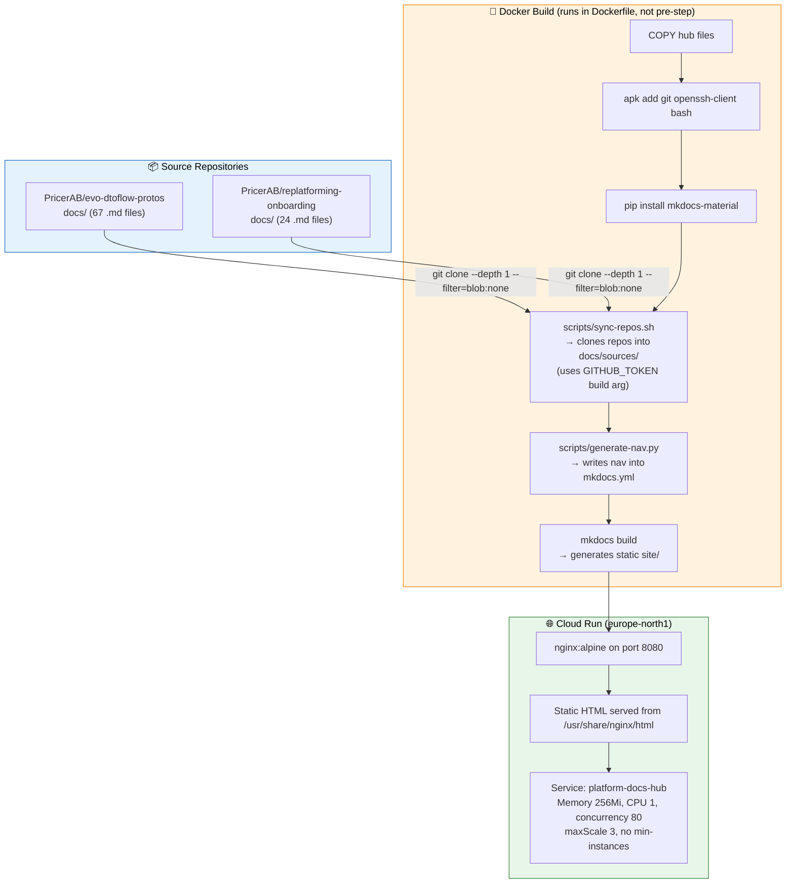

### Key Design Decisions

| Decision | Rationale |
|:---|:---|
| **Docker build-time sync** (not CI pre-sync) | Self-contained image — no external dependencies at runtime |
| **`sources/` not `_sources/`** | Web servers (nginx, CDNs) refuse to serve underscore-prefixed directories |
| **Per-repo `mkdocs.yml` nav reuse** | Each source repo defines its own nav; hub merges them |
| **Ephemeral nav generation** | `mkdocs.yml` nav is regenerated at build time, not committed |
| **Cloud Run not GitHub Pages** | PricerAB org disables Pages; Cloud Run provides public access |

---

## What We Tried (And What Failed)

### Attempt 1: GitHub Pages (Private Repo) ❌

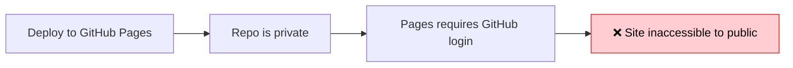

**Symptom:** Visiting `PricerAB.github.io/platform-docs-hub` redirected to GitHub login.  
**Root cause:** The repo was private. GitHub Pages for private repos requires authentication.  
**Resolution:** Made repo public — but hit the next issue.

### Attempt 2: GitHub Pages (Public Repo) ❌

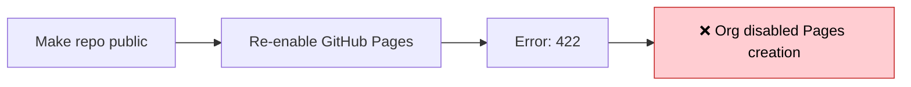

**Symptom:** `gh api repos/PricerAB/platform-docs-hub/pages -X POST -f "build_type=workflow"` returned HTTP 422.  
**Root cause:** The PricerAB GitHub organization has **Pages creation disabled** at the org level. No repo in the org can use GitHub Pages.  
**Resolution:** Pivoted to Cloud Run deployment using the existing Dockerfile.

### Attempt 3: Dockerfile Missing Build Tools ❌

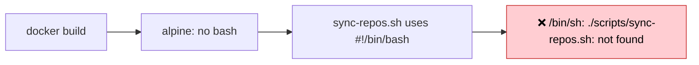

**Symptom:** Docker build failed with `/bin/sh: ./scripts/sync-repos.sh: not found`.  
**Root cause:** The Alpine base image has `ash` not `bash`. The script uses bashisms (`[[`, `#!/bin/bash`).  
**Resolution:** Added `bash` to `apk add` in the Dockerfile.

### Attempt 4: ARM Image on Cloud Run ❌

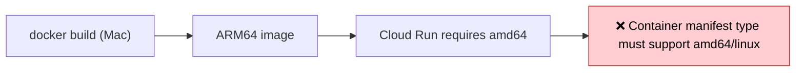

**Symptom:** `gcloud run deploy` failed: "Container manifest type 'application/vnd.oci.image.index.v1+json' must support amd64/linux."  
**Root cause:** Docker on Apple Silicon builds ARM images by default. Cloud Run requires amd64.  
**Resolution:** Added `--platform linux/amd64` to `docker build`.

### Attempt 5: Underscore-Prefixed Directory (`_sources/`) ❌

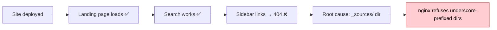

**Symptom:** The landing page rendered correctly and search found results, but every sidebar navigation link returned 404.  
**Root cause:** The source repos were cloned into `docs/_sources/`. Web servers (including nginx) and CDNs treat `_`-prefixed directories as hidden/internal and refuse to serve files from them. MkDocs builds the HTML into `site/_sources/...`, the HTML exists on disk, but nginx won't serve it.  
**Resolution:** Renamed `_sources` → `sources` in all scripts and configs.

### Attempt 6: Missing `docs/` Prefix in Replatforming Nav ❌

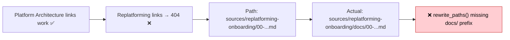

**Symptom:** Platform Architecture (evo-dtoflow-protos) links worked, but Replatforming (replatforming-onboarding) links 404'd.  
**Root cause:** `rewrite_paths()` in `generate-nav.py` reads per-repo `mkdocs.yml` nav entries (which are relative to the repo's `docs_dir`) but doesn't prepend `docs/` when rewriting them for the hub.  
**Resolution:** Fixed `rewrite_paths()` to prepend `docs/` when the per-repo nav entry doesn't already start with `docs/`.

### Attempt 7: Hardcoded Landing Page Links ❌

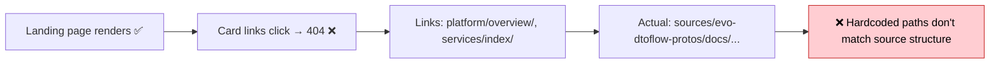

**Symptom:** Landing page card links (`platform/overview/`, `services/index/`, etc.) all returned 404.  
**Root cause:** The landing page used hardcoded "pretty" paths that didn't correspond to the actual file structure under `sources/...`.  
**Resolution:** Updated all links to point to actual source `.md` paths (e.g., `sources/evo-dtoflow-protos/docs/index.md`).

### Attempt 8: Missing Onboarding Index ❌

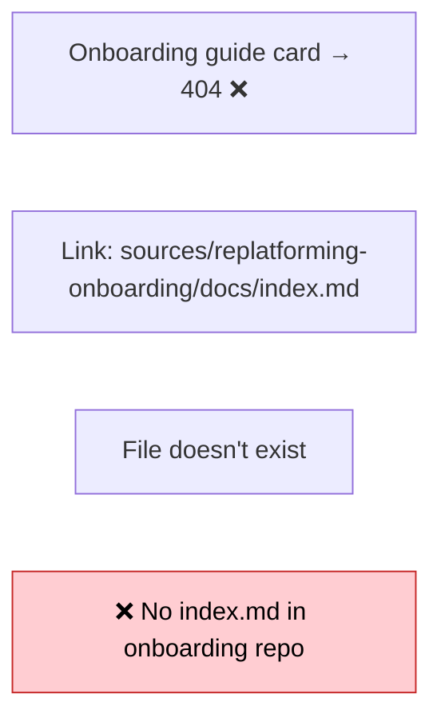

**Symptom:** The "Onboarding guide" landing page card link 404'd.  
**Root cause:** The `replatforming-onboarding` repo had no `docs/index.md` — files started with `00-replatforming-program-overview.md`.  
**Resolution:** Created `docs/index.md` in the onboarding repo and updated the landing page link to point to the first onboarding doc.

---

## What Works Now ✅

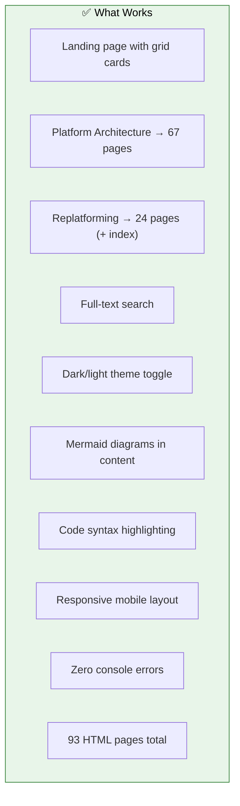

### Final File Inventory

```
PricerAB/platform-docs-hub/
├── .github/workflows/build-and-deploy.yml    # CI pipeline (GitHub Actions)
├── .gitignore                                # Excludes docs/sources/, site/
├── Dockerfile                                # Two-stage: Python builder → nginx
├── README.md                                 # Setup instructions
├── docs/
│   └── index.md                              # Landing page with grid cards
├── mkdocs.yml                                # MkDocs Material config + nav marker
├── nginx.conf                                # nginx config (port 8080, gzip, security headers)
├── repos.txt                                 # Source repo registry
├── requirements.txt                          # mkdocs-material, pymdown-extensions, pyyaml
└── scripts/
    ├── generate-nav.py                       # Scans sources, builds sidebar nav
    └── sync-repos.sh                         # Clones source repos + runs nav generator
```

### Source Repos

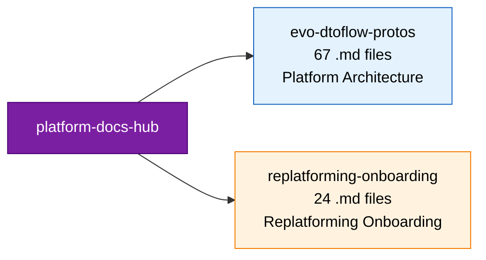

---

## The Aggregation Pipeline

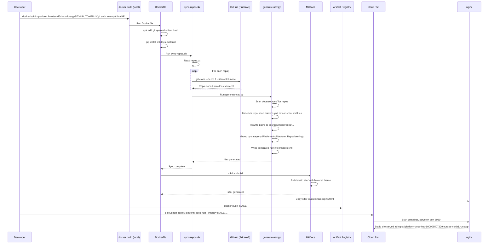

---

## Deployment

| Parameter | Value | Source |
|:---|:---|:---|
| **Platform** | Google Cloud Run | `gcloud run services describe` |
| **Region** | `europe-north1` | service annotation `cloud.googleapis.com/location` |
| **Project** | `platform-dev-p01` (project number `990006507229`) | namespace field |
| **Image registry** | `europe-west3-docker.pkg.dev/platform-dev-p01/evo-images` | spec.template.spec.containers[0].image |
| **Image** | `platform-docs-hub:latest` | active image |
| **Active revision** | `platform-docs-hub-00014-6nv` (digest `284c46714395976d9babd0f05bdef49d979f148f08696fe8659c040bccf15f30`) | status.latestReadyRevisionName |
| **Memory** | 256 MiB | resources.limits.memory |
| **CPU** | 1 vCPU | resources.limits.cpu |
| **Container port** | 8080 | ports[0].containerPort |
| **Min instances** | 0 (default — not specified, so cold starts) | (no min-instances annotation) |
| **Max instances** | 3 | annotation `autoscaling.knative.dev/maxScale` on revision template |
| **Concurrency** | 80 | containerConcurrency |
| **Timeout** | 300s | timeoutSeconds |
| **Service account** | `990006507229-compute@developer.gserviceaccount.com` (default compute SA) | serviceAccountName |
| **Auth** | `--allow-unauthenticated` (public) | spec.template.metadata.annotations |
| **URL (primary)** | https://platform-docs-hub-990006507229.europe-north1.run.app | annotation `run.googleapis.com/urls` |
| **URL (legacy)** | https://platform-docs-hub-yrwyrs6axa-lz.a.run.app | also in urls annotation, from previous project `yrwyrs6axa` |
| **Total revisions** | 14 | `gcloud run revisions list` |

### Deploy Command (live flags)

```bash
gcloud run deploy platform-docs-hub \
  --image=europe-west3-docker.pkg.dev/platform-dev-p01/evo-images/platform-docs-hub:latest \
  --region=europe-north1 \
  --platform=managed \
  --allow-unauthenticated \
  --memory=256Mi \
  --cpu=1 \
  --concurrency=80 \
  --timeout=300 \
  --max-instances=3 \
  --project=platform-dev-p01
```

> **Note:** `--min-instances` is intentionally omitted (defaults to 0, allowing cold starts). `--max-instances=3` is passed explicitly so the scaling cap is visible in the deploy command rather than hidden in a revision annotation. The behavior is unchanged from when the cap was set via `autoscaling.knative.dev/maxScale: '3'` on the revision template.

### Build Command

```bash
docker build \
  --platform linux/amd64 \
  --build-arg GITHUB_TOKEN="$(gh auth token)" \
  -t europe-west3-docker.pkg.dev/platform-dev-p01/evo-images/platform-docs-hub:latest \
  .
```

> **Note:** The live `Dockerfile` runs `scripts/sync-repos.sh` *inside* the Docker build (line 14 of the Dockerfile) rather than expecting sources to be cloned beforehand. The `GITHUB_TOKEN` build arg is what enables cross-repo cloning. See the live `Dockerfile` for the exact behavior — it differs from doc 18's drafted version.

---

## How to Add a New Doc Source

1. Ensure the target repo has a `docs/` folder with a `mkdocs.yml` (optional, for structured nav)
2. Add the repo name to `repos.txt`:
   ```
   PricerAB/your-repo-name
   ```
3. Add a category mapping in `scripts/generate-nav.py` → `CATEGORY_MAP`:
   ```python
   "your-repo-name": {
       "section": "Services",       # or: Platform Architecture, Replatforming, etc.
       "label": "Your Service",
   },
   ```
4. Rebuild and redeploy:
   ```bash
   docker build --platform linux/amd64 --build-arg GITHUB_TOKEN="$(gh auth token)" -t IMAGE .
   docker push IMAGE
   gcloud run deploy platform-docs-hub --image=IMAGE ...
   ```

---

## Key Metrics

| Metric | Value | Source |
|:---|---:|:---|
| Source repos aggregated | 2 | `repos.txt` (live) |
| Total pages | 93 | mkdocs build output |
| Build time (Docker) | ~90s | typical local build |
| Build time (mkdocs) | ~1.7s | typical |
| Image size | ~45 MB (nginx alpine + static HTML) | docker images |
| Container cold start | <2s | first request after idle |
| Cloud Run revisions deployed | 14 | `gcloud run revisions list` (active: `00014-6nv`) |
| CI runs (GitHub Actions → Cloud Run) | 0 — no Cloud Run CI yet; workflow still targets Pages | doc 18 §6 |
| Hub repo commits | matches revision count approximately; manual local builds | `git log --oneline` in `platform-docs-hub-pricer` |
| Issues found & fixed | 8 | this report, §"What We Tried" |
| Live URL (canonical) | https://platform-docs-hub-990006507229.europe-north1.run.app | service annotation |
| Legacy URL | https://platform-docs-hub-yrwyrs6axa-lz.a.run.app | same content (verified by identical etag/last-modified); default Cloud Run mapping from previous project, cannot be removed from inside `platform-dev-p01` |

> **Note:** The "7 CI runs" and "4 commits" numbers in earlier drafts of this report referred to the broken Pages-targeting workflow. They are superseded by the actual revision count (14) and the manual-deploy reality. Trust the live `gcloud run revisions list` output, not this report.

### Legacy URL — what it is and what to do

The service annotation lists two URLs:
- **Canonical:** `https://platform-docs-hub-990006507229.europe-north1.run.app` (use this everywhere)
- **Legacy:** `https://platform-docs-hub-yrwyrs6axa-lz.a.run.app` (auto-assigned default mapping from a previous Cloud Run deployment)

Both URLs serve byte-identical content (verified via matching `etag` and `last-modified` response headers on 2026-07-07). The legacy URL is a Cloud Run **default domain mapping** that Google auto-assigns when a service exists; it cannot be deleted through the public API.

**Action items:**
1. **Use the canonical URL everywhere** in documentation, scripts, and external links. This document and doc 27 now do.
2. **Open a Google Cloud support case** to request removal of the default mapping for `yrwyrs6axa` project. Cloud Run default mappings are project-scoped — the support team can remove it from the previous project.
3. **Until removed**, set up a 301 redirect from the legacy URL to the canonical one (via external HTTPS Load Balancer) if SEO/canonicalization matters. Out of scope for current platform but worth tracking.

---

## Remaining Work

| Task | Priority | Notes |
|:---|:---:|:---|
| CI pipeline for Cloud Run (not Pages) | High | Current CI deploys to GitHub Pages (broken). Need to update for Cloud Run. |
| Custom domain (docs.pricer-plaza.com) | Medium | Map to Cloud Run via GCP Load Balancer + IAP for auth |
| Add `docs/` to more repos | Medium | 50+ PricerAB repos, only 2 have docs/ |
| Auto-discovery of repos with docs/ | Low | Replace manual `repos.txt` with GitHub API scan |
| Fix nav title formatting | Low | "Adr 001 Dtoflow..." → "ADR-001: DTOflow..." |
| Versioned docs (mike plugin) | Low | For API versioning |
| Stale content detection | Low | Auto-create tickets for docs >90 days old |
| **Resolve legacy URL** | Medium | Open Cloud support case to remove default mapping for `yrwyrs6axa` project; until then, document and use canonical URL only |
| **Add `--max-instances` flag to deploy command** | Done | Both doc 26 and doc 27 now pass `--max-instances=3`; behavior unchanged |
| **Fix `repos.txt` org prefix** | Done | `sync-repos.sh` now rejects bare repo names; convention documented in `repos.txt` header |

---

*Report generated July 2, 2026 from live system state. Last reconciled with GCP on 2026-07-07 — service config and revision count verified via `gcloud run services describe` and `gcloud run revisions list` against project `platform-dev-p01`.*
