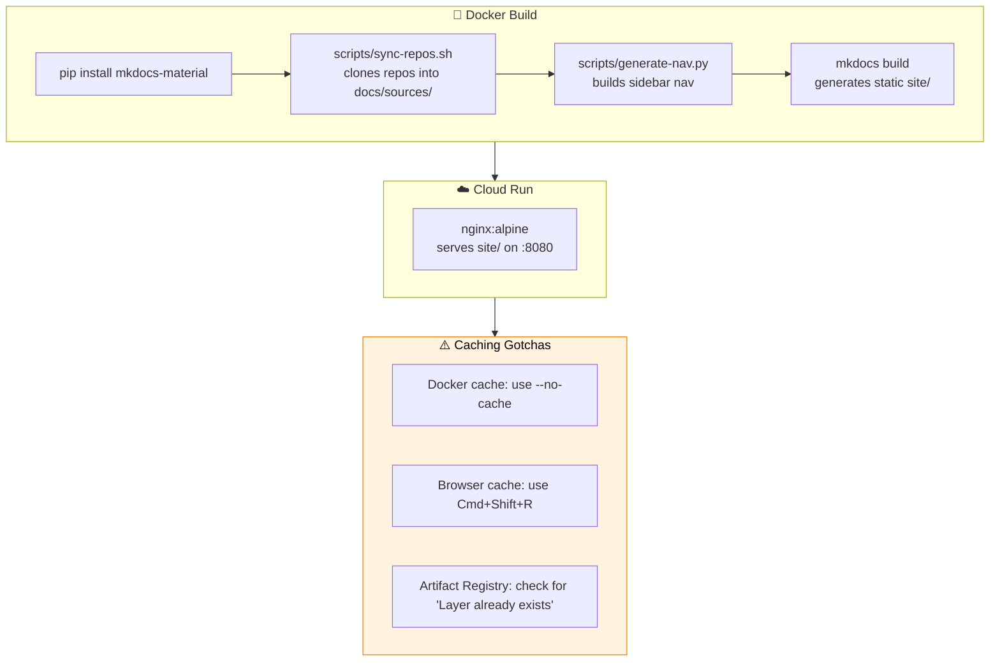

# Platform Docs Hub — Operations & Maintenance Guide

> **Date:** July 2, 2026 (last reconciled with GCP: 2026-07-07)  
> **Repo:** `PricerAB/platform-docs-hub` (local path: `/Users/cridea/Projects/AI/platform-docs-hub-pricer`)  
> **Live Site (primary):** https://platform-docs-hub-990006507229.europe-north1.run.app  
> **Live Site (legacy):** https://platform-docs-hub-yrwyrs6axa-lz.a.run.app (reachable from previous project — same service)  
> **GCP Project:** `platform-dev-p01` (project number `990006507229`)  
> **Region:** `europe-north1`  
> **Active revision:** `platform-docs-hub-00014-6nv`

---

## 1. Quick Reference — Full Build & Deploy

```bash
# 1. Force a clean build (no Docker cache — critical when CSS/theme changes don't appear)
docker build --no-cache \
  --platform linux/amd64 \
  --build-arg GITHUB_TOKEN="$(gh auth token)" \
  -t platform-docs-hub:latest \
  .

# 2. Tag for Artifact Registry
docker tag platform-docs-hub:latest \
  europe-west3-docker.pkg.dev/platform-dev-p01/evo-images/platform-docs-hub:latest

# 3. Push to registry
docker push europe-west3-docker.pkg.dev/platform-dev-p01/evo-images/platform-docs-hub:latest

# 4. Deploy to Cloud Run (matches live flags — --max-instances=3 explicit)
gcloud run deploy platform-docs-hub \
  --image=europe-west3-docker.pkg.dev/platform-dev-p01/evo-images/platform-docs-hub:latest \
  --region=europe-north1 \
  --platform=managed \
  --allow-unauthenticated \
  --memory=256Mi \
  --cpu=1 \
  --concurrency=80 \
  --timeout=300 \
  --max-instances=3 \
  --project=platform-dev-p01
```

> **Note:** `--min-instances` is intentionally omitted — the service runs with min-instances=0 (cold starts enabled). `--max-instances=3` is passed explicitly so the scaling cap is visible in the deploy command. Behavior unchanged from when this was enforced via a revision template annotation.

---

## 2. 🐛 Troubleshooting: "I Don't See My Changes"

This is the most common issue. There are **three** caching layers that can hide your changes:

### Layer 1: Docker Build Cache

**Symptom:** You changed CSS or mkdocs.yml, rebuilt, redeployed — but no change visible on the site.

**Why:** Docker caches each build step. If the `COPY` step hasn't changed (same source files copied), Docker reuses the cached layer even though the file content changed. The `mkdocs build` step is inside the Dockerfile and only re-runs if the file content actually changed in the COPY — but Docker's COPY layer caching can be tricky with build-arg changes.

**Fix:** Always use `--no-cache` when making CSS/mkdocs.yml changes:

```bash
docker build --no-cache --platform linux/amd64 ... -t platform-docs-hub:latest .
```

This forces every Dockerfile step to re-run from scratch. Without `--no-cache`, Docker may reuse old layers and your changes won't make it into the image.

### Layer 2: Artifact Registry Cache

**Symptom:** You built with `--no-cache`, the image is fresh locally, but after `docker push` the old version still runs.

**Why:** Docker pushes by digest. If the local image tag points to the same digest as what's already in the registry, `docker push` won't send new layers. This usually happens when the build actually used cached layers.

**Fix:** Always verify the build output shows new layer digests being pushed, not "Layer already exists". If you see "Layer already exists", your `--no-cache` didn't actually work — or the content truly didn't change.

### Layer 3: Browser Cache

**Symptom:** The new version is deployed (Cloud Run shows a new revision serving traffic) but your browser still shows the old look.

**Why:** Your browser cached the CSS file from the previous visit. MkDocs generates CSS with the same filename (`extra.css`, `main.*.min.css`), so the browser doesn't know it changed.

**Fix — three options:**

| Method | How |
|:---|---:|
| **Hard refresh** | `Cmd+Shift+R` (Mac) or `Ctrl+F5` (Windows) |
| **Incognito window** | Opens a fresh session with no cache |
| **Disable cache in DevTools** | F12 → Network tab → check "Disable cache" → reload |

**Pro tip:** When you're making active changes to the site, keep DevTools open with "Disable cache" checked while you work. This saves repeated hard refreshes.

---

## 3. Making Changes to the Hub

### 3.1 Changing the Theme / Layout

Edit these two files:

| File | What to change |
|:---|---:|
| `mkdocs.yml` | Theme palette colors (`primary`, `accent`), font choices (`text`, `code`), navigation features |
| `docs/stylesheets/extra.css` | All custom styling — colors, spacing, layout, cards, tables, code blocks, dark mode |

After editing:

```bash
docker build --no-cache --platform linux/amd64 ... -t platform-docs-hub:latest .
docker tag ... && docker push ... && gcloud run deploy ...
```

**Then do a hard refresh** (Cmd+Shift+R) in your browser.

### 3.2 Changing the Landing Page

Edit `docs/index.md`:

```bash
# Md file changes usually get picked up by Docker cache correctly,
# but if in doubt, use --no-cache
docker build --no-cache ... -t platform-docs-hub:latest .
```

### 3.3 Changing Navigation Sidebar

The nav is auto-generated by `scripts/generate-nav.py` during build. To change nav structure:

1. Edit the category mapping in `scripts/generate-nav.py`:
   ```python
   CATEGORY_MAP = {
       "evo-dtoflow-protos": {
           "section": "Platform Architecture",
           "label": "DTOflow & DTOs",
       },
       "replatforming-onboarding": {
           "section": "Replatforming",
           "label": "Onboarding Guide",
       },
   }
   ```
2. Rebuild with `--no-cache`

### 3.4 Adding a New Doc Source

1. Ensure the target repo has a `docs/` folder with a `mkdocs.yml`
2. Add the repo to `repos.txt`:
   ```
   PricerAB/new-repo-name
   ```
3. Add a category mapping in `scripts/generate-nav.py`
4. Rebuild and redeploy

---

## 4. Project File Reference

| File | Purpose |
|:---|---:|
| `mkdocs.yml` | Main configuration — theme, plugins, nav structure |
| `docs/index.md` | Landing page with card grid |
| `docs/stylesheets/extra.css` | Custom styling overrides (colors, layout, typography) |
| `Dockerfile` | Two-stage build: Python (mkdocs) → nginx (static server) |
| `nginx.conf` | Web server config (port 8080, gzip, security headers) |
| `repos.txt` | List of source repos to clone at build time |
| `scripts/sync-repos.sh` | Clones source repos into `docs/sources/` |
| `scripts/generate-nav.py` | Auto-generates nav from cloned repos' mkdocs.yml |
| `requirements.txt` | Python packages (mkdocs-material, pymdown-extensions) |

---

## 5. Architecture Overview



---

## 6. Useful Commands

```bash
# Check current revision serving traffic
gcloud run revisions list --service=platform-docs-hub --region=europe-north1 --project=platform-dev-p01

# View recent logs
gcloud logging read "resource.type=cloud_run_revision AND resource.labels.service_name=platform-docs-hub" --limit=20 --project=platform-dev-p01

# Verify the live CSS is your latest version
curl -s https://platform-docs-hub-990006507229.europe-north1.run.app/stylesheets/extra.css | grep "max-width"

# Quick build without pushing (test locally)
mkdocs build
python3 -m http.server 8000 --directory site
# Then open http://localhost:8000 in your browser
```

---

## 7. Build Command One-Liner (copy-paste ready)

```bash
docker build --no-cache --platform linux/amd64 --build-arg GITHUB_TOKEN="$(gh auth token)" -t platform-docs-hub:latest . && \
docker tag platform-docs-hub:latest europe-west3-docker.pkg.dev/platform-dev-p01/evo-images/platform-docs-hub:latest && \
docker push europe-west3-docker.pkg.dev/platform-dev-p01/evo-images/platform-docs-hub:latest && \
gcloud run deploy platform-docs-hub --image=europe-west3-docker.pkg.dev/platform-dev-p01/evo-images/platform-docs-hub:latest --region=europe-north1 --platform=managed --allow-unauthenticated --memory=256Mi --cpu=1 --concurrency=80 --timeout=300 --max-instances=3 --project=platform-dev-p01 --quiet
```

> **Note:** `--max-instances=3` is explicit so the scaling cap is visible. `--min-instances` is omitted (defaults to 0, allowing cold starts).

---

*See also: [Implementation report](26-platform-docs-hub-implementation-report.md) for the full build history and troubleshooting.*