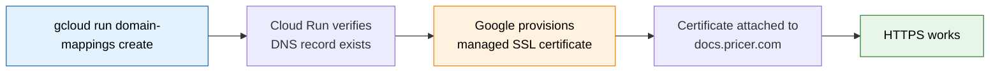
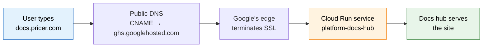

# 28 — Custom Domain Setup for the Docs Hub

> **Goal:** Make the docs hub reachable at `https://docs.pricer.com` instead of `https://platform-docs-hub-990006507229.europe-north1.run.app`.
>
> **Status:** Drafted. Needs DNS owner action. Once they add the records, a single `gcloud` command finishes the setup.
>
> **Audience:**
> 1. **You (platform engineer)** — to understand what we're asking the DNS owner to do and why.
> 2. **The DNS owner** — to follow the instructions in §3 and add the right DNS records.
>
> **Time required:** ~15 minutes once the DNS owner adds the records.

---

## Table of Contents

1. [Why this is split between two teams](#1-why-this-is-split-between-two-teams) — what GCP does vs. what DNS does
2. [What the user will see](#2-what-the-user-will-see) — before vs. after
3. [Instructions for the DNS owner](#3-instructions-for-the-dns-owner) — copy-paste ready
4. [Instructions for the platform engineer](#4-instructions-for-the-platform-engineer) — the gcloud command
5. [Verification](#5-verification) — how to confirm it works
6. [What if something goes wrong](#6-what-if-something-goes-wrong) — troubleshooting
7. [Rollback](#7-rollback) — if we need to undo

---

## 1. Why this is split between two teams

The docs hub runs on **Google Cloud Run**. To make it reachable at `docs.pricer.com`, two things need to happen:

| Who | What they do | Why |
|:---|:---|:---|
| **Google (Cloud Run)** | Map `docs.pricer.com` to our service so requests to that name reach our app | Cloud Run only knows about its own auto-generated URLs. We have to tell it "also accept this name." |
| **DNS owner** | Tell the internet "docs.pricer.com lives on Google" via a DNS record | When someone types `docs.pricer.com` in their browser, DNS is what points them to the right place. Without a DNS record, the name doesn't resolve anywhere. |

**Analogy:** Think of `docs.pricer.com` as a phone number for our docs. GCP needs to know to answer when that number is called (domain mapping). The DNS owner needs to make sure the phone number is actually listed in the public phone book (DNS record). Both must happen.

---

## 2. What the user will see

**Before:**
```
User types:  https://platform-docs-hub-990006507229.europe-north1.run.app
            └─ long, ugly, has random numbers, hard to share, easy to typo
```

**After:**
```
User types:  https://docs.pricer.com
            └─ short, memorable, branded, easy to share in Slack/email
```

Both URLs serve the exact same site (they point to the same Cloud Run service). The old URL still works after the change — we don't break anything.

---

## 3. Instructions for the DNS owner

> **This section is what you forward to the person who controls the `pricer.com` DNS zone.** It's written so they don't need to know anything about Cloud Run or our docs setup. They just add one DNS record.

### What we need

We need **one DNS record** added to the `pricer.com` DNS zone:

| Field | Value |
|:---|:---|
| **Record type** | `CNAME` |
| **Host / Name** | `docs` |
| **Target / Value** | `ghs.googlehosted.com.` *(note the trailing dot — that's normal)* |
| **TTL** | 300 (or whatever your default is — 5 minutes is fine) |

### What this record does (plain English)

When someone types `docs.pricer.com` in their browser:

1. Their computer asks the public DNS system "where does `docs.pricer.com` live?"
2. The DNS system sees your `CNAME` record and says "go ask Google at `ghs.googlehosted.com`"
3. Google's DNS responds with the IP address of our docs hub
4. The browser connects and the docs load

This is the standard pattern Google documents for all Cloud Run custom domains. It's safe, well-supported, and what Google itself recommends.

### Where to add it

Use whatever tool your team uses to manage DNS. Examples:

| Tool | How |
|:---|:---|
| **Cloudflare** | DNS → Records → Add → Type: CNAME, Name: `docs`, Target: `ghs.googlehosted.com.` |
| **Route 53 (AWS)** | Hosted zones → pricer.com → Create record → CNAME, Name: `docs`, Value: `ghs.googlehosted.com.` |
| **Google Cloud DNS** | If `pricer.com` is managed there: `gcloud dns record-sets create docs.pricer.com --zone=<zone-name> --type=CNAME --ttl=300 --rrdatas=ghs.googlehosted.com.` |
| **Other registrar** | Wherever the `pricer.com` nameservers are pointed |

### Once added

Reply to this ticket (or message me) with "DNS added" so I can finish the GCP side. After DNS propagates (usually 5-15 minutes), I'll run one command and we're done.

---

## 4. Instructions for the platform engineer

> **Run after the DNS owner confirms they added the record. Wait at least 5 minutes after they confirm — DNS takes a moment to propagate.**

### One command

```bash
gcloud run domain-mappings create \
  --service=platform-docs-hub \
  --domain=docs.pricer.com \
  --region=europe-north1 \
  --project=platform-dev-p01
```

### What happens automatically after this command

Google handles the rest:



1. Cloud Run checks that the `CNAME` from §3 actually exists
2. Google provisions a free managed SSL certificate (Let's Encrypt under the hood, rotated automatically)
3. The cert is attached to `docs.pricer.com`
4. `https://docs.pricer.com` starts serving the docs

Total time: 5-30 minutes, mostly waiting for SSL provisioning.

---

## 5. Verification

After running the command in §4, check status:

```bash
# Should show ACTIVE state once everything is ready
gcloud run domain-mappings describe \
  --domain=docs.pricer.com \
  --region=europe-north1 \
  --project=platform-dev-p01
```

Then test from your machine:

```bash
# Should return HTTP/2 200 with the docs HTML
curl -sI https://docs.pricer.com | head -3

# Old URL should still work too (we're not breaking anything)
curl -sI https://platform-docs-hub-990006507229.europe-north1.run.app | head -1
```

In a browser, open `https://docs.pricer.com` — you should see the docs landing page with a valid certificate (no browser warnings).

### What success looks like



---

## 6. What if something goes wrong

### "CNAME not found" when creating the domain mapping

**Cause:** DNS record not added yet, or DNS hasn't propagated.

**Fix:**
1. Confirm with the DNS owner that the record was actually saved (not just entered but not committed)
2. Wait 5-15 minutes for DNS propagation
3. Re-run the command from §4

You can check DNS propagation from your machine:

```bash
# Should return ghs.googlehosted.com. (or A records resolving to Google IPs)
dig docs.pricer.com CNAME +short
nslookup docs.pricer.com
```

### "Certificate provisioning failed"

**Cause:** Google's automated SSL cert provisioning hit an issue. Common reasons:
- DNS points to the wrong target (typo in `ghs.googlehosted.com.`)
- Domain ownership not verified in Google Search Console (usually not required for subdomains of already-verified domains, but can be)

**Fix:**
1. Verify the CNAME is exactly `ghs.googlehosted.com.` (with trailing dot)
2. Check Google Search Console for the domain (https://search.google.com/search-console)
3. Wait 30 minutes and re-check

### "Site loads but browser shows certificate warning"

**Cause:** SSL cert isn't fully provisioned yet, or there's a caching issue.

**Fix:**
1. Wait 15-30 minutes — cert provisioning can take time on first setup
2. Hard refresh (Cmd+Shift+R) or try incognito
3. Check status: `gcloud run domain-mappings describe --domain=docs.pricer.com --region=europe-north1 --project=platform-dev-p01`

### Old URL still works, new URL doesn't (or vice versa)

**Expected behavior.** Both URLs are independent. The old URL is the Cloud Run auto-generated URL and always works. The new URL works once SSL is provisioned. There's no conflict between them.

---

## 7. Rollback

If we need to undo the custom domain (rare — usually we just leave it):

```bash
# 1. Remove the Cloud Run domain mapping
gcloud run domain-mappings delete \
  --domain=docs.pricer.com \
  --region=europe-north1 \
  --project=platform-dev-p01

# 2. Ask the DNS owner to remove the CNAME record
# (their process — same tool they used to add it)
```

The old URL continues working throughout — rollback only affects the new custom domain.

---

## 8. Notes for the future

- **Cost:** Domain mapping is free. You only pay for the underlying Cloud Run service (already running).
- **Limits:** Cloud Run domain mappings support one certificate per mapping. Subdomains of subdomains work fine (e.g., `docs.pricer.com`, `api.pricer.com`).
- **Migration path:** If we later need IAP for SSO (`@pricer.com` only), we'd migrate to a load balancer + IAP setup. The custom domain name `docs.pricer.com` would stay the same — only the infrastructure behind it changes.
- **Documentation update:** Once live, update the canonical URL in doc 26 and doc 27 from `https://platform-docs-hub-990006507229.europe-north1.run.app` to `https://docs.pricer.com`. The old URL remains valid as an alias.

---

*Drafted 2026-07-07. Last verified Cloud Run domain-mapping docs: see [Google's official guide](https://cloud.google.com/run/docs/mapping-custom-domains).*