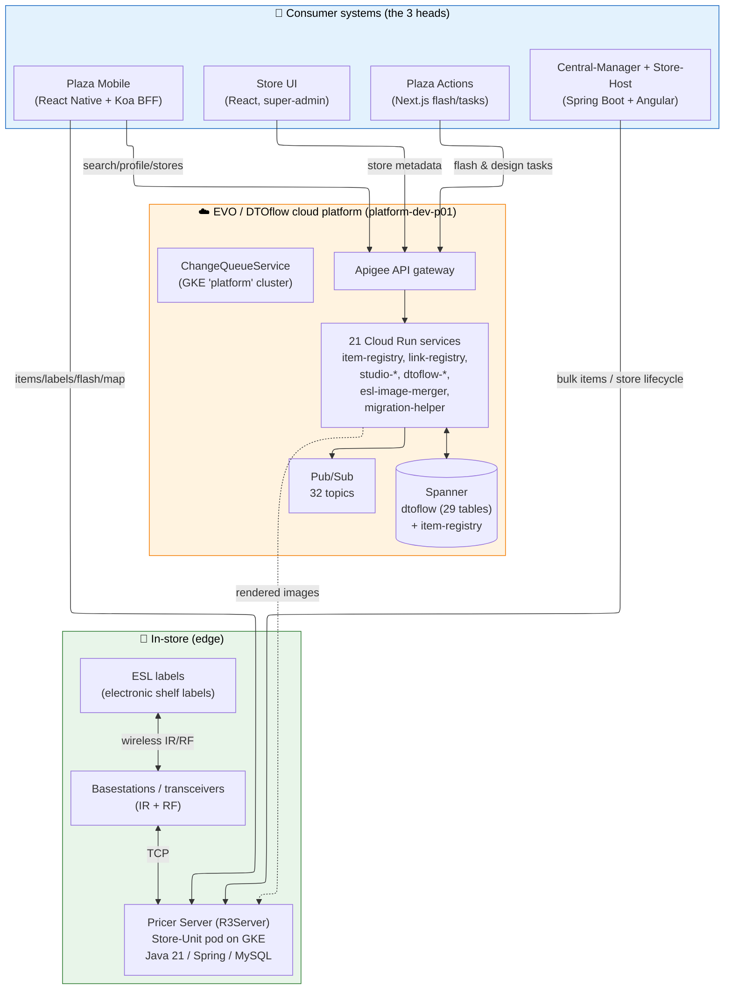

# Pricer AB — Systems & Replatforming Onboarding

> **Audience:** A new engineer/architect **taking over leadership of the Replatforming project**.  
> **Goal:** Understand the entire Pricer platform — from the ESL on the shelf up to Plaza Mobile, Central‑Manager and Store UI — what a *tenant* is, what *Replatforming* is, and the *target EVO/DTOflow architecture*.
>
> **Last validated:** 2026-06-30 — against **live** Jira (`project = PLT`, 15 epics queried), GCP project `platform-dev-p01` (`europe-north1`, 21 Cloud Run services confirmed), the GitHub `PricerAB` org, and the `evo-dtoflow-protos` central-documentation branch. All 15 onboarding docs cross-referenced.

---

## How to read this set

Read in order. Each document is self‑contained but builds on the previous one.

| # | Document | What you'll learn | Read if you need… |
|---|----------|-------------------|-------------------|
| 0 | **README** (this file) | Orientation, glossary, data sources | …the map of everything |
| 1 | [01 — Current Systems Architecture](01-systems-architecture.md) | The whole integrated platform today: ESL → basestation → Pricer Server (R3Server) → the three consumer "heads" → cloud edges. Includes the BEEP dev harness. | …to understand what exists now |
| 2 | [02 — The Tenant Model](02-tenant-model.md) | What a tenant is, its characteristics, what it depends on, and how isolation works today vs. in the cloud. | …to reason about customers & isolation |
| 00 | [00 — Program Overview](00-replatforming-program-overview.md) | The **starting point** for Replatforming: P0 (Prove it) / P1 (Ship it) / P2 (Scale it), why we're doing this, how we're structuring it from slogans down to Jiras, prerequisites, acceptance criteria, and timeline. | …to understand the whole program at a glance |
| 3 | [03 — Replatforming Deep Dive](03-replatforming-deep-dive.md) | Why we're replatforming, the DTOflow platform, P0/P1/P2 phases, Shadow Mode, the live epic backlog and the critical blocker. | …to lead the program |
| 4 | [04 — Target Architecture](04-target-architecture.md) | The target EVO/DTOflow cloud platform and **how it still connects back to Pricer Server** (the hybrid cloud‑edge boundary). | …to drive the technical design |
| 5 | [05 — Core Concepts Deep Dive](05-core-concepts-deep-dive.md) | Link · Tenant · EVO Token · PCS Instance — what each is **in code**, how they relate, and how Replatforming changes them. | …to read the auth/link code |
| 6 | [06 — Engineer Daily Workflow](06-engineer-daily-workflow.md) | How engineers actually work in the BEEP sandbox: `hive-connect`, `gwt task`, builds, skills, memory, cleanup. | …to onboard to the dev harness |
| 7 | [07 — M2M Token Manager](07-m2m-token-manager-deep-dive.md) | Central-Manager's service-to-service auth (`client_credentials`, Guava cache, GCP Secret Manager). | …to understand server-to-server auth |
| 8 | [08 — Delta Report](08-replatforming-delta-report.md) | **Live validation** of all docs against Jira/GCP/Confluence/GitHub as of 2026-06-23. Corrections, built inventory, remaining work, risks, next steps. | …to see what changed since docs were written |
| 9 | [09 — Freshness Check](09-freshness-check-june24.md) | **Daily freshness verification** as of 2026-06-24. Live queries to Jira/GCP/Confluence confirm no material changes since the delta report. | …to confirm the workspace is current today |
| 13 | [13 — Core Data Flows](13-core-data-flows.md) | Detailed validation of the 5 core end-to-end data flows using GCP Pub/Sub mechanics and Protobuf schemas. Includes Mermaid diagrams tracking DTO mutations. | …to understand the event-driven sequences |
| 14 | [14 — Tenant Migration Guide](14-tenant-migration.md) | Store-by-store migration process: Shadow Mode operation, validation (image + API parity), switch procedure (5 steps), migration candidates, and per-store checklist. | …to plan and execute tenant migrations |
| 15 | [15 — Overall Status v3](15-overall-status.md) | Complete status using the Phase → Milestone → Increment → Epic hierarchy with `[C1]`–`[C5]` capability tags. All 58 epics mapped across 6 Milestones with Increment-level demo gates. Designed for PMO / CTO status presentations. | …to present program status to stakeholders |
| 15a | [15 — Overall Status v2](15-overall-status-v2.md) | Previous version using the Workstream → Capability hierarchy — kept for reference. | …to compare with the previous format |
| 16 | [16 — Docs GitHub Strategy](16-docs-github-strategy.md) | Strategy to move all Pricer documentation from Confluence to GitHub — docs-as-code with MkDocs Material, per-repo `docs/` convention, centralized hub via `evo-docs`, 4-phase migration plan, repo prioritization, risk mitigations (non-technical contributors, stale content, external links), and per-phase success criteria. | …to plan and execute the docs migration |
| 17 | [17 — Phase 1 Plan](17-phase-1-plan.md) | High-level Phase 1 plan: scope definition (what's in, what's out, what depends on tenant selection), 5 workstreams with sequencing, 3 end-to-end data flows mapped to current state vs. gaps, 8 identified gaps with proposed solutions, per-tenant migration strategy (byPricer → Landwaart → Spar-be), risk assessment, and rough timeline. | …to lead Phase 1 planning and execution |
| 18 | [18 — Docs GitHub Implementation](18-docs-github-implementation.md) | Concrete implementation guide: GCP setup (Cloud Run + IAP + WIF), complete evo-docs hub repo setup (all files copy-paste ready), creating/adopting repos, CI/CD pipeline, maintenance (incl. stale content detection), contribution workflows (developer + non-technical paths via web UI or issues), PR template with docs checklist, and troubleshooting. | …to implement the docs platform |
| 19 | [19 — Delivery Framework](19-dimension-frameworks.md) | The **Phase → Milestone → Increment → Epic** delivery hierarchy. Documents why earlier Frameworks A/B/C failed, the chosen structure (4 levels, each answering a different question), the full 6-Milestone plan across all 3 Phases, Phase 0 Increment breakdown with demo scenarios, and Capability reference tags. | …to understand how the program is structured and why |
| 20 | [20 — Phase 0 Effort Analysis](20-phase-0-effort-analysis.md) | Effort estimation analysis for all 18 Phase 0 epics. Raw Jira time tracking, identification of 11 unestimated epics, PLT-2354 estimate correction (1w 2d → 5w), per-engineer capacity analysis, realistic mid-August deadline assessment, and 6 immediate actions. | …to plan sprints and assess Phase 0 deadline feasibility |

> **Docs 05–07** are code-verified, corrected versions of earlier drafts (`Core-Concepts-Deep-Dive.md`, `Engineer-Daily-Workflow.md`, `M2M-Token-Manager-Deep-Dive.md`) that lived in the `Replatforming/` root. They were re-validated on 2026-06-17 against repo code, live GCP/Jira, and the sandbox scripts — **not** against personal Confluence pages. Inline ✅/✏️ flags mark what was verified vs corrected.
>
> **Doc 08** was created 2026-06-23 by querying all four MCP servers live to produce a delta report. It documents the current state with corrections to the earlier docs.
> **Doc 09** was created 2026-06-24 as a daily freshness check via Jira MCP, GCP MCP, and Confluence MCP. No material changes detected.

---

## The platform in one picture



**The one‑sentence summary:** Pricer runs an **electronic shelf label** platform; today each store is served by an instance of **Pricer Server (R3Server)** running as a Kubernetes "Store‑Unit"; the **Replatforming** program is moving data, APIs and rendering off each Store‑Unit and into a shared multi‑tenant cloud platform (**DTOflow** on Cloud Run + Spanner), while the real‑time radio transmission to labels **stays on R3Server at the edge**.

---

## Glossary (acronyms you'll hit immediately)

| Term | Meaning |
|------|---------|
| **ESL** | Electronic Shelf Label — the e‑paper price tag on the shelf. |
| **Basestation / transceiver** | In‑store radio hardware that talks to ESLs over **IR** (infrared) and **RF** (radio). |
| **PLID** | The unique barcode/ID of a physical label (`pricerlabel`). |
| **Pricer Server / R3Server** | The core in‑store backend. "R3Server" is the modern, Plaza/cloud‑aware build of Pricer Server. |
| **Store‑Unit** | One R3Server instance (+ its MySQL) deployed as a Kubernetes workload for a single store. |
| **PCS** | Pricer Central Solution — the current GKE‑hosted product that runs Store‑Units (confirmed in CM i18n + the `pricer-central-solution` helm chart). |
| **EVO** | The next‑generation cloud platform/auth that the new services live under. |
| **Tenant** | A Pricer **customer** (a retail chain). The top‑level isolation unit. See [doc 02](02-tenant-model.md). |
| **Item** | A product (price, description, properties). Identified per store; optionally by **SIC**. |
| **SIC** | Store Item Code — a customer's own item identifier (alternative to Pricer's item id). |
| **Link** | The association between an **item** and a **label** (ECC link or Designer/Canvas link). |
| **ECC** | The legacy linking + rendering system (item→label templates). Being superseded by **Designer/Studio**. |
| **Flash** | Make a label blink its LED to physically locate it on the shelf. |
| **Display page** | The page an ESL currently shows (price / promo / inventory). Switching is a real‑time IR command. |
| **DTO** | Data Transfer Object — the standardized data record type in the cloud platform. |
| **DTOflow** | The cloud data backbone: per‑DTO gRPC servers + Spanner storage + Pub/Sub change topics. |
| **CQS** | ChangeQueueService — subscription-based fan-out layer; delivers Pub/Sub change events to services that self-configure subscriptions. No central routing logic. |
| **LFS** | Large File Service — GCS‑backed storage for big blobs (e.g. images) in DTOflow. |
| **BFF** | Backend‑for‑Frontend — a thin API tailored to one client (Plaza Mobile has one). |
| **Apigee** | Google's API gateway — the single front door to the cloud services. |
| **PSC** | Private Service Connect — private networking from Apigee/clients to Cloud Run. |
| **Shadow Mode** | Running the cloud pipeline in parallel with R3Server **without** updating real labels — the Phase‑0 validation gate. |
| **BEEP** | Pricer's internal AI‑assisted development harness (sandbox + scaffold). See [doc 01 §7](01-systems-architecture.md#7-how-the-team-builds--the-beep-ai-harness). |

---

## Repositories covered (this workspace)

| Repo | Role | Stack |
|------|------|-------|
| `pricer-server-r3server` | Pricer Server (Plaza/cloud build) | Java 21, Spring, Maven (multi‑module), MySQL |
| `pricer-server-on-prem` | Pricer Server (legacy on‑prem build) | Java 21, Spring, Maven |
| `plaza-mobile-ui-backend` | Plaza Mobile BFF | Node/TypeScript, Koa |
| `plaza-mobile-ui-frontend` | Plaza Mobile app | React Native |
| `chain-management-centralization` | Central‑Manager + Store‑Host + CM UI + EVO UI | Spring Boot + Angular + K8s |
| `store-ui` | Super‑admin store portal | React + RTK Query |
| `plaza-actions` | Flash/design task platform | Next.js / React |
| `beep-gemini-sandbox`, `beep-dot-ai-root` | AI dev harness | Docker + shell + scaffold |

> The `Replatforming/` folder (where these docs live) is a **local notes folder**, not a tracked git repo. Earlier analysis files in it were drafted with DeepSeek and used here only as a cross‑reference; **the facts in this set are re‑verified against live sources.**

---

## Live data sources (how to refresh these docs)

All four integrations are reachable from this machine. The Jira/Confluence/GCP MCP servers are configured in `~/.claude.json` (`atlassian`, `gcp-infra`, `github`); if they aren't auto‑loaded as native tools in a session, they can be driven directly over stdio.

```bash
# GCP (project platform-dev-p01, region europe-north1) — uses the gcloud CLI
gcloud run services list --region=europe-north1 --project=platform-dev-p01
gcloud spanner databases ddl describe dtoflow --instance=dtoflow --project=platform-dev-p01
gcloud pubsub topics list --project=platform-dev-p01
gcloud container clusters list --project=platform-dev-p01

# GitHub (org PricerAB) — uses the gh CLI
gh repo list PricerAB --limit 100

# Jira / Confluence — live via the configured 'atlassian' MCP server (pricer-org.atlassian.net).
# Refresh the epic backlog with this JQL:
#   project = PLT AND issuetype = Epic
#   AND labels in ("replatforming-phase-0","replatforming-phase-1","replatforming-phase-2")
#   ORDER BY status ASC
```

If you prefer them as one‑click native tools, re‑enable the project‑scoped MCP servers in your Claude Code config — the server definitions already exist and authenticate.